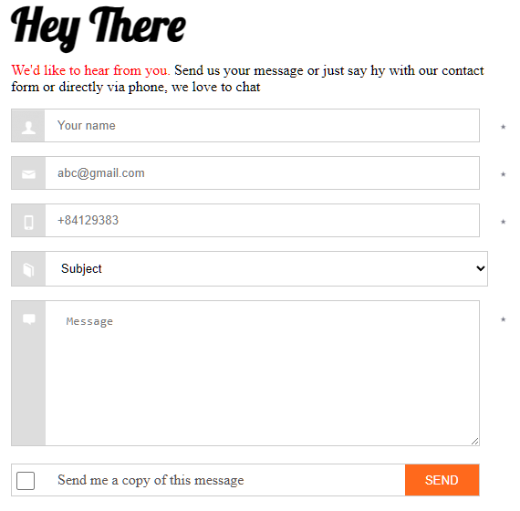
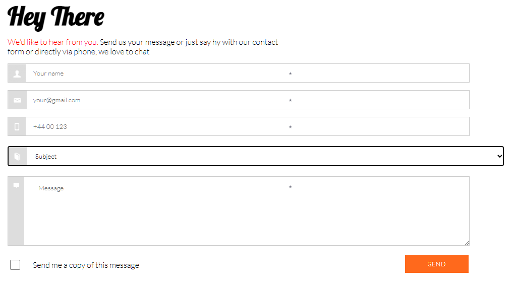
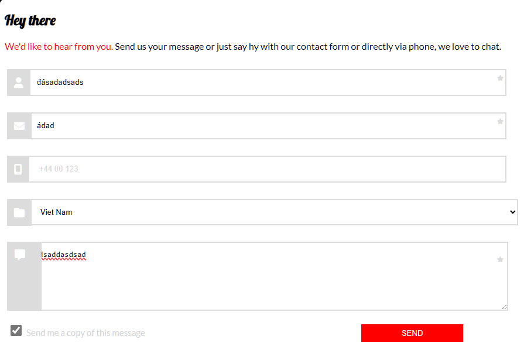
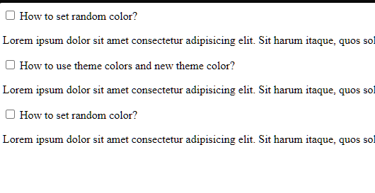
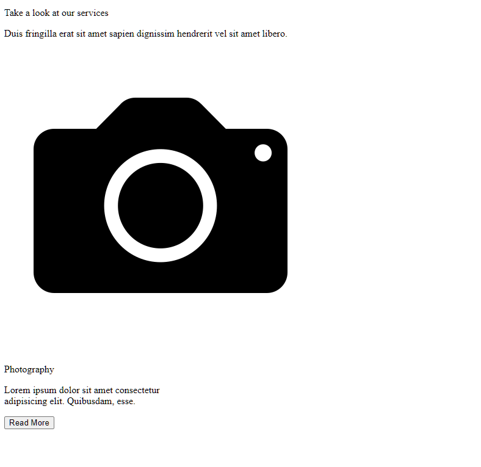
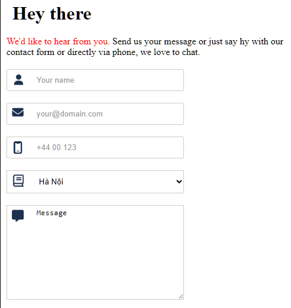
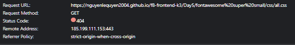

# Dương review bài học viên FE K3.

## [Nguyễn Đức Hải](https://duchainguyen.github.io/F8-FE-K3/day-5/deloy.html)

    Sớm nhất *

- [x] [Bài 1](https://duchainguyen.github.io/F8-FE-K3/day-5/deloy.html)

  Bài làm sơ sài, nhiều lỗi.

  Chưa có action click vào label

  Chưa có các phần tooltip nổi lên.

  Chưa thay đổi icon khi focus

  Font-weight `.title` hơi đậm.

  Phần content text sai font chữ

  

---

- [x] [Bài 2](https://duchainguyen.github.io/F8-FE-K3/day-5/deloy.html)

  Bài làm tốt

  Sai font chữ. Ở trong bài sử dụng font chữ không chân.

---

- [x] [Bài 3](https://duchainguyen.github.io/F8-FE-K3/day-5/deloy.html)

  Bài làm tốt

  Tỷ lệ của box đang sai.

  Khoảng cách giữa content text đến button đang thiếu

  Bản mẫu không có border.

  khoảng cách giữa subtitle đến các box thiếu.

  Màu chữ và font chữ subtitle đang sai.

  Khoảng cách giữa các box với nhau thiếu.

---

- Đánh giá chung bài tập về nhà: Bài làm tốt, có thể chỉn chu hơn, cải thiện hơn nữa.

## [Đỗ Ngọc Tiến](https://dongoctien17.github.io/F8-frontend-k3)

- [x] [Bài 1](https://dongoctien17.github.io/F8-frontend-k3)

  Bài làm sơ sài, nhiều lỗi.

  Chưa có action click vào label

  Chưa có các phần tooltip nổi lên.

  Chưa thay đổi icon khi focus

  Font-weight `.title` hơi đậm.

  

---

- [x] [Bài 2](https://dongoctien17.github.io/F8-frontend-k3)

  Bài làm tốt

  Sai font chữ. Ở trong bài sử dụng font chữ không chân.

---

- [x] [Bài 3](https://dongoctien17.github.io/F8-frontend-k3)

  Bài làm tốt

  Tỷ lệ của box đang sai.

  Font chữ content text quá nhỏ.

  Icon và phần padding quá nhỏ.

  Phần `.text-2` nên sử dụng thẻ heading vì ở đây là một đầu mục services trong một section.

---

- Đánh giá chung bài tập về nhà: Bài làm tốt, có thể chỉn chu hơn, cải thiện hơn nữa.

  \* Lưu ý: Cần chú ý hơn tới thẻ meta title vì chúng rất quan trọng trong SEO và trải nghiệm người dùng. Đang đặt tên title bừa bãi và không có ý nghĩa đúng.

## [thuy nguyen](https://tnnhungoc.github.io/F8-FE-K3)

- [x] [Bài 1](https://tnnhungoc.github.io/F8-FE-K3)

  Bài làm rất tốt \*

  Font-weight title hơi đậm.

  Khi focus thiếu action giữ lại màu của `.form`

  Set max-width để giữ đúng tỷ lệ của các phần tử trong form đó.

  Cần chú ý hơn tới thẻ meta title vì chúng rất quan trọng trong SEO và trải nghiệm người dùng

---

- [x] [Bài 2](https://tnnhungoc.github.io/F8-FE-K3)

  Bài làm rất tốt \*

  Nếu sử dụng input `type="radio"` thì sẽ khó làm thêm tính năng bấm vào tiêu đề tự đóng lại hoặc mở nhiều phần cùng lúc.

---

- [x] [Bài 3](https://tnnhungoc.github.io/F8-FE-K3)

  Bài làm tốt \*

  Tỷ lệ của box đang sai.

  Phần title ở `.card-title` là một tiêu đề con của `.section-header h2`. Nên sử dụng `h3` thay vì `h2`.

---

- Đánh giá chung bài tập về nhà: Bài làm rất tốt, chỉ cần chú ý một số chi tiết nhỏ.

## [Nguyễn Đình Khánh](https://github.com/khanhngoolearn/F8-homework-fe-k3/tree/main/Day5)

- [x] [Bài 1](https://github.com/khanhngoolearn/F8-homework-fe-k3/tree/main/Day5)

  Bài làm **Sai Yêu Cầu**

  Font-weight `h3` quá đậm.

  Khi focus thiếu action giữ lại màu của `.form`

  Phần icon sau khi focus quá xấu, background không đúng với mẫu.

  Sau khi un-focus thì không trở về icon cũ

  Chưa có phần tooltip như yêu cầu đề bài

  Bài tập để ôn tập về CSS. Không được sử dụng JS.

  Code lại.

---

- [x] [Bài 2](https://github.com/khanhngoolearn/F8-homework-fe-k3/tree/main/Day5)

  Bài làm **Sai Yêu Cầu**

  Thiếu padding trong các tiêu đề.

  Sử dụng sai font chữ, ở bản mẫu sử dụng font chữ không chân.

  Set max-width để giữ đúng tỷ lệ các phần tử bên trong.

  Bài tập để ôn tập về CSS. Không được sử dụng JS.

  Code lại.

---

- [x] [Bài 3](https://github.com/khanhngoolearn/F8-homework-fe-k3/tree/main/Day5)

  Bài làm **Không Tốt**

  Cần chú ý thêm vào thẻ meta title vì chúng rất quan trọng trong SEO và trải nghiệm người dùng

  Các font chữ đang sai, trong bản mẫu sử dụng font chữ không chân.

  Các màu trong bài làm đang sai, sử dụng một màu khác gần đúng hơn.

  Phần tiêu đề trong mỗi box vẫn nên sử dụng thẻ `heading`

  Phần icon chưa sử dụng tốt.

  Phần border-radius của icon chưa sử dụng tốt.

  Phần nút trong bản mẫu không có border.

  Phần content trong các box có font chữ hơi to, thiếu khoảng cách xuống dưới.

  Code lại.

---

- Đánh giá chung bài tập về nhà: Bài làm không tốt. Code lại toàn bộ cho chỉn chu hơn.

  \* Lưu ý: Bài làm tới, yêu cầu nộp cả link github repo và github pages.

## [Nguyen Tuan Anh](https://github.com/fanbaday/f8-fullstack-offline-K3/tree/main/Day5)

- [x] [Bài 1](https://github.com/fanbaday/f8-fullstack-offline-K3/tree/main/Day5)

  Bài làm tốt \*

  Phần tooltip đang hơi lệch.

  Chưa xử lý focus giữ lại màu background của icon và giữ lại tooltip.

  Chưa xử lý đổi icon bên phải

  Phần Subject là một thẻ select.

  Phần chữ màu đỏ đang bị nhạt quá.

  Cần chú ý thêm vào thẻ meta title vì chúng rất quan trọng trong SEO và trải nghiệm người dùng

---

- [x] [Bài 2](https://github.com/fanbaday/f8-fullstack-offline-K3/tree/main/Day5)

  Bài làm rất tốt \*

  Thiếu action đổi icon khi click mở content.

---

- [x] [Bài 3](https://github.com/fanbaday/f8-fullstack-offline-K3/tree/main/Day5)

  Bài làm tốt \*

  Phần đổ bóng đằng sau hơi đậm

  Cần chú ý thêm vào thẻ meta title vì chúng rất quan trọng trong SEO và trải nghiệm người dùng

  Vì đây chỉ là một section nhỏ trong một trang web. Không nên sử dụng các thẻ heading từ `h1`. Nên bắt đầu từ `h2`.

---

- Đánh giá chung bài tập về nhà: Bài làm tốt, nên chú ý làm đủ các yêu cầu của đề bài để bài làm tốt hơn.

  \* Lưu ý: Bài làm tới, yêu cầu nộp cả link github repo và github pages.

## [Gia Bảo Đỗ](https://github.com/Dogiaba/F8-Fe-K3/tree/main/Day5)

- [x] [Bài 1](https://github.com/Dogiaba/F8-Fe-K3/tree/main/Day5)

  Bài làm **Không Tốt**

  Phần tiêu đề quá nhỏ, font-weight quá đậm.

  Chưa làm đủ yêu cầu đề bài: Làm phần tooltip

  Các phần layout quá xấu.

  Phần message bị hụt một đoạn đầu.

  Chưa thể click vào content của checkbox để active checkbox

  Sửa lại code cho đẹp hơn, chỉn chu hơn.

  

---

- [x] [Bài 2](https://github.com/Dogiaba/F8-Fe-K3/tree/main/Day5)

  Bài làm tốt \*

  Font chữ và font-weight của các tiêu đề quá to.

  Các phần h2 có padding quá to.

---

- [x] [Bài 3](https://github.com/Dogiaba/F8-Fe-K3/tree/main/Day5)

  Bài làm rất tốt \*

  Tỷ lệ box đang sai so với bài mẫu.

  Phần tiêu đề con: `.title_card` thì cấp độ phải nhỏ hơn tiêu đề chính. Nên sử dụng `h3`

  Font-size của `.title_card` hơi bé hơn bản mẫu.

  Tỷ lệ button của các box đang sai so với mẫu.

---

- Đánh giá chung bài tập về nhà: Bài làm tốt, nên chú ý làm đủ các yêu cầu của đề bài để bài làm tốt hơn.

  \* Lưu ý: Bài làm tới, yêu cầu nộp cả link github repo và github pages. Chia rõ thứ tự bài, không sử dụng các tên khác nhau.

## [Nguyễn Khắc Tú](https://github.com/tunguyenhd/FrontEnd-F8-K3/tree/main/Bai_tap/Day_5)

- [x] [Bài 1](https://github.com/tunguyenhd/FrontEnd-F8-K3/tree/main/Bai_tap/Day_5)

  Bài làm rất tốt \*

  Chưa xử lý bỏ icon mặc định của select.

  Không nên sử dụng value mặc định cho message, Nếu người dùng muốn nhập message thì phải xóa đi, điều đó khiến UX không tốt.

---

- [x] [Bài 2](https://github.com/tunguyenhd/FrontEnd-F8-K3/tree/main/Bai_tap/Day_5)

  Bài làm rất tốt \*

  Font chữ sử dụng trong bài mẫu là một font chữ không chân.

  Nên set max-width để giữ đúng tỷ lệ các phần tử bên trong.

---

- [x] [Bài 3](https://github.com/tunguyenhd/FrontEnd-F8-K3/tree/main/Bai_tap/Day_5)

  Bài làm rất tốt \*

  Phần button quá to so với tỷ lệ box.

  Phần chữ content trong box đang sai màu, bản mẫu sử dụng một màu xám.

---

- Đánh giá chung bài tập về nhà: Bài làm rất tốt, chỉ cần chú ý chỉn chu hơn một số chi tiết nhỏ.

## [Duy](https://github.com/saiduii/F8-FE-K3/tree/main/Day-5)

- [x] [Bài 1](https://github.com/saiduii/F8-FE-K3/tree/main/Day-5)

  Bài làm **Không tốt**

  Tất cả font chữ đều sai hết.

  Cần đặt tên font đúng hơn, không phải là **font-1**, **font-2**

  Sử dụng `@font-face` chưa tốt

  ```css
  @font-face {
    font-family: "font-1";
    src: url(../font/Lobster-Regular.ttf);
    font-family: "font-2";
    src: url(../font/Lato-Italic.ttf);
  }
  ```

  Chưa có action focus thì hiện tooltip.

  Phần chữ đỏ của bản mẫu không có in nghiêng.

  Chưa xử lý bất kỳ action gì ở background của icon bên trái

  Chưa làm phần icon bên phải.

  Chưa xử lý để click vào label thì active checkbox.

  Tóm lại, chẳng có gì trong bài để xem.

  Code lại.

---

- [x] [Bài 2](https://github.com/saiduii/F8-FE-K3/tree/main/Day-5)

  Vì sử dụng path "/"

  ```html
  <link rel="stylesheet" href="/Day-5/css/Bai2.css" />
  ```

  Nên đường dẫn css không chắc đúng ở một số môi trường hoặc ở máy khác.

  

  Tóm lại, chẳng có gì để xem.

  Layout vỡ, sai toàn bộ.

  Code lại.

---

- [x] [Bài 3](https://github.com/saiduii/F8-FE-K3/tree/main/Day-5)

  Vì sử dụng path "/"

  ```html
  <link rel="stylesheet" href="/Day-5/css/Bai3.css" />
  ```

  Nên đường dẫn css không chắc đúng ở một số môi trường hoặc ở máy khác.

  

  Tóm lại, chẳng có gì để xem.

  Layout vỡ, sai toàn bộ.

  Code lại.

---

- Đánh giá chung bài tập về nhà: Bài làm quá ẩu, phần đường dẫn đã học từ những buổi đầu nhưng áp dụng vẫn sai.

  \* Lưu ý: Bài làm tới, yêu cầu nộp cả link github repo và github pages. Chia rõ thứ tự bài, không sử dụng các tên khác nhau.

## [Nguyen Le Quyen (FPL HN)](https://github.com/NguyenLeQuyen2004/f8-frontend-k3/tree/main/Day5)

- [x] [Bài 1](https://github.com/NguyenLeQuyen2004/f8-frontend-k3/tree/main/Day5)

  Bài làm **Không tốt**

  Tất cả font chữ đều sai hết.

  

  Tóm lại, không có gì để xem.

  bài làm quá sơ xài

  Code lại.

---

- [x] [Bài 2](https://github.com/NguyenLeQuyen2004/f8-frontend-k3/tree/main/Day5)

  Bài làm tốt \*

  Màu của icon đang sai.

  Các font chữ đang sai, font chữ ở bản mẫu là một font chữ không chân.

  

  Có vẻ do đặt tên folder không hợp lý hoặc sai đường dẫn, có 1 đường dẫn không get được

  Thay vì sử dụng path như này để chỉ tới 1 file cùng cấp, có thể sử dụng path `./`

  ```html
  <link rel="stylesheet" href="../Bai2/bai2.css" />
  ```

  Đề xuất sửa thành:

  ```html
  <link rel="stylesheet" href="./bai2.css" />
  ```

---

- [x] [Bài 3](https://github.com/NguyenLeQuyen2004/f8-frontend-k3/tree/main/Day5)

  Bài làm tốt

  Các button quá to so với bản mẫu.

  Bản mẫu không có border-radius ở button.

  Phần chữ ở `.box__item-dsc` cần nhạt màu hơn.

  Vì sử dụng icon svg, việc tác động màu khá khó. Nên sử dụng cách khác.

---

- Đánh giá chung bài tập về nhà: Bài làm rất tốt, tuy nhiên cần chú ý chỉn chu hơn. Chú ý bài tập 1.

  \* Lưu ý: Bài làm tới, yêu cầu nộp cả link github repo và github pages. Chia rõ thứ tự bài, không sử dụng các tên khác nhau.

## [Vũ Thành Khang](https://github.com/countduck4819/f8-frontend/tree/main/Day5)

- [x] [Bài 1](https://github.com/countduck4819/f8-frontend/tree/main/Day5)

  Bài làm tốt

  Phần tiêu đề chính có font chữ hơi dày

  Tại phần `.desc`, sau dấu chấm chưa có khoảng cách.

  Tại phần `.desc`, màu chữ sai.

  Phần `.confirm-info b`, nên sử dụng thẻ span. Thẻ b chỉ sử dụng khi muốn in đậm một đoạn chữ nào đó.

  Phần tooltip có background sai màu.

  Phần tooltip có color sai màu.

  Phần tooltip có vị trí sai và vị trí chân của tooltip sai.

  Chưa xử lý phần icon của select.

  Màu chữ của button sai.

  Kích thước checkbox sai

---

- [x] [Bài 2](https://github.com/countduck4819/f8-frontend/tree/main/Day5)

  Bài làm tốt

  Các đầu mục không có khoảng cách.

  Background của các đầu mục sau màu.

  Khoảng cách content bên trong so với các đầu mục đang thiếu.

  Phần chữ trên đầu mục đang sai màu

  Font chữ đang sai, font chữ của bản mẫu là một font chữ không chân.

---

- [x] [Bài 3](https://github.com/countduck4819/f8-frontend/tree/main/Day5)

  Bài làm tốt

  Các box có width quá nhỏ so với tỷ lệ bản mẫu.

  Phần đổ bóng đang sai, của bản mẫu nhạt màu hơn

  Font-size của các đầu mục đang sai, của bản mẫu, chúng to hơn tiêu đề chính.

  Sai chính tả: `Road More` => `Read More`

---

- Đánh giá chung bài tập về nhà: Bài làm tốt, tuy nhiên cần chú ý chỉn chu hơn ở các tiểu tiết.

## [Bảo Anh](https://github.com/Baoanh2004/Frontend-Offline-K3/tree/main/Day-5)

- [x] [Bài 1](https://github.com/Baoanh2004/Frontend-Offline-K3/tree/main/Day-5)

  Bài làm tốt

  Phần title có font-weight quá đậm.

  Phần `strong` đang làm sai, không hề có nhấn mạnh hay in đậm, chỉ đơn giản là đổi sang màu đỏ.

  Chưa xử lý action hover.

  Chưa xử lý tooltip như bản mẫu.

  Cần chú ý hơn tới thẻ meta title vì chúng rất quan trọng trong SEO và trải nghiệm người dùng

---

- [x] [Bài 2](https://github.com/Baoanh2004/Frontend-Offline-K3/tree/main/Day-5)

  Bài làm tốt

  Phần tiêu đề các đầu mục có font chữ và font weight sai. Ở bản mẫu, mọi thứ đều nhỏ hơn.

  Khoảng cách giữa các content bên trong và tiêu đề đang thiếu.

  Cần chú ý hơn tới thẻ meta title vì chúng rất quan trọng trong SEO và trải nghiệm người dùng

---

- [x] [Bài 3](https://github.com/Baoanh2004/Frontend-Offline-K3/tree/main/Day-5)

  Bài làm rất tốt \*

  Quá lười để thêm icon 

  Phần content bên trong box cần có màu chữ nhạt hơn.

  Cần chú ý hơn tới thẻ meta title vì chúng rất quan trọng trong SEO và trải nghiệm người dùng

---

- Đánh giá chung bài tập về nhà: Bài làm tốt, tuy nhiên cần chú ý chỉn chu hơn ở các tiểu tiết.

  \* Lưu ý: Phần github pages đặt đường dẫn lộn xộn.
