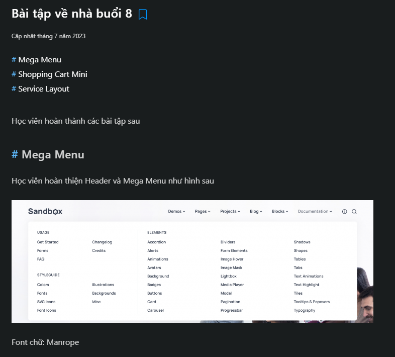
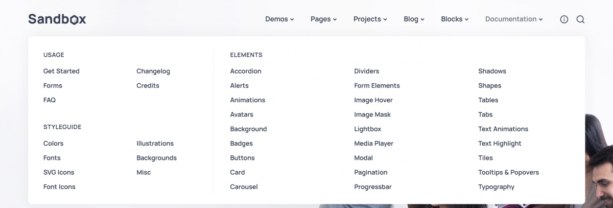
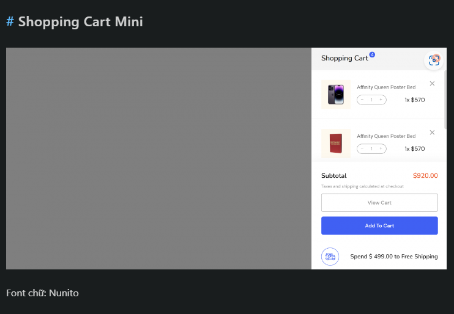
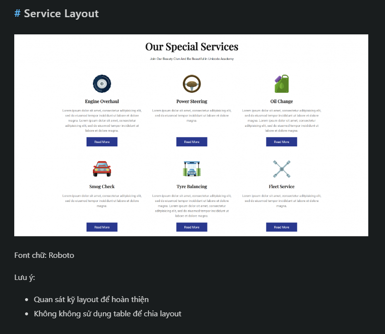
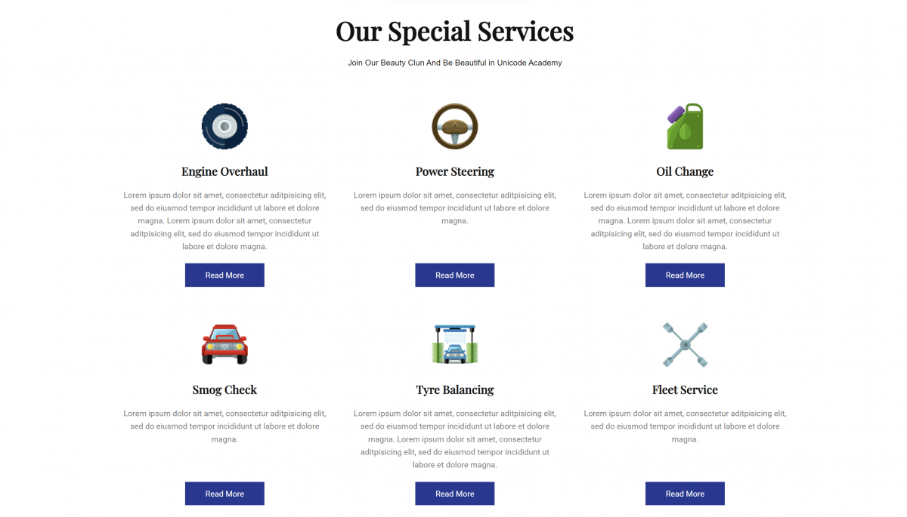

Nguyen Le Quyen (FPL HN)

em nộp bt Day 8: https://github.com/NguyenLeQuyen2004/f8-frontend-k3/tree/main/Day8

---

Vũ Thành Khang

source code : https://github.com/countduck4819/f8-frontend/tree/main/Day8
link deploy : https://countduck4819.github.io/f8-frontend/Day8/nopbai.html

---

Gia Bảo Đỗ

Em nộp bài Day8 ạ: https://github.com/Dogiaba/F8-Fe-K3/tree/main/Day8
Deploy: https://dogiaba.github.io/F8-Fe-K3/

---

thuy nguyen

e nop bai day8 ah : https://github.com/tnnhungoc/F8-FE-K3 deploy: https://tnnhungoc.github.io/F8-FE-K3/

---

Nguyễn Khắc Tú

em nop bai: https://github.com/tunguyenhd/FrontEnd-F8-K3/tree/main/Bai_tap/Day_8 Deploy: https://tunguyenhd.github.io/FrontEnd-F8-K3/

---

Bảo Anh

Em nop bai a: https://github.com/Baoanh2004/Frontend-Offline-K3/tree/main/Day-8 Deploy: https://baoanh2004.github.io/Frontend-Offline-K3/Day-8/

---

Nguyễn Đình Khánh

Em xin phép nộp bài ạ: code: https://github.com/khanhngoolearn/F8-homework-fe-k3/tree/main/day8 deploy: https://khanhngoolearn.github.io/F8-homework-fe-k3/day8/

---

Đỗ Ngọc Tiến

em nộp bài day 8 ạ: https://dongoctien17.github.io/F8-frontend-k3/

---

Nguyen Tuan Anh

Em nộp bài tập ạ: https://github.com/fanbaday/f8-fullstack-offline-K3/blob/main/homework.html

Đề bài:

- 
- 

---

- 
- 

---

- 
- 
