# Dương test bài Học Viên

## [Bi11-043 Đỗ Hà Chi](https://github.com/SerenaHa12/fullstack_nodeJS)

    Sớm nhất *

- [x] [Bài 1](https://github.com/SerenaHa12/fullstack_nodeJS/tree/main/btvn_03)

  - Bài làm tốt

  - Không nên viết tất cả các bai tập vào 1 file html.

  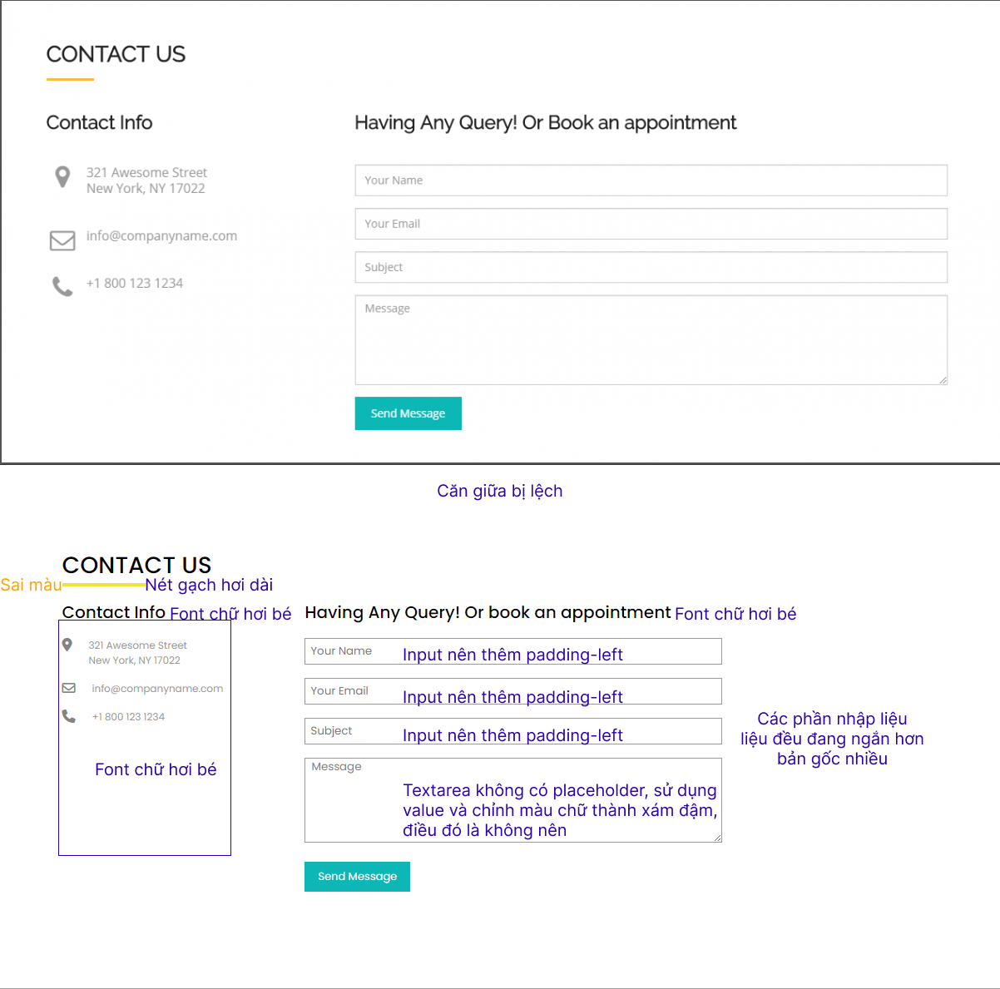

  - Màu nét gạch có thể đổi thành #faa300 cho thành màu cam

  - Đã có một số bài sử dụng flex, có thể sử dụng flex để căn giữa lại

  - Font chữ contact-info có thể lên 1.4rem

  - Font icon to hơn font contact-info một chút, có thể lên 1.5rem

  - Không nên để font chữ dưới 14px, ở phần contact-info có thể lên 14px

  - Thêm box-sizing: border-box cho tất cả các thẻ html

  - Thêm padding-left, right khoảng 8px co các input, text-area giúp UX tốt hơn

  - Width của các input, text-area có thể lên thêm 100px nữa

  - text-area không nên để value, sử dụng placeholder. Style lại màu sắc chữ

- [x] [Bài 2](https://github.com/SerenaHa12/fullstack_nodeJS/tree/main/btvn_03)

  - Bài làm tốt

  - Không nên viết tất cả các bai tập vào 1 file html.

  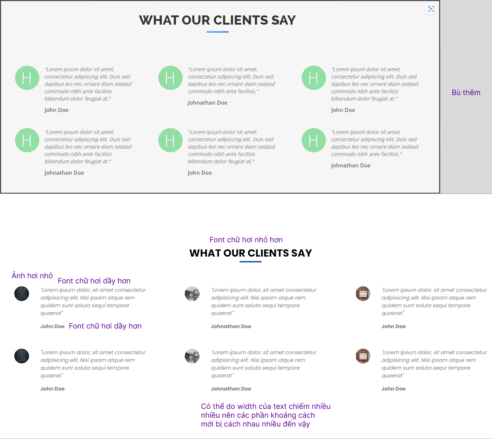

  - Font title có thể lên thêm 1 chút nữa, khoảng 2rem

  - Ảnh có thể lên 60px (Vì ảnh ở bản mẫu có chiều cao ngang 3 dòng chữ + 3 dòng line-height)

  - Set lại width cho các phần text nhỏ lại

  - Font-weight tên tác giả nên giảm xuống 500

  - Font-weight text nên giảm xuống 3-400

- [x] [Bài 3](https://github.com/SerenaHa12/fullstack_nodeJS/tree/main/btvn_03)

  - Bài làm tốt

  - Không nên viết tất cả các bai tập vào 1 file html.

  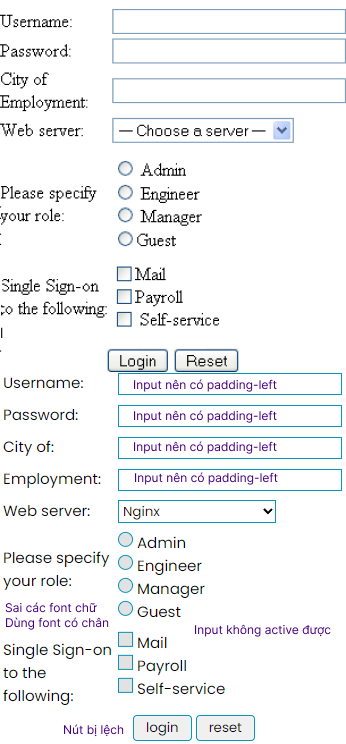

  - Sửa lại font chữ, sử dụng một font chữ có chân như (Times New Roman, ...)

  - Thêm padding-left cho input để tăng UX

  - Các input type checkbox, radio sau khi custom không thể active

  - Căn lại các phần tử nút trong trang

- [x] [Bài 4](https://github.com/SerenaHa12/fullstack_nodeJS/tree/main/btvn_03)

  - Bài làm tốt

  - Không nên viết tất cả các bai tập vào 1 file html.

  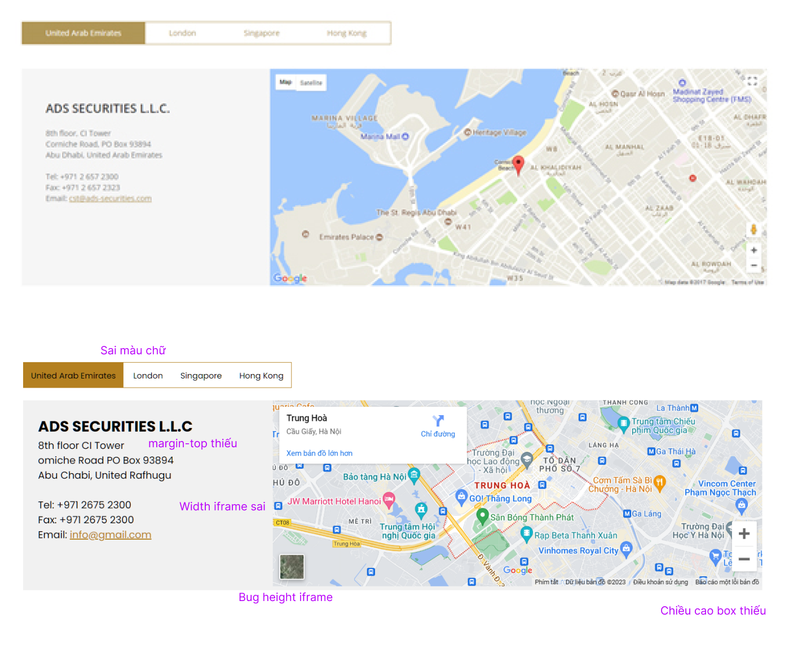

  - Chỉnh lại màu text sao cho đúng hơn

  - Thêm margin-top cho phần text

  - Có bug giao diện ở phần chân map

  - Tăng height của toàn bộ phần content lên một chút, khoảng 50px

  - Chỉnh lại width, height của iframe

- [x] [Bài 5](https://github.com/SerenaHa12/fullstack_nodeJS/tree/main/btvn_03)

  - Bài làm tốt

  - Không nên viết tất cả các bai tập vào 1 file html.

  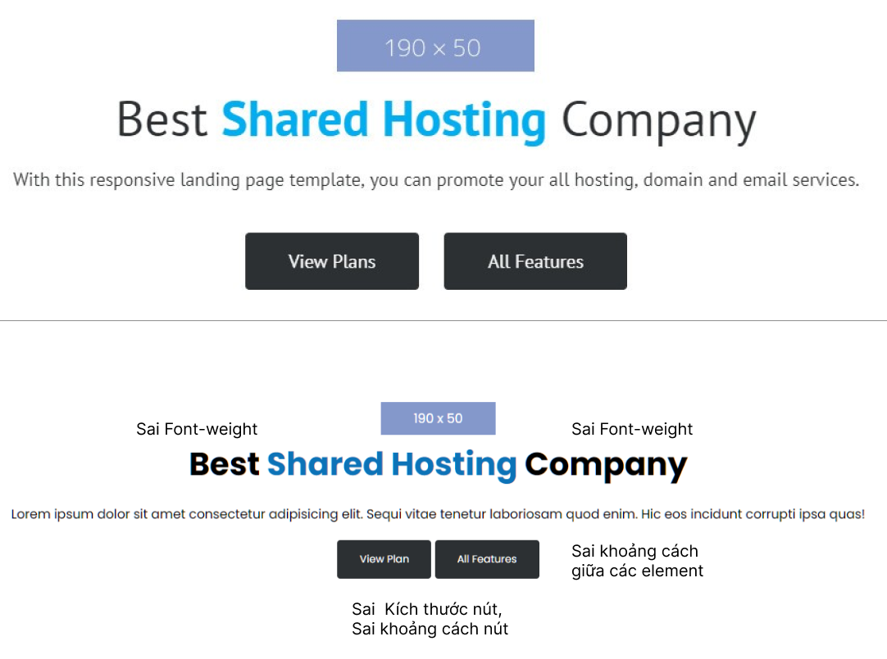

  - Chỉnh lại font-weight cho các phần tử sai

  - Chỉnh lại size, khoảng cách cho các phần tử

* Đánh giá chung bài tập về nhà: Bài làm tốt

- Sử dụng thẻ `br` bừa bãi

```html
<!-- Bài 1 -->
<p>321 Awesome Street <br />New York, NY 17022</p>
<!-- Bài 3 -->
<input type="radio" name="employment" /> Admin<br />
<input type="radio" name="employment" /> Engineer<br />
<input type="radio" name="employment" /> Manager<br />
...
<input type="checkbox" /> Mail<br />
<input type="checkbox" /> Payroll<br />
```

## [Dương Hiệp](https://github.com/duonghiep416/duonghiep_f8_fullstack)

- [x] [Bài 1](https://github.com/duonghiep416/duonghiep_f8_fullstack/tree/main/Day3/Ex1)

  - Bài làm tốt\*

  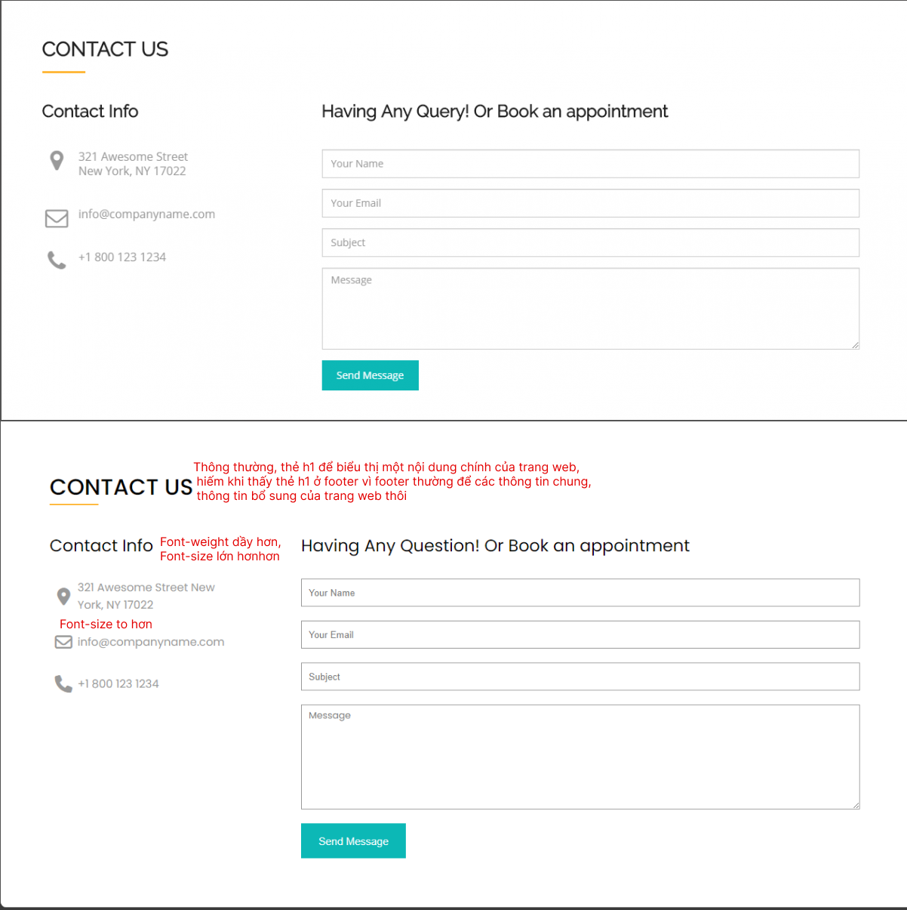

  - Chữ Contact Info nên cho font-size lớn hơn, font-weight lớn hơn

  - Icon nên cho font-size lớn hơn

  - Chữ nên cho font-size lớn hơn khoảng 2px nữa

  - Bộ chọn \* trong css là để chọn tất cả các thẻ html.

    - Nếu muốn tất cả font chữ trong html đều là "Poppins":

    ```css
    * {
      margin: 0;
      padding: 0;
      box-sizing: border-box;
      font-family: "Poppins", sans-serif;
    }
    ```

- [x] [Bài 2](https://github.com/duonghiep416/duonghiep_f8_fullstack/tree/main/Day3/Ex2)

  - Bài làm tốt\*

  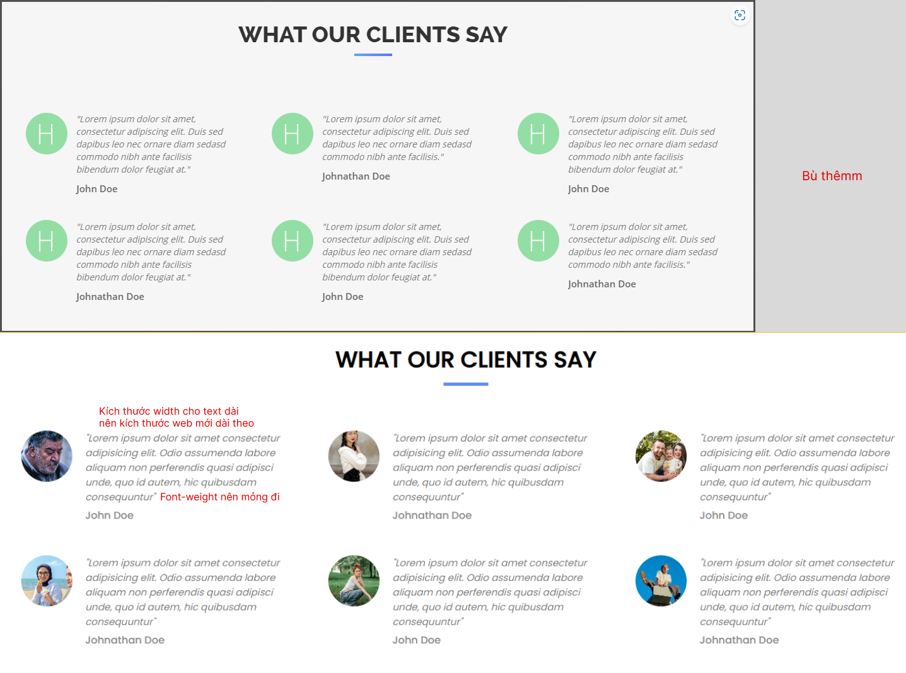

  - Giảm kích thước width của phần text đi một chút

  - Font-weight text nên giảm một chút (400)

- [x] [Bài 3](https://github.com/duonghiep416/duonghiep_f8_fullstack/tree/main/Day3/Ex3)

  - Bài làm tốt

  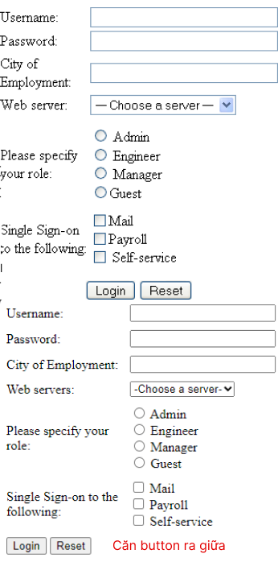

  - Sai layout, căn button ra giữa.

- [x] [Bài 4](https://github.com/duonghiep416/duonghiep_f8_fullstack/tree/main/Day3/Ex4)

  - Bài làm tốt\*

  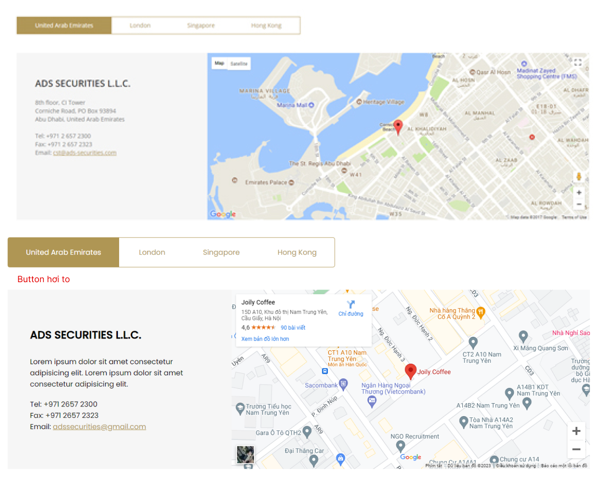

  - Chỉnh lại phần padding, hơi to so với bản mẫu

- [x] [Bài 5](https://github.com/duonghiep416/duonghiep_f8_fullstack/tree/main/Day3/Ex5)

  - Bài làm rất tốt \*

* Đánh giá chung bài tập về nhà:

  - Bài làm tốt, chỉ có một số chỗ nhỏ cần chỉnh lại

## [Sơn Ngô Mạnh](https://github.com/NgoManhson/f8-fullstack-exercises)

- [x] [Bài 1](https://github.com/NgoManhson/f8-fullstack-exercises/tree/main/day-03/ex-01)

  - Bài làm tốt\*

- [x] [Bài 2](https://github.com/NgoManhson/f8-fullstack-exercises/tree/main/day-03/ex-02)

  - Bài làm tốt\*

  - Phần thẻ `blockquote` được dùng để trích dẫn một đoạn văn bản nào đó từ một nguồn khác.

    - Ơ trường hợp này, các đánh giá của user cho mình không phải là một trích dẫn, nên không nên dùng thẻ `blockquote`.

    - Có thể tìm hiểu qua thẻ `q` (quote) để dùng cho các trường hợp này.

    ```html
    <blockquote>
      <i> </i>
    </blockquote>
    ```

    - Đổi thành

    ```html
    <q>
      <i> </i>
    </q>
    ```

- [x] [Bài 3](https://github.com/NgoManhson/f8-fullstack-exercises/tree/main/day-03/ex-03)

  - Bài làm tốt

  - Sai layout button, nên căn ra giữa

  - Tham khảo câu hỏi của bạn [Chi](https://fullstack-nodejs.fullstack.edu.vn/?id=84c9720d-54f7-488d-8d8d-e7c0ce7568b7) để sửa lại phần viền các select, input

- [x] [Bài 4](https://github.com/NgoManhson/f8-fullstack-exercises/tree/main/day-03/ex-04)

  - Bài làm tốt

  - Sai layout phần nút, đang bị xuống dòng cho text

    - Sửa lại phần css như sau la có vẻ đúng layout hơn

    ```css
    .contact-tab > li > a {
      display: block;
      padding: 8px;
      color: #b09757;
      margin-right: ...;
    }
    ```

- [x] [Bài 5](https://github.com/NgoManhson/f8-fullstack-exercises/tree/main/day-03/ex-05)

  - Bài làm rất tốt \*

* Đánh giá chung bài tập về nhà:

  - Bài làm tốt, chỉ có một số chỗ nhỏ cần chỉnh lại

## [Nguyen Xuan Tuan Anh](https://github.com/xuananh2212/bt_03.git)

- [x] [Bài 1](https://github.com/xuananh2212/bt_03.git)

  - Bài làm tốt

  - Style cho chữ hơi chìm màu so với nền, user sẽ nhầm là bị disable

  - Chữ heading hơi nhỏ.

- [x] [Bài 2](https://github.com/xuananh2212/bt_03.git)

  - Bài làm tốt

  - Nên thêm phần line-height cho phần text, để text không bị dính vào nhau

  - Phần thẻ `blockquote` được dùng để trích dẫn một đoạn văn bản nào đó từ một nguồn khác.

    - Ở trường hợp này, các đánh giá của user cho mình không phải là một trích dẫn, nên không nên dùng thẻ `blockquote`.

    - Có thể tìm hiểu qua thẻ `q` (quote) để dùng cho các trường hợp này.

  - Phần hiển thị tên người comment chỉ là hiển thị tên của user, không phải một title nào đó, nên không nên dùng thẻ `h2`.

    - Có thể dùng thẻ `p` để hiển thị tên của user

  - Các phần img hiển hị một avatar của user, cần thiết để một thuộc tính alt có ý nghĩa

  ```html
  
  ```

- [x] [Bài 3](https://github.com/xuananh2212/bt_03.git)

  - Bài làm Rất TỐT \*\*

  - Cần được tuyên dương trước lớp vì khả năng tự học tốt

- [x] [Bài 4](https://github.com/xuananh2212/bt_03.git)

  - Bài làm tốt \*

  - Font trong bản mẫu là một font chữ không chân. Nên sửa lại font chữ cho phù hợp

- [x] [Bài 5](https://github.com/xuananh2212/bt_03.git)

  - Bài làm tốt

  - Phần nút hơi to so với bản gốc.

  - Phần chữ title màu xanh cần cho font-weight lớn hơn

* Đánh giá chung bài tập về nhà:

- Bài làm tốt, chỉ có một số chỗ nhỏ cần chỉnh lại

- Có file reset.css tuy nhiên không được sử dụng.

## [Luu Anh Quan](https://github.com/anhquan2211/exercise-offline-f8-day3)

- [x] [Bài 1](https://github.com/anhquan2211/exercise-offline-f8-day3)

  - Bài làm tốt\*

  - Phần chữ hơi chìm màu so với nền, user sẽ nhầm là bị disable

  - Phần message vẫn để mặc định value khiến UX không tốt.

    - Vì để default value nên phải style cho màu chữ chìm đi. Điều đó cũng khiến user không biết phải nhập gì vào đó.

    - Cái này nói 2 lần rồi

  - Chữ heading hơi to so với bản gốc.

  - Nút send có sáng tạo, tuy nhiên việc hover vào chuyển sang màu xám làm cho user nhầm là nút bị disable.

    - Nên để màu xám nhạt hơn, hoặc để màu xám nhưng có thể hover vào thì chuyển sang màu khác.

  - Vì đây là một trang contact, thẻ hiển thị chữ heading nên là h1

  ```html
  <h2 class="section-heading">CONTACT US</h2>
  ```

  - Các phần Contact info và Query là một title dưới cấp của heading. Nên dùng thẻ h2 thay vì p

  ```html
  <p class="info-heading">Contact Info</p>
  ...
  <p class="form-heading">Having Any Query! Or Book an appointment</p>
  ```

  - Phần text-area nên để placeholder thay vì value

- [x] [Bài 2](https://github.com/anhquan2211/exercise-offline-f8-day3)

  - Bài làm tốt \*

- [x] [Bài 3](https://github.com/anhquan2211/exercise-offline-f8-day3)

  - Bài làm Rất TỐT \*\*

  - Cần được tuyên dương trước lớp vì khả năng tự học tốt

  - Tuy nhiên phần checkbox thiếu dấu tích, nên sửa lại

    - Đề xuất sử dụng một background có dấu tích, và sử dụng thuộc tính background-size để chỉnh lại kích thước cho phù hợp

- [x] [Bài 4](https://github.com/anhquan2211/exercise-offline-f8-day3)

  - Bài làm tốt \*

- [x] [Bài 5](https://github.com/anhquan2211/exercise-offline-f8-day3)

  - Bài làm tốt

* Đánh giá chung bài tập về nhà:

  - Bài làm tốt, chỉ có một số chỗ nhỏ cần chỉnh lại

## [Mai Việt Hoàng](https://github.com/Viethoang-Mai/MVH-fullstack-nodejs-F8-01.git)

- [x] [Bài 1](https://github.com/Viethoang-Mai/MVH-fullstack-nodejs-F8-01.git)

  - Bài làm tốt\*

  - Phần chữ hơi chìm màu so với nền, user sẽ nhầm là bị disable

  - input, message thiếu padding left khiến cho UX không tốt

  - Phần heading, button đều hơi to, khiến cho user nhìn sẽ khó chịu

  - Font roboto hiện đã có sẵn, không cần import từ google font, điều đó khiến cho trang web load chậm hơn

- [x] [Bài 2](https://github.com/Viethoang-Mai/MVH-fullstack-nodejs-F8-01.git)

  - Bài làm tốt\*

  - Phần text nên để màu nhạt hơn, để cho user dễ nhìn hơn

    - Không nên để text có độ tương phản quá cao (#000) hoặc quá thấp

    - Điều đó khiến cho user nhìn sẽ khó chịu

- [x] [Bài 3](https://github.com/Viethoang-Mai/MVH-fullstack-nodejs-F8-01.git)

  - Bài làm tốt\*

  - Có thể xem qua câu hỏi của bạn [Chi](https://fullstack-nodejs.fullstack.edu.vn/?id=84c9720d-54f7-488d-8d8d-e7c0ce7568b7) để sửa lại phần viền các select, input

- [x] [Bài 4](https://github.com/Viethoang-Mai/MVH-fullstack-nodejs-F8-01.git)

  - Bài làm tốt \*

  - Các phần nút hover không nên để animation quá chậm (0.5s)

    - Nên để từ 0.3s đến 0.1s là tốt nhất

- [x] [Bài 5](https://github.com/Viethoang-Mai/MVH-fullstack-nodejs-F8-01.git)

  - Bài làm tốt\*

* Đánh giá chung bài tập về nhà:

  - Bài làm tốt, chỉ có một số chỗ nhỏ cần chỉnh lại

## [Tuấn Phạm](https://github.com/phamtuan162/phamtuan-nodejs-01)

- [x] [Bài 1](https://github.com/phamtuan162/phamtuan-nodejs-01)

  - Bài làm tốt \*

  - Phần màu chữ hơi chìm màu so với nền, user sẽ nhầm là bị disable

  - Code không format, rất khó nhìn

- [x] [Bài 2](https://github.com/phamtuan162/phamtuan-nodejs-01)

  - Bài làm tốt \*

  - Nên thêm line-height vài text cho giống với bản mẫu

  - Thẻ `blockquote` được dùng để trích dẫn một đoạn văn bản nào đó từ một nguồn khác.

    - Ở trường hợp này, các đánh giá của user cho mình không phải là một trích dẫn, nên không nên dùng thẻ `blockquote`.

    - Có thể tìm hiểu qua thẻ `q` (quote) để dùng cho các trường hợp này.

- [x] [Bài 3](https://github.com/phamtuan162/phamtuan-nodejs-01)

  - Bài làm tốt \*

  - Có thể tham khảo câu hỏi của bạn [Chi](https://fullstack-nodejs.fullstack.edu.vn/?id=84c9720d-54f7-488d-8d8d-e7c0ce7568b7) để sửa lại phần viền các select, input
  - Nên thêm padding left cho input để tăng UX

- [x] [Bài 4](https://github.com/phamtuan162/phamtuan-nodejs-01)

  - Bài làm tốt\*

- [x] [Bài 5](https://github.com/phamtuan162/phamtuan-nodejs-01)

  - Bài làm tốt\*

* Đánh giá chung bài tập về nhà:

  - Bài làm tốt, chỉ có một số chỗ nhỏ cần chỉnh lại

## [Hoài Nam Đỗ](https://github.com/oaiHmaN25/btvn.git)

- [x] [Bài 1](https://github.com/oaiHmaN25/btvn.git)

  - CODE LẠI

- [x] [Bài 2](https://github.com/oaiHmaN25/btvn.git)

  - CODE LẠI

- [x] [Bài 3](https://github.com/oaiHmaN25/btvn.git)

  - CODE LẠI

- [x] [Bài 4](https://github.com/oaiHmaN25/btvn.git)

  - Bài làm không tốt

  - Sai phần navbar

  - Các phần text có khoảng cách không hợp lỹ, sai với layout mẫu

  - Phần Map iframe không đúng với kích thước, sai với layout mẫu

  - CODE LẠI

- [x] [Bài 5](https://github.com/oaiHmaN25/btvn.git)

  - Sử dụng font chữ sai so với bản mẫu

  - Các phần text title không có font-weight như bản mẫu

* Đánh giá chung bài tập về nhà:

  - Bài làm KHÔNG TỐT. CODE LẠI!

## [Minh Quang](https://github.com/taminhquang13/Bai_Tap_F8.git)

- [x] [Bài 1](https://github.com/taminhquang13/Bai_Tap_F8.git)

  - CODE LẠI

- [x] [Bài 2](https://github.com/taminhquang13/Bai_Tap_F8.git)

  - Chưa căn giữa các phần tử

  - Phần line-height chưa đúng với bản mẫu

  - Chưa có phần nghiêng chữ như ở bản mẫu

- [x] [Bài 3](https://github.com/taminhquang13/Bai_Tap_F8.git)

  - Khi bấm vào label chưa active được input

  - Sai layout phần input

- [x] [Bài 4](https://github.com/taminhquang13/Bai_Tap_F8.git)

  - Bài làm không tốt

  - Phần nav cần cách phần content một đoạn

  - Phần map cao hơn phần content bên trái nên bị lệch layout

  - CODE LẠI

- [x] [Bài 5](https://github.com/taminhquang13/Bai_Tap_F8.git)

  - Sử dụng font chữ sai so với bản mẫu

  - Các phần text title không có font-weight như bản mẫu

* Đánh giá chung bài tập về nhà:

  - Bài làm không tốt, cần chú ý thêm

## [Trung Le](https://github.com/Trungdeptraii/Le_Van_Trung-11-06-2023-Day3.git)

- [x] [Bài 1](https://github.com/Trungdeptraii/Le_Van_Trung-11-06-2023-Day3.git)

  - Layout quá xấu so với bản mẫu

  - Sử dụng font chữ có chân là sai với bản mẫu

  - Các phần text, icon nên có màu xám đậm để giống với bản mẫu

- [x] [Bài 2](https://github.com/Trungdeptraii/Le_Van_Trung-11-06-2023-Day3.git)

  - Bài làm tốt \*

  - Khoảng cách giữa các item quá to so với bản mẫu

  - Sử dụng font chữ có chân là sai với bản mẫu

- [x] [Bài 3](https://github.com/Trungdeptraii/Le_Van_Trung-11-06-2023-Day3.git)

  - Bài làm tốt \*

  - Có thể xem qua câu hỏi của bạn [Chi](https://fullstack-nodejs.fullstack.edu.vn/?id=84c9720d-54f7-488d-8d8d-e7c0ce7568b7) để sửa lại phần viền các select, input

- [x] [Bài 4](https://github.com/Trungdeptraii/Le_Van_Trung-11-06-2023-Day3.git)

  - Bài làm tốt

  - Phần title của page nên là thẻ h1 thay vì h2

  ```html
  <h2>ADS SECURITIES L.L.C</h2>
  ```

  - Chỉnh lại màu border của navbar

- [x] [Bài 5](https://github.com/Trungdeptraii/Le_Van_Trung-11-06-2023-Day3.git)

  - Sử dụng font chữ sai so với bản mẫu.

  - Các phần text title không có font-weight như bản mẫu.

  - Các button, text button to nên nhìn quá ngợp so với bản mẫu.

* Đánh giá chung bài tập về nhà:

  - Bài làm tốt, cần chú ý thêm

## [Phan Trung Hiếu](https://github.com/pth2003/HOMEWORK/tree/main/btvn_buoi_3)

- Nên chia bài tập về nhà theo count, việc chia theo count sẽ giúp cho việc đánh giá bài tập về nhà dễ dàng hơn
- [x] [Bài 1](https://github.com/pth2003/HOMEWORK/tree/main/btvn_buoi_3)

  - Phần input có màu chữ quá chìm so với màu nền

    - Còn chìm hơn cả màu của placeholder

    - Code lại phần input

- [x] [Bài 2](https://github.com/pth2003/HOMEWORK/tree/main/btvn_buoi_3)

  - Phần ảnh quá bé so với bản mẫu

  - Phần text thiếu line-height, các text bị dính vào nhau

  - Thiếu 2 dấu "" ở phần text

  - Phần text thiếu in nghiêng.

  - Quá lệch so với bản mẫu. Code lại

- [x] [Bài 3](https://github.com/pth2003/HOMEWORK/tree/main/btvn_buoi_3)

  - Bài làm tốt

  - Có thể xem qua câu hỏi của bạn [Chi](https://fullstack-nodejs.fullstack.edu.vn/?id=84c9720d-54f7-488d-8d8d-e7c0ce7568b7) để sửa lại phần viền các select, input

  - Thiếu khoảng cách giữa các input và label của nó.

  - Phần password nên để type là password để che đi các kí tự nhập vào

- [x] [Bài 4](https://github.com/pth2003/HOMEWORK/tree/main/btvn_buoi_3)

  - Bài làm tốt \*

  - Phần iframe thiếu khoảng cách khiến nó không liền mạch với phần content bên trái

    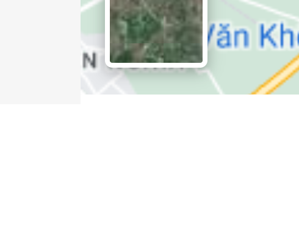

- [x] [Bài 5](https://github.com/pth2003/HOMEWORK/tree/main/btvn_buoi_3)

  - Bài làm tốt.

  - Phần text có chữ quá chìm màu so với nền

* Đánh giá chung bài tập về nhà:

  - Bài làm tốt, cần chú ý thêm về layout mẫu ở một số tiểu tiết.

## [Nam Nguyễn](https://github.com/namnguyen2603/nguyentrungnam_bai3.git)

- [x] [Bài 1](https://github.com/namnguyen2603/nguyentrungnam_bai3.git)

  - Sai font chữ rất nhiều chỗ.

  - Phần text bị xuống dòng không được đúng với bản mẫu. Không được xuống dòng ở dưới phần icon.

    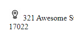

  - Nên thêm padding cho phần input để tăng UX

  - Căn giữa các icon và text tương ứng

- [x] [Bài 2](https://github.com/namnguyen2603/nguyentrungnam_bai3.git)

  - Thiếu bo góc cho phần avatar

  - Các phần text hơi khó nhìn, có thể là do màu chữ hơi tương phản cao

  - Phần text thiếu line-height, các text bị dính vào nhau

  - Một số chỗ bị lặp dấu nháy. Có thể sử dụng thẻ `q` để trích dẫn

  - Các phần text đều sai font chữ. Sử dụng một font chữ không chân thay thế

- [x] [Bài 3](https://github.com/namnguyen2603/nguyentrungnam_bai3.git)

  - Bài làm tốt \*

  - Có thể xem qua câu hỏi của bạn [Chi](https://fullstack-nodejs.fullstack.edu.vn/?id=84c9720d-54f7-488d-8d8d-e7c0ce7568b7) để sửa lại phần viền các select, input

  - Thiếu khoảng cách giữa các input và label của nó.

- [x] [Bài 4](https://github.com/namnguyen2603/nguyentrungnam_bai3.git)

  - Bài làm tốt

  - Phần nav bị lệch nhau do rất nhiều yếu tố style quá bừa bãi.

    - Header đang ăn height vào phần content

    - Sử dụng từng class cho từng phần tử, không dùng class chung cho nhiều phần tử

    - Sử dụng position chưa thành thạo gây ra lỗi layout.

      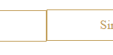

- [x] [Bài 5](https://github.com/pth2003/HOMEWORK/tree/main/btvn_buoi_3)

  - Bài làm tốt.

  - Phần heading nên để font-weight lớn hơn ở phần chữ xanh

  - Các button cần có thêm border-radius để bo góc

* Đánh giá chung bài tập về nhà:

  - Bài làm tốt, cần chú ý thêm về layout mẫu ở một số tiểu tiết.

## [Nguyễn Duy An](https://github.com/nguyenduyan9/fullstack.git)

- [x] [Bài 1](https://github.com/nguyenduyan9/fullstack.git)

  - Quá sai so với bản mẫu

  - CODE LẠI

- [x] [Bài 2](https://github.com/nguyenduyan9/fullstack.git)

  - Bài làm tốt\*

  - Thiếu "" ở các phần quote như bản mẫu. Có thể sử dụng thẻ `q` để trích dẫn

  - Phần font chữ ở heading hơi sai. Nên sử dụng một font chữ không chân thay thế

- [x] [Bài 3](https://github.com/nguyenduyan9/fullstack.git)

  - Quá sai so với bản mẫu

  - CODE LẠI

- [x] [Bài 4](https://github.com/nguyenduyan9/fullstack.git)

  - Bài làm chưa tốt lắm

  - Chưa chỉn chu về layout

  - Nên sử dụng một font chữ không chân thay thế

  - Các phần text nên có line-height để tăng UX

  - Thiếu một background màu cho phần content để tăng sự nổi bật và liên kết giữa các elements

- [x] [Bài 5](https://github.com/nguyenduyan9/fullstack.git)

  - Bài làm tốt

  - Nên sử dụng một font chữ không chân thay thế.

  - Phần text heading có màu nên thêm font-weight để giống với bản mẫu

  - Đoạn text:

  ```text
  With this resposive langding page template ,you can promote your all hosting, domain and email servic
  ```

  - Bị lỗi chính tả: resposive -> responsive, servic -> service, dấu " ," -> ", "

* Đánh giá chung bài tập về nhà:

  - Bài chưa được tốt, cần chú ý thêm nhiều về layout mẫu ở một số tiểu tiết.

    - Nên đặt tên folder có ý nghĩa tường minh hơn.

    - Bài tập hôm nay thì để là `homework` nhưng bài hôm qua lại là `homework2` ?
