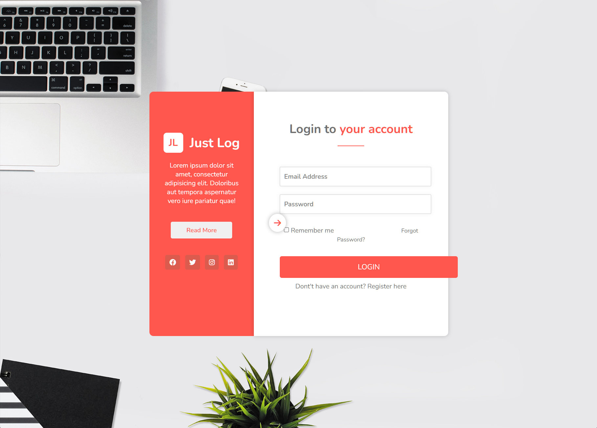
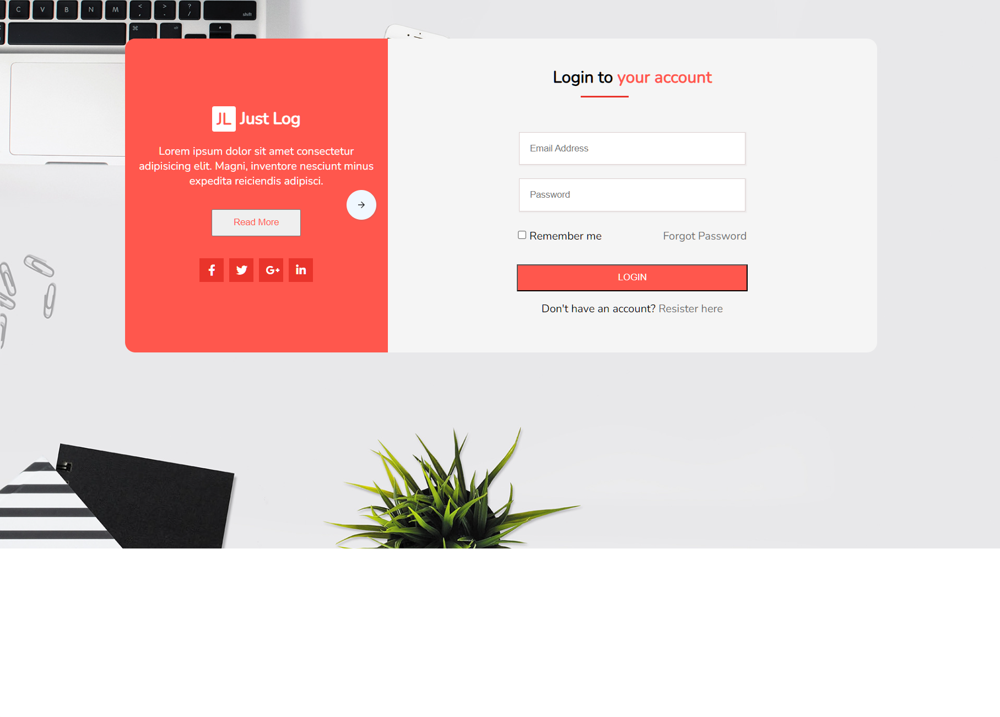
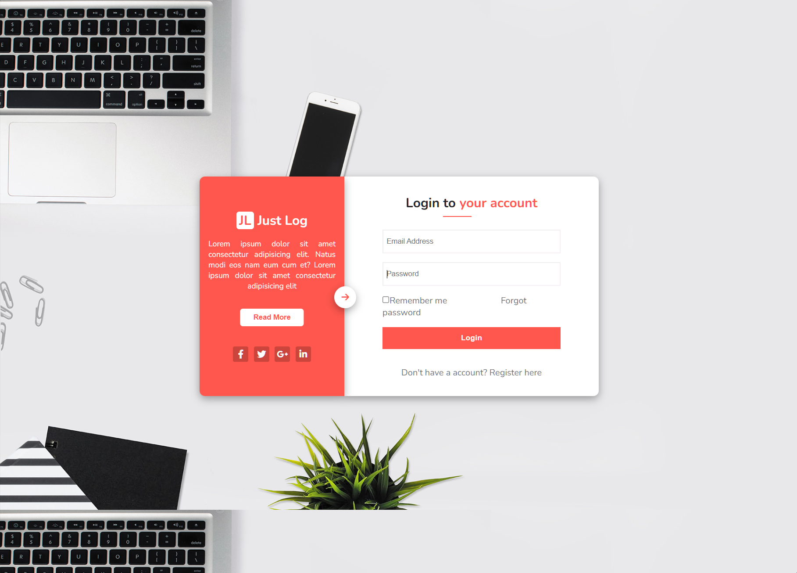

# Dương test bài Học Viên

## [Bi11-043 Đỗ Hà Chi](https://github.com/SerenaHa12/fullstack_nodeJS)

    Sớm nhất *

- [x] [Bài 1](https://github.com/SerenaHa12/fullstack_nodeJS/tree/main/btvn_06/ex01)

  Bài làm rất tốt \*

  Có thể bọc `ul` vào thẻ `nav` để thể hiện cho đúng về mặt ngữ nghĩa là một thanh điều hướng.

---

- [x] [Bài 2](https://github.com/SerenaHa12/fullstack_nodeJS/tree/main/btvn_06/ex02)

  Bài làm tốt \*

  Thiếu phần shadow của các icon.

  Khi hover vào `.item` phần border làm cho chúng bị to lên 1px và bị giật layout. Có thể sử dụng `outline` để thay thế cho `border` trong trường hợp này.

  Cần tối ưu lại CSS phần này:

  ```css
  #item_01:hover {
    border: 1px solid #e10c0c;
  }

  #item_02:hover {
    border: 1px solid #00e9f9;
  }

  #item_03:hover {
    border: 1px solid #ffd700;
  }

  #item_04:hover {
    border: 1px solid #0000ff;
  }

  #item_05:hover {
    border: 1px solid #800080;
  }

  #item_06:hover {
    border: 1px solid #008000;
  }
  ```

  Đề xuất sửa thành:

  ```css
  .item:hover {
    outline: 1px solid transparent;
  }
  #item_01:hover {
    outline-color: #e10c0c;
  }

  #item_02:hover {
    outline-color: #00e9f9;
  }

  #item_03:hover {
    outline-color: #ffd700;
  }

  #item_04:hover {
    outline-color: #0000ff;
  }

  #item_05:hover {
    outline-color: #800080;
  }

  #item_06:hover {
    outline-color: #008000;
  }
  ```

---

- [x] [Bài 3](https://github.com/SerenaHa12/fullstack_nodeJS/tree/main/btvn_06/ex03)

  Bài làm tốt \*

  Có thể do fix cứng kích thước và position của các phần tử nên khi màn hình nhỏ hơn thì các phần tử bị tràn ra ngoài.

  

  Đề xuất một số css để sửa:

  ```css
  .login-switch {
    position: absolute;
    top: 50%;
    right: -20.5px; /*Một nửa chiều rộng của phần tử*/
  }
  .login-description {
    position: relative; /*Để phần tử con có thể sử dụng position absolute*/
  }
  .login-form button {
    width: 100%; /*Để phần tử con chỉ căn đều bên trong, không bị thừa ra ngoài.*/
  }
  ```

---

- Đánh giá chung bài tập về nhà: Bài làm tốt, tuy nhiên phần CSS chưa đủ tối ưu tốt.

## [Sơn Ngô Mạnh](https://github.com/NgoManhson/f8-fullstack-exercises)

- [x] [Bài 1](https://github.com/NgoManhson/f8-fullstack-exercises)

  Bài làm rất tốt \*

---

- [x] [Bài 2](https://github.com/NgoManhson/f8-fullstack-exercises)

  Bài làm rất tốt \*

  Thiếu phần shadow của các icon.

---

- [x] [Bài 3](https://github.com/NgoManhson/f8-fullstack-exercises)

  Bài làm rất tốt \*

  Phần `.form-left:after` có 2 đoạn code css font-family khác nhau.

  ```css
  .form-left::after {
    font-family: "FontAwesome";
    ...
    font-family: fontAwesome;
    ...
  }
  ```

---

- Đánh giá chung bài tập về nhà: Bài làm rất tốt. Chỉ cần chú ý lại một chút về phần CSS là được.

## [Nguyen Xuan Tuan Anh](https://github.com/xuananh2212/full_stack_01.git)

- [x] [Bài 1](https://github.com/xuananh2212/full_stack_01.git)

  Bài làm tốt \*

  Phần mũi tên tam giác, các icon trong list con bị lệch so với bản mẫu

  Các li rỗng nên xử lý lại, ở phần nav, khi hover vào li rỗng vẫn lên màu

  Phần li con để làm hình tam giác có thể sử dụng `::before` hoặc `::after` để tạo ra hình tam giác, không cần phải dùng thêm thẻ `li`

---

- [x] [Bài 2](https://github.com/xuananh2212/full_stack_01.git)

  Bài làm rất tốt \*

  Thiếu phần shadow của các icon.

---

- [x] [Bài 3](https://github.com/xuananh2212/full_stack_01.git)

  Bài làm rất tốt \*

  Phần className `.bg__logn-in` không rõ là gì.

  Sai chính tả `Remeber me` -> `Remember me`

  Do phần css này nên hình ảnh bị khuyết vì hình ảnh đã bị đẩy ra ngoài phần hiển thị.

  Không nên để width và height là 100vw và 100vh, nên để là `100%` hoặc `min-width`, `min-height` để phù hợp với mọi kích thước màn hình.

  ```css
  .bg__logn-in {
    width: 100vw;
    height: 100vh;
    background-size: cover;
    background-position: -4px -259px;
  }
  ```

  

---

- Đánh giá chung bài tập về nhà: Bài làm rất tốt.

## [Dương Hiệp](https://github.com/duonghiep416/duonghiep_f8_fullstack.git)

- [x] [Bài 1](https://github.com/duonghiep416/duonghiep_f8_fullstack.git)

  Bài làm rất tốt \*

  Phần mũi tên đang bị ở dưới list. Không đúng với bản mẫu.

---

- [x] [Bài 2](https://github.com/duonghiep416/duonghiep_f8_fullstack.git)

  Bài làm tốt \*

  Thiếu phần shadow của các icon.

  Icon trong bản mẫu là màu linear. Nhưng trong bài làm lại là màu đơn.

---

- [x] [Bài 3](https://github.com/duonghiep416/duonghiep_f8_fullstack.git)

  Bài làm rất tốt \*

  Thiếu phần shadow cho icon ở giữa.

---

- Đánh giá chung bài tập về nhà: Bài làm rất tốt, cần chú ý thêm vào tiểu tiết để bài tập được chỉn chu hơn.

## [Mai Việt Hoàng](https://github.com/Viethoang-Mai/MVH-fullstack-nodejs-F8-01.git)

- [x] [Bài 1](https://github.com/Viethoang-Mai/MVH-fullstack-nodejs-F8-01.git)

  Bài làm rất tốt \*

---

- [x] [Bài 2](https://github.com/Viethoang-Mai/MVH-fullstack-nodejs-F8-01.git)

  Bài làm tốt \*

  Thiếu phần shadow của các icon.

  Khi bỏ transition, effect bị giật xuống, không mượt.

---

- [x] [Bài 3](https://github.com/Viethoang-Mai/MVH-fullstack-nodejs-F8-01.git)

  Bài làm tốt

  Làm sai mẫu. Thiếu icon ở giữa.

---

- Đánh giá chung bài tập về nhà: Bài làm tốt, cần chú ý vào bản mẫu để làm đúng hơn.

## [Nguyễn Thành Dương](https://github.com/duongano/day3.git)

- [x] [Bài 1](https://github.com/duongano/day3.git)

  Bài làm tốt \*

  Giao diện quá xấu so với mẫu.

  Sử dụng sai font chữ.

  Khi hover màu chữ chưa đổi.

  Khi hover `.menu.box` vẫn bị đổi màu.

---

- [x] [Bài 2](https://github.com/duongano/day3.git)

  Bài làm tốt \*

  Thiếu phần shadow của các icon.

  Khi hover phần `border` làm cho chúng bị to lên 1px và bị giật layout. Có thể sử dụng `outline` để thay thế cho `border` trong trường hợp này.

---

- [x] [Bài 3](https://github.com/duongano/day3.git)

  Bài làm tốt

  Phần icon chưa ở đúng vị trí.

  Phần body chưa set đúng chiều cao nên hình ảnh bị lệch.

  

---

- Đánh giá chung bài tập về nhà: Bài làm tốt, cần chú ý vào bản mẫu để làm đúng hơn.

## [Luu Anh Quan](https://github.com/anhquan2211/exercise-offline-F8-day6.git)

- [x] [Bài 1](https://github.com/anhquan2211/exercise-offline-F8-day6.git)

  Bài làm rất tốt \*

---

- [x] [Bài 2](https://github.com/anhquan2211/exercise-offline-F8-day6.git)

  Bài làm rất tốt \*

  Thiếu phần shadow cho icon.

---

- [x] [Bài 3](https://github.com/anhquan2211/exercise-offline-F8-day6.git)

  Bài làm rất tốt \*

---

- Đánh giá chung bài tập về nhà: Bài làm rất tốt \*

## [Minh Quang](https://github.com/taminhquang13/Bai_Tap_F8)

- [x] [Bài 1](https://github.com/taminhquang13/Bai_Tap_F8)

  Bài làm tốt \*

  Nên chú ý thêm vào meta title, vì chúng rất quan trọng trong SEO và trải nghiệm người dùng.

  Giao diện quá xấu so với bản mẫu.

  Sai giao diện khi menu hover không có khoảng cách và mũi tên

---

- [x] [Bài 2](https://github.com/taminhquang13/Bai_Tap_F8)

  Bài làm tốt \*

  Nên chú ý thêm vào meta title, vì chúng rất quan trọng trong SEO và trải nghiệm người dùng.

  UI quá lệch so với bản mẫu:

  - Chữ quá to

  - Sai màu icon

  - Thiếu shadow icon

---

- [x] [Bài 3](https://github.com/taminhquang13/Bai_Tap_F8)

  Phần hover mới hiện ra là không tốt, việc sáng tạo ra nó khiến người dùng khó dùng, không thoải mái.

  Việc hover không xử lý tốt khiến màn hình bị giật, không tốt cho người dùng

  Nên chú ý thêm vào meta title, vì chúng rất quan trọng trong SEO và trải nghiệm người dùng.

---

- Đánh giá chung bài tập về nhà: Bài làm không tốt, cần chú ý đến giao diện mẫu, không được ẩu, cũng không sáng tạo, việc sáng tạo đôi khi khiến mọi thứ quá rối, không tốt một chút nào. Làm lại toàn bộ bài 2, 3

## [Tuấn Phạm](https://github.com/phamtuan162/phamtuan-nodejs-01)

- [x] [Bài 1](https://github.com/phamtuan162/phamtuan-nodejs-01)

  Bài làm rất tốt \*

  Phần `.navbar__menu` có một style không rõ ý đồ:

  ```css
  .navbar__menu {
    transition: 0.5s;
  }
  ```

---

- [x] [Bài 2](https://github.com/phamtuan162/phamtuan-nodejs-01)

  Bài làm rất tốt \*

---

- [x] [Bài 3](https://github.com/phamtuan162/phamtuan-nodejs-01)

  Bài làm rất tốt \*

---

- Đánh giá chung bài tập về nhà: Bài làm rất tốt. Cần chú ý tối ưu lại một chút về phần CSS.

## [Phan Trung Hiếu](https://github.com/pth2003/HOMEWORK/tree/main/BTVN/btvn_buoi_6)

- [x] [Bài 1](https://github.com/pth2003/HOMEWORK/tree/main/BTVN/btvn_buoi_6)

  Bài làm tốt \*

  Giao diện hơi xấu so với bản mẫu.

  Phần mũi tên bị chìm so với box menu. Nên để mũi tên ở trên box menu.

---

- [x] [Bài 2](https://github.com/pth2003/HOMEWORK/tree/main/BTVN/btvn_buoi_6)

  Bài làm tốt \*

  Thiếu phần shadow của các icon.

  Phần icon là background linear gradient, không phải là màu đơn.

---

- [x] [Bài 3](https://github.com/pth2003/HOMEWORK/tree/main/BTVN/btvn_buoi_6)

  Bài làm tốt

  Layout bị vỡ ở các màn hình khác.

  

---

- Đánh giá chung bài tập về nhà: Bài làm tốt. Tuy nhiên cần chú ý thêm vào bản mẫu để làm đúng hơn.

## [Hoài Nam Đỗ](https://github.com/oaiHmaN25/btvn.git)

- [x] [Bài 1](https://github.com/oaiHmaN25/btvn.git)

  Bài làm **Không Tốt**

  Sai giao diện, không giống bản mẫu.

  Code lại.

---

- [x] [Bài 2](https://github.com/oaiHmaN25/btvn.git)

  Bài làm chưa tốt

  Thiếu phần background của icon.

  Layout hơi xấu so với bản mẫu.

  Code lại.

---

- [x] [Bài 3](https://github.com/oaiHmaN25/btvn.git)

  Layout quá xấu so với bản mẫu.

  Thiếu rất nhiều chỗ.

  Code lại.

---

- Đánh giá chung bài tập về nhà: Bài làm không tốt. Code lại toàn bộ.

## [Dương Quốc Anh](https://github.com/QuocAnh-bit/F8_fullstack_006.git)

- [x] [Bài 1](https://github.com/QuocAnh-bit/F8_fullstack_006.git)

  Bài làm tốt \*

  Giao diện hơi xấu so với bản mẫu.

  Chưa có phần gạch chân ngăn cách các `list-item` con.

---

- [x] [Bài 2](https://github.com/QuocAnh-bit/F8_fullstack_006.git)

  Bài làm rất tốt \*

  Thiếu phần shadow của các icon và các box.

  Các background của icon không phải là màu đơn mà là màu linear.

  Khi hover, phần `border` làm cho chúng bị to lên một chút và bị giật layout. Có thể sử dụng `outline` để thay thế cho `border` trong trường hợp này.

---

- [x] [Bài 3](https://github.com/QuocAnh-bit/F8_fullstack_006.git)

  Vỡ layout

  

  Phần icon chưa ở đúng vị trí (icon bị lệch so với bản mẫu).

  Sau khi sáng tạo, giao diện xấu hơn bản mẫu rất nhiều.

  Khi click vào `Remember me` thì phần checkbox không được check.

---

- Đánh giá chung bài tập về nhà: Bài làm tạm ổn, tuy nhiên cần chú ý thêm vào bản mẫu để làm đúng hơn. Đừng sáng tạo, làm theo bản mẫu là được.
