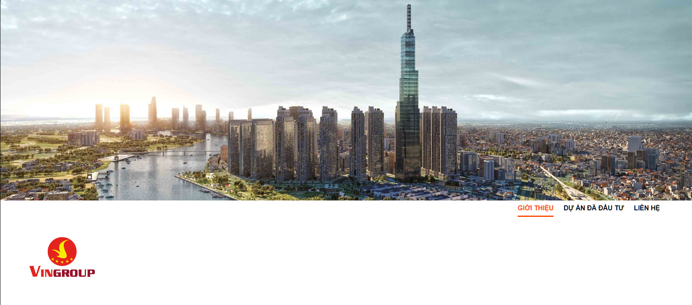
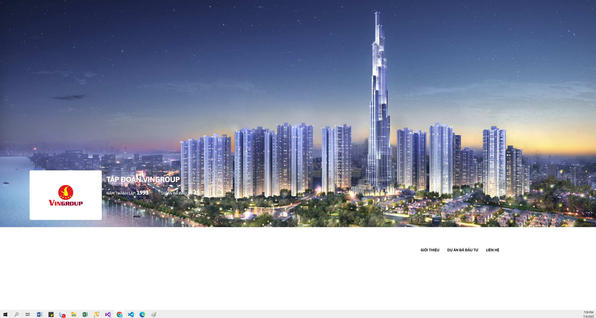

# Dương review bài học viên Fullstack NodeJS K2 Day 7

## [Đoàn Duy Chinh](https://duychinh.github.io/f8-fullstack-KS2/Day-7/day7.html)

    Sớm nhất

---

- [x] Bài 1: Bài làm tốt

  Chưa giống với bản mẫu cần làm chỉn chu hơn.

  Background image cần full màn hình.

  Nên sử dụng thuộc tính `cursor` để thay đổi thành `pointer` giúp cho trải nghiệm người dùng tốt hơn khi di chuyển vào tiêu đề.

---

- [x] Bài 2: Bài làm tốt

  Chưa giống với bản mẫu cần làm chỉn chu hơn.

  Phần background cần sử dụng thuộc tính `overlay` để làm nổi bật phần chữ lên.

  Phần `navbar` cần bổ sung active vào mục "Giới thiệu" giống với bản mẫu hơn.

---

- [x] Bài 3:

  Chưa giống với bản mẫu:

  Màu background và text khi hover vào các item trong `navbar` cần cho nhạt hơn và đúng màu với thiết kế bản mẫu.

  Trong `navbar` cần active cho thẻ li đầu tiên theo đúng thiết kế.

  Xem lại cách đặt class: Các row có css giống nhau chỉ cần để chung class `row` không nên tách `row-1`, `row-2`. Tương tự với các class `image`.

  Các image có text cần sử dụng thuộc tính `overlay` để làm nổi bật phần chữ.

  Nên tối ưu lại code.

---

- [x] Đánh giá chung về bài tập về nhà: Bài làm tốt, tuy nhiên cần tuân thủ theo bản mẫu về màu sắc, khoảng cách và độ lớn của các phần tử. Một số chỗ chưa chỉn chu, cần khắc phục và tối ưu lại code.

---

## [Thế Nguyễn Đại](https://daithehh04.github.io/fullstack/day7/)

---

- [x] Bài 1: Bài làm tốt

  Phần **block** cần sử dụng thêm thuộc tính `border-radius` để bo góc đúng như bản mẫu.

  Nên sử dụng thuộc tính `cursor` để thay đổi thành `pointer` giúp cho trải nghiệm người dùng tốt hơn khi di chuyển vào tiêu đề.

  Phần **price** cần tăng `font-size` lên để đúng với thiết kế bản mẫu

  Chưa giống với bản mẫu cần làm chỉn chu hơn.

---

- [x] Bài 2: Bài làm tốt

  Phần background cần sử dụng thuộc tính `overlay` để làm nổi bật phần chữ lên.

  Phần **navbar** cần bổ sung active vào mục "Giới thiệu" giống với bản mẫu hơn.

  Cần căn chỉnh chiều cao của đường underline khi hover các item trong **navbar**. Nên đổi từ `bottom` qua `top` để tạo khoảng cách đúng với thiết kế bản mẫu.

  Chưa giống với bản mẫu cần làm chỉn chu hơn.

---

- [x] Bài 3: Bài làm tốt \*

  Nên cho `hover` và sử dụng thuộc tính `cursor` để thay đổi thành `pointer` giúp cho trải nghiệm người dùng tốt hơn khi di chuyển vào tiêu đề trong các class **city** và **item**

---

- [x] Đánh giá chung về bài tập về nhà: Bài làm tốt, tuy nhiên cần tuân thủ theo bản mẫu về khoảng cách và độ lớn của các phần tử. Một số chỗ chưa chỉn chu.

---

## [Đỗ Khắc Quân](https://daithehh04.github.io/fullstack/day7/)

---

- [x] Bài 1: Bài làm rất tốt \*

Phần background chỉ là của section đó(`#project-banner`).

- Nên gộp chung vào thẻ section.

  ```html
  <figure id="background-cover">
    
  </figure>
  ```

  Đề xuất sửa thành:

  ```html
  <section id="project-banner">
    <figure id="background-cover">
      
    </figure>
    ...
  </section>
  ```

  Hoặc cũng có thể sử dụng thuộc tính `background-image` của CSS để thay thế cho thẻ `figure` và `img`.

  ```css
  #project-banner {
    background-image: url("./assets/images/ha-noi-melody-residences-cover.jpg");
  }
  ```

---

- [x] Bài 2: Sử dụng position chưa tốt.



Hiện tại, `.profile` đang position absolute theo body, nên ở một số màn hình khác, nó sẽ bị lệch vị trí.

Với phần `.profile` hiện tại, có thể chưa nên cho là 1 section. Nên đặt nó là 1 `div` bình thường, tên của class sẽ là `.info` hoặc `.introduction`.

Có thể gộp chung `<figure>` vào chung section với `.profile` để tạo thành 1 section.

Hoặc cũng có thể sử dụng thuộc tính `background-image` của CSS để thay thế cho thẻ `figure` và `img`.

Nên có thêm overlay cho background để phần text hiển thị nổi hơn, đảm bảo độ tương phản giữa text và background và khi thay đổi ảnh, text vẫn hiển thị tốt.

---

- [x] Bài 3:

Bài làm tốt

Thiếu phần đường ngang tại `.heading`

Nên có thêm overlay cho background để phần text hiển thị nổi hơn, đảm bảo độ tương phản giữa text và background và khi thay đổi ảnh, text vẫn hiển thị tốt.

Phần `.location-list` chưa hẳn là một section riêng biệt, một section trong trang web cần có ý nghĩa riêng, có tiêu đề, có nội dung riêng biệt. Ở đây đơn giản là một thanh menu để click và đổi các hình ảnh tương ứng ở dưới, có thể sử dụng thẻ `nav` để bọc chúng.

Với các `.location-content`, heading của nó là một tiêu đề nhỏ ở trong từng đầu mục trên thanh menu. Không nên sử dụng heading cùng cấp với `.location-list` ở trên mà nên tăng thêm 1 cấp heading cho `.location-content`.

Trong hầu hết trường hợp, cả một phần to này là một section lớn trong một trang web, nên sử dụng section để bọc chúng, ở bên trong tùy trường hợp có thể sử dụng `nav`, `article`, `footer`, `header` để bọc các phần tử con bên trong. Và các heading sẽ thường bắt đầu từ `h2` trở lên.

---

- [x] Đánh giá chung về bài tập về nhà: Bài làm tốt, tuy nhiên cần chú ý thêm về thuộc tính `position` và cách sử dụng các thẻ HTML theo đúng chuẩn semantics.

---

## [Hồng Hà Nguyễn Thị](https://ha752002.github.io/f8-fullstack-k2/Exercise/Ex_1-7/index.html)

---

- [x] Bài 1: Bài làm tốt \*

  Thuộc tính background-repeat không có tác dụng cho thẻ img.

  Phần `.banner-desc` chưa xuống dòng chính xác.

  Các font chữ không sử dụng ví dụ như Asap font-weight 100, 200 thì không nên tải về.

  Không nên sử dụng :after fix cứng giá trị content, về sau khi đổ dữ liệu rất khó để sửa.

---

- [x] Bài 2: Bài làm rất tốt \*

  Sai chính tả `GIƠI THIỆU` => `Giới THIỆU`

---

- [x] Bài 3: Bài làm tốt \*

  Phần title của item không nên sử dụng `h2` vì có rất nhiều item trong 1 tab, lại có rất nhiều tab.

  Không nên set width, height cứng vì có thể sẽ làm vỡ ảnh, khi muốn resize kích thước thì phải tính toán lại để resize cả 2 cạnh

---

- [x] Đánh giá chung về bài tập về nhà: Bài làm tốt. Chú ý lại về semantic.

---

## [Kiều Duy Tùng](https://stung16.github.io/ex_f8-fullstack/day7)

---

- [x] Bài 1: Bài làm tốt

  Font chữ phần giá sai.

---

- [x] Bài 2: Bài làm rất tốt \*

  Sai chính tả `infor_text` => `info_text`

  Phần background nên thêm overlay để có thể nổi chữ trắng trên nền trong trường hợp thay đổi ảnh quá sáng

---

- [x] Bài 3: Bài làm tốt \*

  Phần background nên thêm overlay để có thể nổi chữ trắng trên nền trong trường hợp thay đổi ảnh quá sáng.

  Phần className `.item_local-01` được sử dụng liên tục, có thể rút gọn.

---

- [x] Đánh giá chung về bài tập về nhà: Bài làm tốt, cần chú ý thêm tiểu tiết và các trường hợp đặc biệt.

---

## [Nguyễn Thị Tuyết](https://xanhrii.github.io/k2-f8-fullstack-course/rii_day07_css/)

---

- [x] Bài 1: Bài làm rất tốt \*

---

- [x] Bài 2: Bài làm rất tốt \*

  Phần background nên thêm overlay để có thể nổi chữ trắng trên nền trong trường hợp thay đổi ảnh quá sáng

---

- [x] Bài 3: Bài làm rất tốt \*

---

- [x] Đánh giá chung về bài tập về nhà: Bài làm rất tốt.

---

## [Nguyễn Văn Đức](https://poyken.github.io/f8-fullstack-k2/)

---

- [x] Bài 1: Bài làm không tốt.

  Nên chú ý thêm vào phần thẻ meta title vì chúng rất quan trọng trong SEO và trải nghiệm người dùng.

  Phần hiển thị giá sai kích thước, sai độ mờ.

  Phần title sai letter-spacing, word-spacing.

  Độ opacity làm chữ rất khó đọc.

  Sửa lại code.

---

- [x] Bài 2: Bài làm chưa tốt

  Không nên set `background-color` cho `body`.

  Background nên cho `width` full màn hình theo đúng bài mẫu.

  Mục **sidebar** nên dùng thẻ `nav` theo chuẩn semantics

  Thẻ `ul` không dùng `position: absolute` bị sai thiết kế

  Code lại

---

- [x] Bài 3: Bài làm chưa tốt

  Khối **box** chưa căn giữa theo đúng thiết kế.

  Phần **title** nên dùng thẻ heading theo chuẩn semantics.

  Phần line ở title đang bị dài quá

  Phần **menu** không cần dùng `position`

  Mục **nav** nên dùng thẻ `nav` theo chuẩn semantics.

  Cần bổ sung `hover` và sửa lại `border-radius` cho các item trong **nav** theo đúng bài mẫu

  Nên có thêm overlay cho background ở các item trong **img** để phần text hiển thị nổi hơn.

  Cần đặt tên class tường minh và đúng ngữ cảnh cho từng khối.

---

- [x] Đánh giá chung về bài tập về nhà: Bài làm chưa tốt, nên đặt class đúng ngữ cảnh và tường minh. Chú ý cách trình bày cần phân tích lại bài mẫu kỹ lưỡng và làm chỉn chu hơn so với bài mẫu.

---

## [Bùi Việt Hoàng](https://github.com/BuiVietHoang2211/f8-fullstack-k2/tree/main/Day_7)

---

- [x] Bài 1: Bài làm tốt

  Background nên cho vào thẻ `div` thay vì cho vào `body`.

  Phần **box price** đang dùng sai `font family` là **SFU** chứ không phải **Asap**.

  Chú ý nên đặt tên class tường minh theo nội dung hiển thị `content-title`, `foot-titles` có thể đổi thành `description`, `address`.

  Khoảng cách giữa 2 đoạn text chưa đúng theo thiết kế

  Chưa dùng đúng màu chữ theo bài mẫu.

---

- [x] Bài 2: Bài làm chưa được chỉn chu

  Nên có thêm overlay cho background để phần text hiển thị nổi hơn.

  Phần chữ cần làm đúng theo bài mẫu là dạng `uppercase`.

  Phần **menu-list** các item khi `hover` chưa có dòng line ở dưới và dòng line active ở item đầu.

  Cần phân tích và xem kỹ lại bài mẫu để thực thi chuẩn thiết kế hơn.

---

- [x] Bài 3: Bài làm chưa tốt

  Cần chú ý cách đặt tên class tường minh và đúng ngữ cảnh. Ví dụ:

  - Thay vì **menu-list**, **product** và **product-content** thì nên đặt là **address-inner**, **address-list** và **address-detail**

  - Thay vì **menu-price**, **menu-image**, **sale-price** thì nên đặt là **product-list**, **product-item**, **item-description**

  Phần **headline** thay vì dùng thẻ `p` nên dùng thẻ heading `h3` để thể hiện đúng semantic đang bị thiếu đường line bên phải title

  Các item trong **product** đang đặt sai `border-radius` so với bài mẫu.

  Trong các item không nên `padding` thẻ `li`.

  Trong trường hợp này, trong thẻ `li` chỉ cần 1 thẻ `a` và đặt thuộc tính `display: flex` để căn chỉnh lại là được.

  Chú ý trong các **menu-image** cần `border-radius` theo đúng bài mẫu.

  Khoảng cách của các \*_menu-image_ chưa đúng so với bài mẫu.

---

- [x] Đánh giá chung về bài tập về nhà: Nên đặt class đúng ngữ cảnh và tường minh. Chú ý cách trình bày cần chỉn chu hơn so với bài mẫu.

---

## [Bùi Quang Trưởng](https://okazakitruong.github.io/BQTruong-F8-K2-Offline/Day7)

---

- [x] Bài 1: Bài làm tốt \*

  Cần `border-radius` cho **section-content** để đúng bài mẫu.

  Nên bọc thẻ `div` cho icon-address và address.

  Chú ý về màu sắc `background-color` của button cần đúng theo bài mẫu.

---

- [x] Bài 2: Bài làm chưa tốt

  Nên có thêm overlay cho background để phần text hiển thị nổi hơn.

  Phần chữ cần làm đúng theo bài mẫu là dạng `uppercase`.

  Phần **menu-list** các item cần dùng `hover` và có dòng line ở dưới không dùng `border-bottom` để trải nghiệm người dùng tốt hơn.

  Cần phân tích và xem kỹ lại bài mẫu để thực thi chuẩn thiết kế hơn.

---

- [x] Bài 3: Bài làm tốt

  Chú ý các item trong `nav` đã dùng `flex` thì không cần bổ sung `margin-right`. Có thể thay thế bằng `gap` hoặc `justify-content: space-between`.

  Cần `hover` cho các thẻ `a` nằm trong `nav`

  Phần nội dung chi tiết cho các thẻ `a` phải là chữ nghiêng theo đúng bài mẫu.

  Các **content-item** cần bổ sung `overlay` cho **background-image** để text hiển thị nổi hơn.

  Nên bổ sung thẻ `a` bọc **content-item** để chuẩn semantics

---

- [x] Đánh giá chung về bài tập về nhà: Bài làm tốt, cần tìm hiểu thêm về semantics và xem - phân tích bài mẫu để làm bài chỉn chu hơn.

---

## [Hoàng Lâm](https://okazakitruong.github.io/BQTruong-F8-K2-Offline/Day7)

---

- [x] Bài 1: Bài làm sai layout

  

---

- [x] Bài 2: Bài làm chưa tốt

  Nên set `background-img` không nên fix cứng `height` để tránh méo ảnh.

  Nên set `width`, `height` cho logo đúng kích thước với bài mẫu.

  Chú ý phần `ul` cần cho vào thẻ `nav` để đúng semantics.

  Các thẻ `a` trong list cần chỉnh lại khoảng cách underline giống trong bài mẫu.

  Nên `hover` vào thẻ `a`.

  Cần phân tích và xem kỹ lại bài mẫu để thực thi chuẩn thiết kế hơn.

---

- [x] Bài 3: Bài làm sai

---

- [x] Đánh giá chung về bài tập về nhà: Bài làm chưa được tốt, cần tìm hiểu thêm về semantics và xem - phân tích bài mẫu để làm bài chỉn chu hơn.

---

## [Phạm Tiến Đạt](https://phamtiendat18.github.io/Fullstack-K2/)

---

- [x] Bài 1: Bài làm chưa tốt

  Chú ý xem lại link bài 1

  Cần cho `background` full màn hình đúng theo thiết kế, có thể dùng thêm `background-size: 100%`

  Cần set `border-radius` cho **content-box**

---

- [x] Bài 2: Bài làm chưa tốt

  Nên có thêm overlay cho background để phần text hiển thị nổi hơn.

  Trong **menu** cần cho text `uppercase`

  Nên `padding` và `hover` vào thẻ `a`

  Chú ý khoảng cách underline ở các item trong **menu** và active item đầu trong **menu**

---

- [x] Bài 3: Bài làm chưa tốt

  Cần dùng thẻ `section` để bọc nội dung theo chuẩn semantics.

  Nên thêm active cho item đầu tiên ở thẻ `nav`

  Nên có thêm overlay cho background item **project** để phần text hiển thị nổi hơn.

  Bị thừa phần `box-shadow` cho các item **project**

---

- [x] Đánh giá chung về bài tập về nhà: Bài làm chưa được tốt, cần tìm hiểu thêm về semantics và xem - phân tích bài mẫu để làm bài chỉn chu hơn.

---

## [Vũ Đức Tài](https://github.com/Apeiron2/F8-fullstack-K2/tree/main/homework/day_07)

---

- [x] Bài 1: Bài làm chưa tốt

  Không nên set `background` cho `body` làm sai bài mẫu.

  Nên đưa `background-image` vào **banner**

  Cần set lại `position` cho **banner** ở vị trí giống thiết kế.

  Nên bọc 2 thông tin thành 2 thẻ `p` để tạo khoảng cách đúng theo thiết kế.

  Không nên sử dụng thẻ `br` bên trong thẻ `p`, vì thẻ `p` đã có chức năng tự động tạo dòng mới.

  Nên bọc **address** trong thẻ `div`

  Khối **price** căn chỉnh kích cỡ chưa đều như trong thiết kế.

---

- [x] Bài 2: Sai layout

  Code lại

  

---

- [x] Bài 3: Bài làm chưa tốt

  Cần xem lại về chuẩn thiết kế semantics

  Nên bọc nội dung trong thẻ `section`

  Màu sắc cần làm theo đúng thiết kế bài mẫu

  Kích thước của khối chưa căn đều hai bên theo thiết kế

  Phần **line** ở **title** cần căn giữa theo **title**

  Cần active `hover` của item đầu tiên trong **provinces**

  Background trong các thẻ `li` cần thêm overlay để hiển thị nổi bật hơn cho chữ

---

- [x] Đánh giá chung về bài tập về nhà: Bài làm chưa được tốt, cần xem lại về chuẩn thiết kế semantics và xem - phân tích bài mẫu để làm bài chỉn chu hơn.

---
