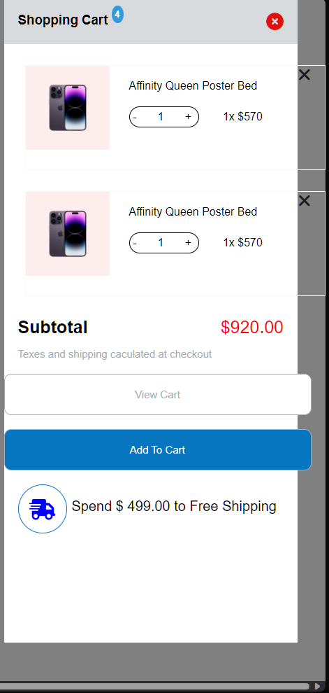

# Dương review bài học viên Fullstack NodeJS K2 Day 7

## [Đoàn Duy Chinh](https://duychinh.github.io/f8-fullstack-KS2/Day-7/day7.html)

    Sớm nhất

---

- [x] Bài 1: Bài làm tốt \*

  Chưa có border-radius cho mega menu.

  Font-weight của các menu con hơi mỏng.

  Font-size của các menu con hơi to.

  Sai màu của navbar-menu khi hover.

  Chưa xử lý khoảng trắng khiến cho trước khi hover vào mega menu thì bị mất.

  Các phần text không nên để màu mặc định là #000 mà nên để màu #333 vì màu #000 quá tương phản khiến cho mắt bị mỏi.

  List menu ở dưới của Projects chưa thẳng hàng.

  List menu ở Elements chưa chưa thẳng hàng với bản mẫu.

  Phần `.seperate`(Sai chính tả => `separate`) hơi đậm, dày hơn bản mẫu.

---

- [x] Bài 2: Bài làm tốt \*

  Xử lý chưa tốt khi phải focus vào thẻ a thì mới mở cart.

  Nút **Add To Cart** và **View Cart** sai màu background.

  Font-size của `p.desc` quá nhỏ.

  Nút **X** để xóa sản phẩm quá nhỏ.

  Nút tăng giảm số lượng hơi ngắn so vơi bản mẫu.

---

- [x] Bài 3: Bài làm tốt \*

  Sai font chữ, font chữ của bản mẫu là một font chữ có chân ở các title.

  Phần line-height của `.item .desc` quá nhỏ.

---

- [x] Đánh giá chung về bài tập về nhà: Bài làm tốt \*

  Các bài làm đều tốt, chỉ có một số lỗi nhỏ về CSS về các tiểu tiết. Chú ý đến các tiểu tiết nhỏ sẽ giúp cho bài tập trở nên hoàn hảo hơn.

---

## [Thế Nguyễn Đại](https://daithehh04.github.io/fullstack/day8)

---

- [x] Bài 1: Bài làm tốt \*

  Font-size title của các menu con hơi to.

  Chưa xử lý khiến cho khi hover vào mega menu thì bị mất.

  List menu ở dưới của Projects chưa thẳng hàng.

  List menu ở Elements chưa chưa thẳng hàng với bản mẫu.

---

- [x] Bài 2: Bài làm rất tốt \*

  Nút **X** để xóa sản phẩm quá nhỏ.

---

- [x] Bài 3: Bài làm tốt \*

  Sai font chữ, font chữ của bản mẫu là một font chữ có chân ở các title.

  Phần font-size của `.service .text` quá nhỏ.

---

- [x] Đánh giá chung về bài tập về nhà: Bài làm tốt \*

  Các bài làm đều tốt, chỉ có một số lỗi nhỏ về CSS về các tiểu tiết. Chú ý đến các tiểu tiết nhỏ sẽ giúp cho bài tập trở nên hoàn hảo hơn.

---

## [Kiều Duy Tùng](https://stung16.github.io/ex_f8-fullstack/Day8)

---

- [x] Bài 1: **Bài làm rất tốt** \*

  Phần text của navbar menu quá chìm vào nền.

  Nên chú ý thêm vào phần meta title vì chúng rất quan trọng trong SEO và trải nghiệm người dùng.

---

- [x] Bài 2: Bài làm tốt \*

  Nên chú ý thêm vào phần meta title vì chúng rất quan trọng trong SEO và trải nghiệm người dùng.

  Nút **Add To Cart** và **View Cart** chưa đồng nhất về chiều cao.

  Font-size của `p.content` quá nhỏ.

---

- [x] Bài 3: Bài làm tốt \*

  Nên chú ý thêm vào phần meta title vì chúng rất quan trọng trong SEO và trải nghiệm người dùng.

  Sai font chữ, font chữ của bản mẫu là một font chữ có chân ở các title.

  Phần line-height của `.item_sub` quá nhỏ.

---

## [Nguyễn Văn Đức](https://poyken.github.io/f8-fullstack-k2)

- [x] Bài 1: Bài làm chưa tốt

  Mọi thứ đều quá to, nhìn rất mỏi mắt.

  Font-size của các menu con hơi to.

  Việc xử lý bằng cách focus vào thẻ a là không tốt. Nên xử lý bằng cách hover vào thẻ cha.

  List menu ở Elements chưa chưa thẳng hàng với bản mẫu.

  Chưa có đường dọc phân cách giữa các menu con.

---

- [x] Bài 2: Bài làm tốt

  Mọi thứ đều quá to, nhìn rất mỏi mắt.

  Nút tăng giảm số lượng hơi thấp so vơi bản mẫu.

---

- [x] Bài 3: Bài làm tốt \*

  Sai font chữ, font chữ của bản mẫu là một font chữ có chân ở các title.

  Phần line-height của `
...
` quá nhỏ và sai màu.

  Các phần tiêu đề của box trong section service nên dùng thẻ h3 thay vì thẻ p.

---

- [x] Đánh giá chung về bài tập về nhà: Bài làm tốt \*

  Các bài làm đều tốt, chỉ có một số lỗi nhỏ về CSS về các tiểu tiết. Chú ý đến các tiểu tiết nhỏ sẽ giúp cho bài tập trở nên hoàn hảo hơn.

---

## [Duy Hiếu Nguyễn](https://hieuboss.github.io/F8-fullstack-k2/html/lesson8/buoi8.html)

- [x] Bài 1: Bài làm tốt \*

  Sai màu của navbar-menu khi hover.

  Chưa xử lý khoảng trắng khiến cho trước khi hover vào mega menu thì bị mất.

  List menu ở Elements chưa chưa thẳng hàng với bản mẫu.

  Phần border-right `.content__left` hơi đậm, dày hơn bản mẫu.

  Sai layout ở **progressbar**

---

- [x] Bài 2: Bài làm tốt \*

  Nút **Add To Cart** và **View Cart** hơi thấp so với bản mẫu.

  Nút **X** để xóa sản phẩm quá nhỏ.

  Nút tăng giảm số lượng hơi ngắn so với bản mẫu.

  Phần `.footer__desc` ở sai vị trí

---

- [x] Bài 3: Bài làm tốt \*

  Phần font-size của `
...
` quá nhỏ.

  Các title `<h2>...</h2>` bị lệch nhau.

---

- [x] Đánh giá chung về bài tập về nhà: Bài làm tốt \*

  Các bài làm đều tốt, chỉ có một số lỗi nhỏ về CSS về các tiểu tiết. Chú ý đến các tiểu tiết nhỏ sẽ giúp cho bài tập trở nên hoàn hảo hơn.

---

## [Hồng Hà Nguyễn Thị](https://ha752002.github.io/f8-fullstack-k2/Exercise/Ex_4-7/index.html)

- [x] Bài 1: Bài làm rất tốt \*

---

- [x] Bài 2: Bài làm rất tốt \*

  Phần `.total-price` hơi nhỏ so với bản mẫu, Không nên sử dụng thẻ div để thể hiện giá tiền, nên sử dụng thẻ span, vì thẻ div được sử dụng để tạo khối.

---

- [x] Bài 3: Bài làm tốt \*

  Phần font-family của `
...
` sai, ở bản mẫu là một font chữ không chân.

  Phần button sai border, ở bản mẫu không có border.

---

- [x] Đánh giá chung về bài tập về nhà: Bài làm rất tốt \*

  Các bài làm đều rất tốt, sáng tạo là tốt, tuy nhiên hầu hết các trường hợp, nên tuân thủ theo bản mẫu, nên chú ý đến các tiểu tiết nhỏ sẽ giúp cho bài tập trở nên hoàn hảo hơn.

---

## [Phạm Tiến Đạt](https://github.com/phamtiendat18/Fullstack-K2/tree/main/Day_08)

---

- [x] [Bài 1](https://github.com/phamtiendat18/Fullstack-K2/tree/main/Day_08)

  Bài làm chưa tốt

  Phần background-image bị hiện cả ở phần header

  `Drop-menu` căn chỉnh chưa đều, thiếu cột

  Chưa có box-shadow cho `drop-menu`

  Khi hover vào các thẻ li trên menu thì đổi màu cả icon mũi tên xuống và text (trong bản mẫu chỉ đổi màu text)

---

- [x] [Bài 2](https://github.com/phamtiendat18/Fullstack-K2/tree/main/Day_08)

  Bài làm chưa tốt

  Phần shopping-cart chưa chiếm hết height, height phần này cần chiếm hết màn hình

  Phần ảnh và `product-info` chưa được căn giữa, vẫn bị lệch

  Chữ trong phần `product-info` nhạt hơn so với bản mẫu

  Thiếu phần giá `$920.00` chưa làm

  Chữ `Shopping Cart` và `Subtotal` dày hơn so với thiết kế

  Các nút button có border hơi dày, chưa được căn giữa, chữ hơi nhỏ, sai màu nền

  Chữ `Send $ 499.00 Free Shipping` cần được căn sát lề phải, font-weight mỏng hơn so với bản mẫu

  Nút **x** không hoạt động, cho icon vào thẻ label trỏ đến thẻ input checkbox để khi click vào dấu **x** sẽ tắt `shopping cart`

---

- [x] [Bài 3](https://github.com/phamtiendat18/Fullstack-K2/tree/main/Day_08)

  Bài làm chưa tốt

  Đặt width, height cho ảnh nhưng không sử dụng `object-fit: cover` khiến cho ảnh bị méo

  Khoảng cách giữa ảnh và thẻ h2 hơi ít

  `font-size` của phần description to hơn bản mẫu, chưa có line-height

  Nút `read more` nhỏ hơn so với bản mẫu

---

- [x] Đánh giá chung bài tập về nhà: Bài làm chưa tốt, cần chú ý bám sát với bản mẫu, làm giống bản mẫu nhất có thể.

## [Hoàng Lâm](https://github.com/nvhlam2211/f8-fullstack/tree/main/day-8/exercise)

---

- [x] [Bài 1](https://github.com/nvhlam2211/f8-fullstack/tree/main/day-8/exercise)

  Bài làm chưa tốt, còn rất nhiều lỗi, hầu như không giống với giao diện mẫu (Làm lại)

---

- [x] [Bài 2](https://github.com/nvhlam2211/f8-fullstack/tree/main/day-8/exercise)

  Bài làm chưa tốt, không giống với giao diện mẫu

  Bài làm cần sát lề phải, chiều cao full màn hình

  Lỗi ảnh ở sản phẩm 2

  Căn lệch số 4 ở text `shopping cart`

  Nút `x` để đóng nhỏ hơn so với bản mẫu

  Nút `view cart` không dùng thẻ input để làm, dùng thẻ button hoặc thẻ a

  Nút `add to cart` thừa border

  Các nút button có border hơi dày, chữ hơi nhỏ

  Phần giá và đoạn text ở dưới bị căn lệch

---

- [x] [Bài 3](https://github.com/nvhlam2211/f8-fullstack/tree/main/day-8/exercise)

  Bài làm chưa tốt

  Hầu như không có khoảng cách giữa các phần tử trong bài

  Bố cục bài bị lệch nhau

  Tiêu đề của các item có font-size nhỏ

  Phần desc chưa có line-height, hơi to so với thiết kế

  Nút read more bị sai màu, thừa border

---

- [x] Đánh giá chung bài tập về nhà: Bài làm chưa tốt, cần cải thiện nhiều, chú ý bám sát với bản mẫu, làm giống bản mẫu nhất có thể.

## [Bùi Quang Trưởng](https://okazakitruong.github.io/BQTruong-F8-K2-Offline/Day8/index.html)

- [x] Bài 1: Bài làm rất tốt \*

  Các phần text không nên để màu mặc định là #000 mà nên để màu #333 vì màu #000 quá tương phản khiến cho mắt bị mỏi.

  List menu ở dưới của Projects chưa thẳng hàng.

---

- [x] Bài 2: Bài làm rất tốt \*

  Nút **X** để xóa sản phẩm quá nhỏ.

  Phần `.shipping-promotion` có font-weight quá lớn so với bản mẫu.

  Nút tăng giảm số lượng hơi thấp so vơi bản mẫu.

---

- [x] Bài 3: Bài làm rất tốt \*

  Sai font chữ, font chữ của bản mẫu là một font chữ không chân ở các content.

---

- [x] Đánh giá chung về bài tập về nhà: Bài làm tốt \*

  Các bài làm đều rất tốt, chỉ có một số lỗi nhỏ về CSS về các tiểu tiết. Chú ý đến các tiểu tiết nhỏ sẽ giúp cho bài tập trở nên hoàn hảo hơn.

---

## [Nguyễn Thị Tuyết](https://xanhrii.github.io/k2-f8-fullstack-course/rii_day08_css/)

- [x] Bài 1: Bài làm tốt \*

  Tất cả text ở các menu có font-weight quá mỏng.

  List menu ở dưới của Projects chưa thẳng hàng.

---

- [x] Bài 2: Bài làm rất tốt \*

  Các nút **+**, **-** để tăng, giảm số lượng sản phẩm quá nhỏ.

  Có khoảng trống quá lớn ở phần hiển thị các sản phẩm, nhưng lại có scroll, nên cho phần hiển thị nhiều hơn.

---

- [x] Bài 3: Bài làm rất tốt \*

---

- [x] Đánh giá chung về bài tập về nhà: Bài làm tốt \*

  Các bài làm đều rất tốt, chỉ có một số lỗi nhỏ về CSS về các tiểu tiết. Chú ý đến các tiểu tiết nhỏ sẽ giúp cho bài tập trở nên hoàn hảo hơn.

---

## [Đỗ Khắc Quân](https://okazakitruong.github.io/BQTruong-F8-K2-Offline/Day8/index.html)

- [x] Bài 1: Bài làm tốt

  Vì mega menu là một menu con của navbar menu, không nên hiển thị luôn mà sử dụng action hover để hiển thị.

  Tất cả text ở các menu có font-weight quá mỏng.

  Phần width của mega menu quá dài. Dẫn đến tất cả các item ở trong bị lệch

---

- [x] Bài 2: Bài làm **Không Tốt**

  

  Sửa lại cho tốt hơn.

---

- [x] Bài 3: Bài làm rất tốt \*

  Phần line-height của `.service-content .service-description p` quá nhỏ.

---

- [x] Đánh giá chung về bài tập về nhà: Bài làm tốt \*

  Các bài làm đều rất tốt. Trừ bài 2. Xem lại bài làm 2 và sửa lại cho tốt hơn.

---
