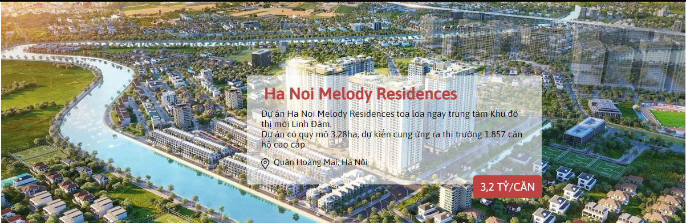
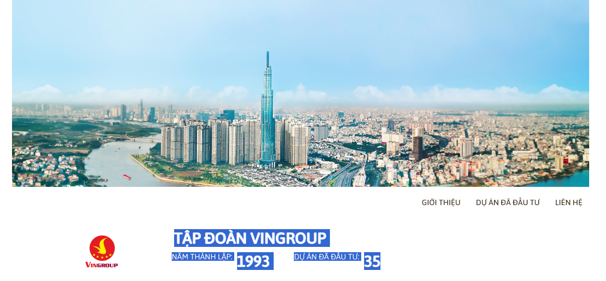

# Dương đánh giá bài học viên

## [Phí Văn Đức](https://github.com/PhiVanDuc/Offline-F8-K3/tree/main/Day-7/)

- [x] [Bài 1](https://github.com/PhiVanDuc/Offline-F8-K3/tree/main/Day-7/)

  Bài làm rất tốt

  Phần giá chưa được viết hoa tất cả các ký tự

  Vì đây là banner dạng slider, nên để width chiếm hết màn hình

---

- [x] [Bài 2](https://github.com/PhiVanDuc/Offline-F8-K3/tree/main/Day-7/)

  Bài làm tốt

  Ảnh avatar to hơn bản mẫu

  Chưa có bóng đổ ở tiêu đề `h1`

  Phần số liệu trong `history` hơi nhỏ

  Nên có một lớp phủ màu đen mờ cho background để phần chữ trắng ở trên dễ đọc hơn

---

- [x] [Bài 3](https://github.com/PhiVanDuc/Offline-F8-K3/tree/main/Day-7/)

  Bài làm rất tốt

  Chưa có đường gạch ngang cạch `heading`

---

- [x] Đánh giá chung bài tập về nhà: Bài làm tốt, chú ý những chi tiết cơ bản để giống với bản mẫu hơn.

## [Đỗ Văn Khoa](https://github.com/mrkhoadev/F8-Fullstack-K3/tree/main/Day7)

    Sớm nhất*

- [x] [Bài 1](https://github.com/mrkhoadev/F8-Fullstack-K3/tree/main/Day7)

  Bài làm tốt

  Chưa reset css

  Width của `article` rộng hơn bản mẫu

  Sai màu chữ địa chỉ

---

- [x] [Bài 2](https://github.com/mrkhoadev/F8-Fullstack-K3/tree/main/Day7)

  Bài làm tốt

  Chưa reset css

  Chưa có bóng đổ ở tiêu đề `h2`

  Nên có một lớp phủ màu đen mờ cho background để phần chữ trắng ở trên dễ đọc hơn

  Width của `avatar` nhỏ hơn bản mẫu

  Phần `avatar__name` text có font-size nhỏ hơn bản mẫu

  Không sử dụng thẻ a để bọc thẻ label. Có thể sử dụng trang web: https://validator.w3.org/#validate_by_input để check code html.

---

- [x] [Bài 3](https://github.com/mrkhoadev/F8-Fullstack-K3/tree/main/Day7)

  Bài làm tốt

  Không sử dụng thẻ `label` để bọc thẻ `p`. Không sử dụng thẻ `inline` để bọc thẻ `block`, có thể thay thế thẻ `p` bằng thẻ `span`

  Các item trong `container` chưa chiếm hết width của `container`

---

- [x] Đánh giá chung bài tập về nhà: Bài làm tốt, chú ý reset css ở mỗi bài, chú ý về quy tắc viết của các thẻ HTMl, những chi tiết nhỏ trong bản mẫu.

## [Nguyễn Quang Cường](https://github.com/cuonggold2408/Fullxinach_K3/tree/main/Day_7)

- [x] [Bài 1](https://github.com/cuonggold2408/Fullxinach_K3/tree/main/Day_7)

  Bài làm tốt

  Không được để trống thuộc tính `alt=""` trong thẻ `img`

  Nên giới hạn chiều cao của ảnh và đặt thuộc tính `object-fit: cover` cho ảnh đỡ bị méo

---

- [x] [Bài 2](https://github.com/cuonggold2408/Fullxinach_K3/tree/main/Day_7)

  Bài làm tốt

  Ảnh nhỏ hơn so với bản mẫu

  Avatar cách phần chữ quá xa

  Phần text của `thông tin` có `font-size` nhỏ hơn bản mẫu

  Chưa có bóng đổ ở tiêu đề `h2`

  Nên có một lớp phủ màu đen mờ cho background để phần chữ trắng ở trên dễ đọc hơn

  Không được để trống thuộc tính `alt=""` trong thẻ `img`

---

- [x] [Bài 3](https://github.com/cuonggold2408/Fullxinach_K3/tree/main/Day_7)

  Bài làm tốt

  Sai màu text, sai màu nền phần địa chỉ

  Nên có một lớp phủ màu đen mờ cho ảnh để phần chữ trắng ở trên dễ đọc hơn

  Không được để trống thuộc tính `alt=""` trong thẻ `img`

---

- [x] Đánh giá chung bài tập về nhà: Bài làm tốt, chú ý các chi tiết nhỏ và bám sát với bản mẫu nhất có thể.

## [NTiến Đạt](https://github.com/Ntiendat-2k3/F8-FullStack/tree/main/BT_B7)

---

- [x] [Bài 1](https://github.com/Ntiendat-2k3/F8-FullStack/tree/main/BT_B7)

  Bài làm tốt

  Vì đây là banner dạng slide, nên để width chiếm hết màn hình

  Phần text `desc`quá nhỏ gây khó đọc, sai chính tả, ngắt dòng chưa đúng với bản mẫu

  Sai màu chữ phần `desc` và địa chỉ

  Sai font chữ giá

  Chưa có border-radius

  Phần desc chưa line-height

---

- [x] [Bài 2](https://github.com/Ntiendat-2k3/F8-FullStack/tree/main/BT_B7)

  Bài làm tốt

  Thừa border-radius phần dưới của ảnh avatar

  Nên có một lớp phủ màu đen mờ cho background để phần chữ trắng ở trên dễ đọc hơn

  Chưa có bóng đổ của title

  Font chữ của phần info hơi nhỏ so với bản mẫu

---

- [x] [Bài 3](https://github.com/Ntiendat-2k3/F8-FullStack/tree/main/BT_B7)

  Bài làm tốt

  Sai màu text

  Thẻ sử dụng thẻ article phải chứa thẻ h1 -> h6 ở trong

  Chữ trong các item hơi nhỏ

  Đường gạch ngang bị dài vượt quá nội dung

---

- [x] Đánh giá chung bài tập về nhà: Bài làm tốt, chú ý các chi tiết nhỏ và bám sát với bản mẫu nhất có thể.

---

## [Hữu Hưng](https://github.com/HuuHungg/f8-homework/tree/main/Day7)

- [x] [Bài 1](https://github.com/HuuHungg/f8-homework/tree/main/Day7)

  Bài làm tốt

  Nên đặt các link font, icon,... trước link css chính để tránh các lỗi về độ ưu tiên css (cái này đã nhắc nhiều lần)

  Nên sử dụng `position: absolute` để căn chỉnh vị trí nội dung

  Nền phần giá và màu chữ title phải giống nhau

  Sai font chữ giá

---

- [x] [Bài 2](https://github.com/HuuHungg/f8-homework/tree/main/Day7)

  Bài làm tốt

  Không nên sử dụng thẻ `h1` làm title trong trường hợp này, nên sử dụng thẻ `h2`

  Text của title, địa điểm có `font-weight` dày hơn bản mẫu

  Text phần địa điểm trong các item có `font-size` nhỏ hơn bản mẫu

  `font-weight` của chữ `bất động sản đang bán` hơi mỏng so với bản mẫu

  Không để trống thuộc tính `alt=""` khi sử dụng thẻ `img`

  Không sử dụng `javascript` để làm bài (đề bài không yêu cầu chuyển nội dung khi click)

---

- [x] [Bài 3](https://github.com/HuuHungg/f8-homework/tree/main/Day7)

  Bài làm tốt

  Đặt kích thước cố định `width`, `height` cho ảnh nhưng không thêm `object-fit: cover` vào làm ảnh bị méo

  Không để trống thuộc tính `alt=""` khi sử dụng thẻ `img`

  Phần ảnh hơi nhỏ so với bản mẫu

  Phần title chưa có bóng đổ

  Nên có một lớp phủ màu đen mờ cho background để phần chữ trắng ở trên dễ đọc hơn

  text trong `container-title` hơi nhỏ so với bản mẫu

  `font-weight` của `năm thành lập, dự án đã đầu tư` mỏng hơn so với bản mẫu.

  Sử dụng cùng 1 id ở nhiều thẻ khác nhau. 1 id chỉ được dùng cho 1 thẻ duy nhất trong trang

  Không sử dụng `javascript` để làm bài

- [x] Đánh giá chung bài tập về nhà: Bài làm tốt, cần cải thiện, chú ý các chi tiết nhỏ và bám sát với bản mẫu nhất có thể.

---

## [Nguyễn Thành Tráng](https://github.com/thanhtrang16490/f8-offline/tree/main/data/lesson7)

- [x] [Bài 1](https://github.com/thanhtrang16490/f8-offline/tree/main/data/lesson7)

  Bài làm tốt

  Sai chính tả, sai màu chữ trong phần description, address

  Sai font chữ giá

  Vì đây là banner dạng slide, nên để width chiếm hết màn hình

  Không nên sử dụng thẻ `h1` trong trường hợp này, nên sử dụng thẻ `h2`

  `font-weight` của title hơi mỏng hơn so với bản mẫu.

---

- [x] [Bài 2](https://github.com/thanhtrang16490/f8-offline/tree/main/data/lesson7)

  Bài làm rất tốt

  Nên có một lớp phủ màu đen mờ cho background để phần chữ trắng ở trên dễ đọc hơn

---

- [x] [Bài 3](https://github.com/thanhtrang16490/f8-offline/tree/main/data/lesson7)

  Bài làm rất tốt

  Phần `4.664 bất động sản đang bán` chưa giống với bản mẫu

---

- [x] Đánh giá chung bài tập về nhà: Bài làm tốt, chú ý các chi tiết nhỏ và bám sát với bản mẫu nhất có thể.

---

## [Vương Đông](https://github.com/DongVuong/f8-fullstack-k3/tree/main/DAY7)

- [x] [Bài 1](https://github.com/DongVuong/f8-fullstack-k3/tree/main/DAY7)

  Bài làm tốt

  Vì đây chỉ là một phần của trang web nên không nên đặt thẳng background cho thẻ `body`

  Nên sử dụng `position: relative`, `position: absolute` để căn chỉnh vị trí. Trong bài sử dụng `margin` khiên nội dung bị độn lên

  Chưa có border-radius

---

- [x] [Bài 2](https://github.com/DongVuong/f8-fullstack-k3/tree/main/DAY7)

  Bài làm chưa tốt

  Không nên để trống thuộc tính `alt=""` của ảnh

  Chưa có border-radius của ảnh

  Chưa có bóng đổ của title

  `font-weight` của các item trong `list-items` hơi mỏng

  Nên có một lớp phủ màu đen mờ cho background để phần chữ trắng ở trên dễ đọc hơn

---

- [x] [Bài 3](https://github.com/DongVuong/f8-fullstack-k3/tree/main/DAY7)

  Bài làm tốt

  Sai chính tả từ `option` thành `oftion`

  Không sử dụng thẻ `label` để bọc thẻ `p`. Không sử dụng thẻ `inline` để bọc thẻ `block`, có thể thay thế thẻ `p` bằng thẻ `span`

  Chưa có đường gạch ngang sau title

  Nên có lớp phủ đèn mờ của ảnh ở mỗi item để phần chữ trắng ở trên dễ đọc

  Phần `sub-content` chưa giống với bản mẫu

- [x] Đánh giá chung bài tập về nhà: Bài làm tốt, chú ý các chi tiết nhỏ và bám sát với bản mẫu nhất có thể, chú ý lỗi chính tả.

## [Trần Xuân Bách](bach0128.github.io/f8-fullstack-k3)

- [x] [Bài 1](https://bach0128.github.io/f8-fullstack-k3)

  Bài làm tốt \*

  Đang sử dụng opacity cho toàn bộ content. Trong bản mẫu chỉ sử dụng background opacity cho phần màu trắng phía sau.

---

- [x] [Bài 2](https://bach0128.github.io/f8-fullstack-k3)

  Bài làm tốt

  Hình ảnh đang set cả width, height nên tỷ lệ bị bóp méo, không nên set cả 2 thuộc tính này, nếu về sau hình ảnh đổi hoặc muốn thay đổi kích thước thì sẽ phải sửa lại.

  Phần banner ở bản mẫu có chiều cao ngắn hơn.

  Nên có overlay ở background banner để nếu hình ảnh thay đổi thì chữ màu trắng vẫn đọc được.

  Phần navbar item cần có font-weight đậm hơn để giống bản mẫu.

---

- [x] [Bài 3](https://bach0128.github.io/f8-fullstack-k3)

  Bài làm tốt \*

  Nên có overlay ở background box để nếu hình ảnh thay đổi thì chữ màu trắng vẫn đọc được.

  Hình ảnh ở `#address-3` đang bị lỗi, không hiển thị dược.

---

- [x] Đánh giá chung bài tập về nhà: Bài làm tốt, có thể cải thiện thêm ở một số chi tiết nhỏ.

## [Trần Đình Trọng](https://github.com/trandinhtrongg/f8_fullstack_k3/tree/main/F8-offline/Day7)

**Không có link github pages**

- [x] [Bài 1](https://github.com/trandinhtrongg/f8_fullstack_k3/tree/main/F8-offline/Day7)

  Bài làm không tốt.

  Phần `.info-group` đang position absolute theo body nên ở một số màn hình khác nhau sẽ bị lệch vị trí.

  

---

- [x] [Bài 2](https://github.com/trandinhtrongg/f8_fullstack_k3/tree/main/F8-offline/Day7)

  Bài làm không tốt.

  Phần `.info-group` đang position absolute theo body nên ở một số màn hình khác nhau sẽ bị lệch vị trí.

  

---

- [x] [Bài 3](https://github.com/trandinhtrongg/f8_fullstack_k3/tree/main/F8-offline/Day7)

  Bài làm tốt \*

  Nên có overlay ở background box để nếu hình ảnh thay đổi thì chữ màu trắng vẫn đọc được.

  Layout quá xơ sài, thiếu khoảng cách 2 bên.

  Các phần tử trong bản mẫu không có căn giữa mà căn bên trái.

---

- [x] Đánh giá chung bài tập về nhà: Bài làm tốt, có thể cải thiện thêm ở một số chi tiết nhỏ.

## [Minh Pham](https://minh0314.github.io/F8-K3/Day7/index.html)

**Nên chú ý tới thẻ meta title vì chúng rất quan trọng trong SEO và trải nghiệm người dùng.**

- [x] [Bài 1](https://minh0314.github.io/F8-K3/Day7/index.html)

  Bài làm tốt.

  Sử dụng font chữ không giống bản mẫu.

  - Có thể do đường dẫn tới file fonts sai.

  Khoảng cách giữa `.sub-title` và `h2` không giống bản mẫu.

---

- [x] [Bài 2](https://minh0314.github.io/F8-K3/Day7/index.html)

  Bài làm tốt.

  Sử dụng font chữ không giống bản mẫu.

  - Có thể do đường dẫn tới file fonts sai.

  Do set cả width và height cho hình ảnh nên tỷ lệ bị bóp méo, không nên set cả 2 thuộc tính này, nếu về sau hình ảnh đổi hoặc muốn thay đổi kích thước thì sẽ phải sửa lại.

  Nên có overlay ở background banner để nếu hình ảnh thay đổi thì chữ màu trắng vẫn đọc được.

  Font chữ ở list navbar không giống bản mẫu.

---

- [x] [Bài 3](https://minh0314.github.io/F8-K3/Day7/index.html)

  Bài làm tốt \*

  Nên có overlay ở background box để nếu hình ảnh thay đổi thì chữ màu trắng vẫn đọc được.

  Font chữ của `h3` quắ to khiến cho chữ bị xuống hàng.

  Chiều cao của box quá to so với bản mẫu.

  Các font chữ ở `.project-number, city` quá to so với bản mẫu

  Thiếu khoảng cách 2 bên của 1 item `lists .list-city a`

---

- [x] Đánh giá chung bài tập về nhà: Bài làm tốt,tuy nhiên cần chú ý thêm vào bài tập về nhà, cần chỉn chu hơn nữa.

## [Vũ Thống](https://pencilbsp.github.io/f8_offline/BTVN/btvn_buoi_07)

- [x] [Bài 1](https://pencilbsp.github.io/f8_offline/BTVN/btvn_buoi_07)

  Bài làm rất tốt \*

  Font-size ở phần địa chỉ cần đậm hơn.

  Khoảng cách giữa các chữ ở phần giá tiền `.price` cần lớn hơn.

  Có thể dùng thuộc tinh background-image trong css thay cho việc sử dụng một thẻ img để làm background.

---

- [x] [Bài 2](https://pencilbsp.github.io/f8_offline/BTVN/btvn_buoi_07)

  Bài làm tốt \*

  Phần navbar trước khi có tác động thì không có màu đỏ.

  Nếu chỉ sử dụng thuộc tính `width: 100%` mà không set height thì thuộc tính `object-fit: cover` sẽ không có tác dụng.

  Có thể sử dụng thuộc tính background-image thay cho việc sử dụng một thẻ img để làm background.

  Nên có overlay để đảm bảo nếu hình ảnh thay đổi thì chữ màu trắng vẫn đọc được.

---

- [x] [Bài 3](https://pencilbsp.github.io/f8_offline/BTVN/btvn_buoi_07)

  Sai layout đề bài.

  Ở đề bài, các đầu mục nằm trên một dòng.

  Nên có overlay để đảm bảo nếu hình ảnh thay đổi thì chữ màu trắng vẫn đọc được.

---

- [x] Đánh giá chung bài tập về nhà: Bài làm rất tốt, tuy nhiên cần chú ý thêm vào bài tập về nhà, cần chỉn chu hơn nữa.

## [Lê Quốc Khánh](https://github.com/lekhanhdhpt/F8-Fullstack-K3/tree/main/Day-7)

**Không có link github pages**

- [x] [Bài 1](https://github.com/lekhanhdhpt/F8-Fullstack-K3/tree/main/Day-7)

  Bài làm tốt \*

  Font chữ ở phần giá sai hoàn toàn với yêu cầu đề bài.

  Khoảng cách giữa 2 dòng content `
... ...
` quá xa so với bản mẫu.

  Các phần border-radius trong bài đều quá tròn.

  Phần ảnh background có thể sử dụng thuộc tính background-image thay cho việc sử dụng một thẻ img để làm background.

---

- [x] [Bài 2](https://github.com/lekhanhdhpt/F8-Fullstack-K3/tree/main/Day-7)

  Bài làm tốt

  Phần image background set cả width và height nên bị bóp méo tỷ lệ, không nên set cả 2 thuộc tính này, nếu về sau hình ảnh đổi hoặc muốn thay đổi kích thước thì sẽ phải sửa lại.

  Phần logo quá to so với bản mẫu. Có thể thêm `padding: 40px` để hình ảnh được thu nhỏ lại.

  Khoảng cách giữ `h1` và `.info` thấp hơn ở đề bài.

  Action click vào navbar không remove active của các item khác.

  Các item của navbar nên hạ font-weight xuống một chút.

  Thiếu `border-radius` ở phần logo.

  Nên thêm overlay để đảm bảo nếu hình ảnh thay đổi thì chữ màu trắng vẫn đọc được.

---

- [x] [Bài 3](https://github.com/lekhanhdhpt/F8-Fullstack-K3/tree/main/Day-7)

  Nên thêm overlay để đảm bảo nếu hình ảnh thay đổi thì chữ màu trắng vẫn đọc được.

  Ở đề bài không phải căn giữa mà là căn trái.

  Các chữ trong navbar sai màu khi được active.

  Việc sử dụng color: #000 sẽ gây tương phản cao cho mắt, khiến cho người dùng khó chịu.

  Chiều cao của đường ngang quá lớn, nên giảm từ 3px xuống khoảng 1px.

  Có thể sử dụng luôn ::before và ::after để tạo ra đường ngang.

  Khoảng cách giữa các box đang quá lớn.

  Khi click vào item trong navbar, chưa remove active của các item khác.

---

- [x] Đánh giá chung bài tập về nhà: Bài làm tốt, cần chú ý chỉn chu hơn nhiều nữa trong bài tập tới. Bài làm có phần sơ sài.

  \* Lưu ý: Tên folder cần đặt một cách ngắn gọn dễ hiểu hơn: **imageford7** => **images**

## [Đỗ Tiến Khiêm](https://github.com/tienkhiemkahp/f8/tree/main/homework/Day-7)

**Không có link github pages**

**Nên chú ý tới thẻ meta title vì chúng rất quan trọng trong SEO và trải nghiệm người dùng.**

- [x] [Bài 1](https://github.com/tienkhiemkahp/f8/tree/main/homework/Day-7)

  Bài làm tốt

  Chưa rõ ý tưởng khoảng cách 100px cho top và bottom của `.container`

  Đang xuất hiện scrollbar ngang và dọc.

  Không nên fix cứng width là 100vw hoặc height là 100vh vì sẽ khó để điều chỉnh ở nhiều màn hình.

  - Nên sử dụng `min-height: 100vh` để đảm bảo chiều cao luôn bằng hoặc lớn hơn 100vh.

  - Nên sử dụng `max-width: 100vw` để đảm bảo chiều rộng luôn bằng hoặc nhỏ hơn 100vw, tránh trường hợp bị scroll ngang.

  Phần font chữ giá sử dụng font sai so với bản mẫu.

---

- [x] [Bài 2](https://github.com/tienkhiemkahp/f8/tree/main/homework/Day-7)

  Bài làm tốt

  Thiếu border-radius ở phần logo.

  Phần item trong navbar cần có font-weight đậm hơn để giống bản mẫu.

---

- [x] [Bài 3](https://github.com/tienkhiemkahp/f8/tree/main/homework/Day-7)

  Nên sử dụng `before, after` để tạo ra lớp mờ phủ lên trên ảnh

  Thiếu border-radius ở phần avatar

  Khoảng cách giữa phần `self-introduction` và `avatar` quá lớn

  Không nên sử dụng thẻ `h1` ở phần title

  Chưa có bóng đổ ở title

  `font-weight` text của navbar mỏng hơn so với bản mẫu

---

- [x] Đánh giá chung bài tập về nhà: Bài làm tốt, cần chú ý chỉn chu hơn nhiều nữa trong bài tập tới.

## [Hoàng Bảo Long](https://github.com/tienkhiemkahp/f8/tree/main/homework/Day-7)

- [x] [Bài 1](https://github.com/tienkhiemkahp/f8/tree/main/homework/Day-7)

  Bài làm tốt

  Phần giá không phải là một tiêu đề mà chỉ là một đoạn text bình thường, nên không nên sử dụng thẻ `h2` mà nên sử dụng thẻ `span`

  Phần giá đang bị lệch so với bản mẫu.

  Font chữ của giá đang bị sai font so với bản mẫu.

---

- [x] [Bài 2](https://github.com/tienkhiemkahp/f8/tree/main/homework/Day-7)

  Bài làm tốt

  Phần heading là một tiêu đề, không nên cho vào thẻ `

`, nên sử dụng thẻ `<h1></h1>`

  Các font chữ đề quá to so với bản mẫu.

  Thiếu phần gạch chân ở các menu navbar.

---

- [x] [Bài 3](https://github.com/tienkhiemkahp/f8/tree/main/homework/Day-7)

  Phần ảnh quá tối so với bản mẫu.

  Các phần tử trong bản mẫu không có căn giữa mà căn bên trái.

  Các menu navbar ở bản mẫu không có border.

  Thiếu đường gạch ngang ở heading.

---

- [x] Đánh giá chung bài tập về nhà: Bài làm tốt, cần chú ý chỉn chu hơn nhiều nữa trong bài tập tới.
