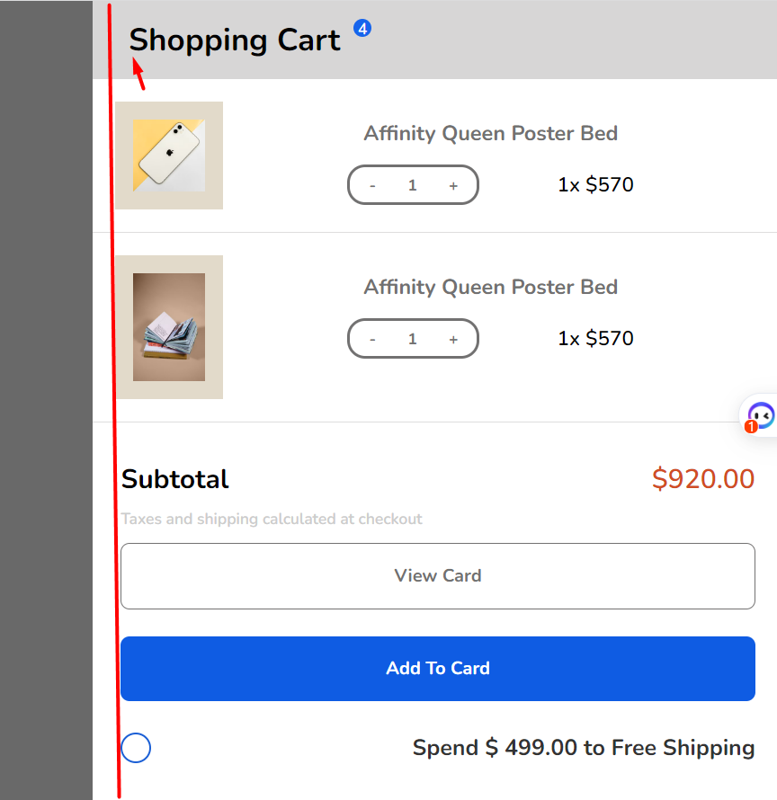
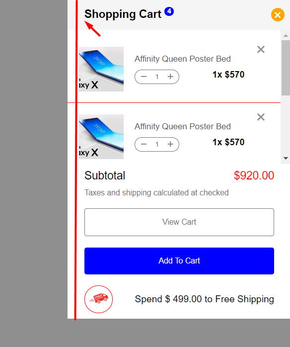
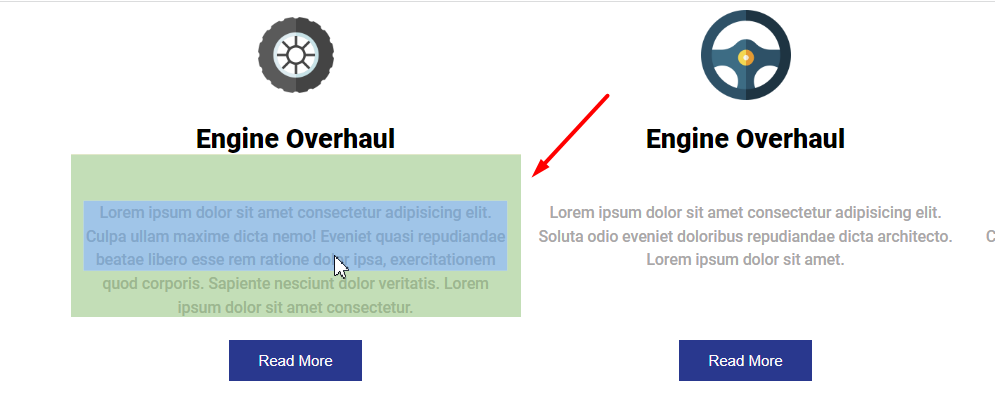

## [Đỗ Văn Khoa](https://github.com/mrkhoadev/F8-Fullstack-K3/tree/main/Day8)

- [x] [Bài 1](https://github.com/mrkhoadev/F8-Fullstack-K3/tree/main/Day8)

  Bài làm rất tốt\*

  Sai màu chữ, màu icon

  Nên thêm `cursor: pointer` vào các thẻ `li` để khi hover vào có hình bàn tay

  Phần `nav-content` chưa kéo dài hết nội dung của `nav`

---

- [x] [Bài 2](https://github.com/mrkhoadev/F8-Fullstack-K3/tree/main/Day8)

  Bài làm chưa tốt

  `cart` chưa dính vào bên phải màn hình, chiều cao của `cart` chưa hết chiều cao của màn hình

  Sai màu chữ trong `cart__product--right`

  Cỡ chữ của chữ `subtotal`, `$920.00` nhỏ hơn bản mẫu

  Sai màu chữ phần text dưới phần `subtotal`

  Chưa có khoảng cách giữa phần sản phẩm và subtotal, subtotal và nút view cart

---

- [x] [Bài 3](https://github.com/mrkhoadev/F8-Fullstack-K3/tree/main/Day8)

  Bài làm tốt

  Nên sử dụng thẻ `h2` ở phần `header` vì đây chỉ là một section ở trong trang web

  `font-weight` của thẻ `p` trong `header` hơi dày so với thiết kế

  Nên sử dụng thẻ `h3` làm tiêu đề trong từng item

  Tiêu đề trong từng item có cỡ chữ hơi nhỏ hơn so với thiết kế

  Thẻ `p` trong từng item có `font-weight` dày hơn so với thiết kế, sai màu

  `button` trong các item có màu nền sai với thiết kế

  Nên sử dụng thẻ `img` trong file html để thể hiện hình ảnh sản phẩm trong các item

---

- [x] Đánh giá chung bài tập về nhà: Bài làm tốt, chú ý những chi tiết về màu sắc, cỡ chữ, font chữa để giống với bản mẫu hơn.

## [Minh Pham](https://github.com/Minh0314/F8-K3/tree/main/Day8)

- [x] [Bài 1](https://github.com/Minh0314/F8-K3/tree/main/Day8)

  Bài làm chưa tốt

  Trong bài chỉ cần sử dụng font `Manrope` nhưng lại link cả font `Manrope` và `Asap`

  Nên link các link icon, font chữ, reset css... trước file css chính để tránh các lỗi về độ ưu tiên css

  Sai màu chữ trong `list-item`, icon trong `list-item` to hơn thiết kế

  Khi hover vào `list-item` thì cả text và cả icon đều đổi màu (theo bản mẫu chỉ có phần text đổi màu còn icon vẫn giữ nguyên màu)

  Sai màu chữ trong `sub-nav`

  Thẻ `a` khi chưa có link có thể để `href="#!"`, không để trống giá trị của thuộc tính nào trong thẻ html

  Chưa có khoảng cách rõ ràng ở phần `usage` và `styleguide`trong `subnav`, các đầu mục lớn trong `subnav` chưa được viết in hoa tất cả các chữ cái

  Căn chỉnh các thẻ `li` chưa đều nhau ở trong `subnav`

---

- [x] [Bài 2](https://github.com/Minh0314/F8-K3/tree/main/Day8)

  Bài làm chưa tốt

  Trong bài chỉ cần sử dụng font `Nunito` nhưng lại link cả font `Nunito` và `Asap`

  Nên link các link icon, font chữ, reset css... trước file css chính để tránh các lỗi về độ ưu tiên css

  `shopping-cart` theo bản mẫu phải nằm ở bên phải màn hình

  Sai màu nền các phần tử trong `shopping-cart`

  Phần `content`, `info2` cách nhau quá xa, chưa được căn giữa ảnh, 2 phần này có thể gộp chung vào 1 thẻ `div` để ngang hàng với ảnh

  Phần `content`, `info2` sai màu chữ

  Dấu `+`, `-` trong phần `quantum` căn bị lệch lên trên

  Cỡ chữ phần `price` to hơn thiết kế

  Sai màu border nút `view cart`

  Không sử dụng thẻ `hr` để tạo đường ngăn cách giữa các item trong trường hợp này. Thẻ `hr` được sử dụng để tạo đường ngăn cách giữa các đoạn văn, có thể tham khảo cách sử dụng tại đây: [Tag hr](https://developer.mozilla.org/Web/HTML/Element/hr). Có thể sử dụng border hoặc before, after để tạo đường gạch ngang trong trường hợp này

---

- [x] [Bài 3](https://github.com/Minh0314/F8-K3/tree/main/Day8)

  Bài làm chưa tốt

  Trong bài chỉ cần sử dụng font `Roboto` nhưng lại link cả font `Roboto` và `Asap`

  Nên để các link `font chữ`, `icon`, `reset css` ở trước link `css` để tránh các lỗi về độ ưu tiên css

  Nên sử dụng thẻ `h2` ở phần `header` vì đây chỉ là một section ở trong trang web

  Sai `font-family` ở thẻ `h1` theo bản mẫu là font chữ có chân (serif) vì đề bài không ghi rõ font nào nên có thể chọn ngẫu nhiên 1 font chữ có chân

  Chỉ dùng thẻ h3 khi đã có thẻ h2, trong bài đang sử dụng thẻ h1 -> h3. Có thể tham khảo cách sử dụng cách thẻ heading tại đây: https://developer.mozilla.org/en-US/docs/Web/HTML/Element/Heading_Elements

  Kích thước width của các item to hơn bản mẫu

  `desc` trong các item có font chữ to hơn bản mẫu, sai màu so với bản mẫu

  Nút trong các item vẫn còn border màu đen

  Ảnh trong các item không cần border-radius

---

- [x] Đánh giá chung bài tập về nhà: Bài làm chưa tốt, chú ý về cách sử dụng các thẻ html, font chữ, màu chữ,... để làm bài giống bản mẫu nhất có thể.

## [NTiến Đạt](https://github.com/Ntiendat-2k3/F8-FullStack/tree/main/BT_B8)

- [x] [Bài 1](https://github.com/Ntiendat-2k3/F8-FullStack/tree/main/BT_B8)

  Bài làm chưa tốt

  Không sử dụng thẻ `div` làm thẻ con trực tiếp của thẻ `ul`. Trong thẻ `ul`, `ol` chỉ có thẻ `li` được làm thẻ con trực tiếp.

  Căn lệch `wrap__list` khiến xuất hiện thanh cuộn ngang khi hover vào các item

  Chưa có khoảng cách rõ ràng giữa `usage` và `styleguide`

  Khoảng cách giữa cột bên trái và cột bên phải trong `wrap__list` xa nhau quá

  Icon info và kính lúp sai màu

---

- [x] [Bài 2](https://github.com/Ntiendat-2k3/F8-FullStack/tree/main/BT_B8)

  Bài làm tốt

  Chiều cao của cart phải phủ hết chiều cao của màn hình

  Sai màu phần giá cạnh phần số lượng trong các sản phẩm

  Phần sản phẩm phải có màu nền hơi tối hơn các phần khác

  Sai chính tả ở `footer__desc`: `taxes` -> `tayes`

  Cỡ chữ trong phần `footer__subtotal` hơi nhỏ hơn so với thiết kế

  Phần đệm lề 2 bên của cả `cart` nhỏ hơn so với bản mẫu

---

- [x] [Bài 3](https://github.com/Ntiendat-2k3/F8-FullStack/tree/main/BT_B8)

  Bài làm rất tốt\*

  `font-weight` của `service__desc` dày hơn thiết kế

  Trong `class="service__desc thin"` chưa có `line-height`

---

- [x] Đánh giá chung bài tập về nhà: Bài làm tốt, chú ý về cách sử dụng các thẻ html, font chữ, màu chữ, lỗi chính tả... để làm bài giống bản mẫu nhất có thể. Chưa gắn link github pages, gắn link github pages giúp trợ giảng dễ dàng review bài hơn.

## [Nguyễn Quang Cường](https://github.com/cuonggold2408/Fullxinach_K3/tree/main/Day_8)

- [x] [Bài 1](https://github.com/cuonggold2408/Fullxinach_K3/tree/main/Day_8)

  Bài làm tốt

  Phần `content` chưa kéo dài hết nội dung của `info-item-checked`

  Sai màu chữ các tiêu đề của `content`, `element` không được viết in hoa tất cả các kí tự

  Khi hover vào `info-item` thì cả phần text cả phần icon đều đổi màu (theo bản mẫu chỉ có chữ đổi màu còn icon vẫn màu đen)

  Đường kẻ dọc ngăn cách giữa 2 cột của `content` hơi đậm hơn so với bản mẫu

---

- [x] [Bài 2](https://github.com/cuonggold2408/Fullxinach_K3/tree/main/Day_8)

  Bài làm chưa tốt

  Chỉ dùng thẻ h3 khi đã có thẻ h2, trong bài đang sử dụng thẻ luôn thẻ h3. Có thể tham khảo cách sử dụng cách thẻ heading tại đây: https://developer.mozilla.org/en-US/docs/Web/HTML/Element/Heading_Elements

  Căn lề các phần tử bị lệch sang bên phải

  Căn chỉnh các phần tử trong `item` bị lệch, item chưa đủ rộng khiến tên item vẫn bị xuống dòng

  Chữ `Subtotal` đang có `font-size` to hơn chữ `Shopping Cart`

---

- [x] [Bài 3](https://github.com/cuonggold2408/Fullxinach_K3/tree/main/Day_8)

  Bài làm chưa tốt

  Sai `font-family` ở thẻ `h1` theo bản mẫu là font chữ có chân (serif) vì đề bài không ghi rõ font nào nên có thể chọn ngẫu nhiên 1 font chữ có chân

  Nên sử dụng thẻ `h2` ở phần `header` vì đây chỉ là một section ở trong trang web

  Chỉ dùng thẻ h3 khi đã có thẻ h2, trong bài đang sử dụng thẻ h1 -> h3. Có thể tham khảo cách sử dụng cách thẻ heading tại đây: https://developer.mozilla.org/en-US/docs/Web/HTML/Element/Heading_Elements

  Sai màu chữ trong các item

  Chưa có `line-height` của chữ trong các item

  Ngữ nghĩa của thẻ `nav` là cung cấp liên kết điều hướng. Ví dụ: Menu, Mục lục, Chỉ mục,... Không dùng thẻ `nav` để chứa nội dung văn bản đơn thuần

  Không nên chia riêng mỗi hàng 1 thẻ div như `item-top`, `item-down` (sử dụng `flex-wrap`, `flex-basis`,... để làm).

---

- [x] Đánh giá chung bài tập về nhà: Bài làm chưa tốt, cần cải thiện nhiều, chú ý các chi tiết nhỏ và bám sát với bản mẫu nhất có thể.

## [Vũ Thống](https://github.com/pencilbsp/f8_offline/tree/main/BTVN/btvn_buoi_08)

- [x] [Bài 1](https://github.com/pencilbsp/f8_offline/tree/main/BTVN/btvn_buoi_08)

  Bài làm rất tốt\*

  Sai chính tả `Documentation` -> `Documnetaion`

  Khi hover vào `class = "link-item has-dropdown"` cả màu text và màu icon đổi (trong bản mẫu chỉ đổi màu text, không đổi màu icon)

  Khoảng cách giữa các hàng trong `dropdown-menu` nhỏ hơn so với bản mẫu, hàng bên trái và hàng bên phải không thẳng nhau

---

- [x] [Bài 2](https://github.com/pencilbsp/f8_offline/tree/main/BTVN/btvn_buoi_08)

  Bài làm rất tốt\*

  Màu phần `quantity`, `icon` dấu `x` hơi đậm hơn so với bản mẫu

  Text trong phần `ship-fee` chưa đặt `font-weight`

---

- [x] [Bài 3](https://github.com/pencilbsp/f8_offline/tree/main/BTVN/btvn_buoi_08)

  Bài làm tốt

  Phần tiêu đề thẻ `h2` có cỡ chữ nhỏ, sai font chữ. theo bản mẫu là font chữ có chân (serif) vì đề bài không ghi rõ font nào nên có thể chọn ngẫu nhiên 1 font chữ có chân

  Thẻ `p` dưới tiêu đề có cỡ chữ to hơn bản mẫu

  Thẻ `p` trong các item có cỡ chữ to hơn bản mẫu, chưa có `line-height`, sai màu sắc

---

- [x] Đánh giá chung bài tập về nhà: Bài làm tốt, chú ý các chi tiết nhỏ và bám sát với bản mẫu nhất có thể.

## [Phí Văn Đức](https://github.com/PhiVanDuc/Offline-F8-K3/tree/main/Day-8)

- [x] [Bài 1](https://github.com/PhiVanDuc/Offline-F8-K3/tree/main/Day-8)

  Bài làm rất tốt\*

---

- [x] [Bài 2](https://github.com/PhiVanDuc/Offline-F8-K3/tree/main/Day-8)

  Bài làm rất tốt\*

  Phần text trong `subtotal` có cỡ chữ hơi nhỏ

---

- [x] [Bài 3](https://github.com/PhiVanDuc/Offline-F8-K3/tree/main/Day-8)

  Bài làm rất tốt\*

  Phần tiêu đề thẻ `h2` sai font chữ. theo bản mẫu là font chữ có chân (serif) vì đề bài không ghi rõ font nào nên có thể chọn ngẫu nhiên 1 font chữ có chân

---

- [x] Đánh giá chung bài tập về nhà: Bài làm rất tốt, chú ý các chi tiết nhỏ và bám sát với bản mẫu nhất có thể.

## [Vương Đông](https://github.com/DongVuong/f8-fullstack-k3/tree/main/DAY8)

- [x] [Bài 1](https://github.com/DongVuong/f8-fullstack-k3/tree/main/DAY8)

  Bài làm rất tốt\*

  Chưa có box-shadow cho `menu-wrap`

---

- [x] [Bài 2](https://github.com/DongVuong/f8-fullstack-k3/tree/main/DAY8)

  Bài làm tốt

  `font-weight` của `title` hơi mỏng hơn so với bản mẫu

  Sai chính tả tên class: `volunm`, màu border, màu chữ phần này hơi đậm so với thiết kế

  Dấu `x` ở mỗi sản phẩm chưa giống thiết kế, nên sử dụng icon có sẵn sẽ đẹp hơn.

  Text phần `cost` có `font-weight` hơi mỏng hơn bản mẫu

  Width của phần `item-container` bị tràn ra ngoài khiến cho xuất hiện thanh cuộn ngang

  Sai màu chữ, border, cỡ chữ nút `View Cart`

  Sai màu background nút `Add to Cart`

  Icon ô tô hơi to, chữ cạnh ô tô có `font-weight` hơi nhỏ

  Chưa có khoảng cách giữa phần `delivery` và nút `Add to Cart`

---

- [x] [Bài 3](https://github.com/DongVuong/f8-fullstack-k3/tree/main/DAY8)

  Bài làm chưa tốt

  Có thể đặt thẻ `header` để chứa tiêu đề nhưng không được đặt thẻ `footer`

  Lỗi ảnh

  Chưa có `line-height` trong thẻ `p` của các `item`

---

- [x] Đánh giá chung bài tập về nhà: Bài làm tốt, chú ý các chi tiết nhỏ và cách sử dụng các thẻ html chuẩn semantic và bám sát với bản mẫu nhất có thể.

## [Trần Đình Trọng](https://github.com/trandinhtrongg/f8_fullstack_k3.git)

- [x] [Bài 1](https://github.com/trandinhtrongg/f8_fullstack_k3.git)

  Bài làm tốt

  Sai chính tả `elements` -> `elements`

  Icon trong `item-list_menu` chưa được căn giữa với phần text

  Khi hover vào `item-list_menu` thì đổi thành màu gần giống màu trắng quá khiến cho người dùng khó đọc

  Khi hover vào `item-list_menu` thì cả text và icon cùng đổi màu (theo mẫu chỉ có text đổi màu, icon vẫn giữ màu cũ)

---

- [x] [Bài 2](https://github.com/trandinhtrongg/f8_fullstack_k3.git)

  Bài làm chưa tốt

  Sai cấu trúc tiêu chuẩn html

  Chiều cao của cart phải phủ hết chiều cao của màn hình

  Số 4 trên chữ `Shopping Cart` không phải hình tròn

  Chưa có khoảng cách giữa `content` và `btn`

  Chưa giới hạn `height` của `info-cart` và cho xuất hiện thanh cuộn để khi thêm sản phẩm mới có thể cuộn xuống

  Màu border, màu chữ của nút `View Cart` đậm hơn bản mẫu

  Thừa border màu xám ở nút `Add to Cart`

---

- [x] [Bài 3](https://github.com/trandinhtrongg/f8_fullstack_k3.git)

  Bài làm chưa tốt

  Sai chính tả các từ trong thẻ `p` trong `header`

  Sai `font-family` ở thẻ `h1` theo bản mẫu là font chữ có chân (serif) vì đề bài không ghi rõ font nào nên có thể chọn ngẫu nhiên 1 font chữ có chân

  Nên sử dụng thẻ `h2` ở phần `header` vì đây chỉ là một section ở trong trang web

  Khoảng cách giữa `item_sub` và nút `Read more` hơi xa

  Chưa có `line-height` của thẻ `p` trong các item

---

- [x] Đánh giá chung bài tập về nhà: Bài làm chưa tốt, cần cải thiện nhiều, bám sát vào yêu cầu đề bài.

## [Lê Quốc Khánh](https://github.com/lekhanhdhpt/F8-Fullstack-K3/tree/main/Day-8)

**Lưu ý**: Từ bài tập sau bạn nhớ gửi thêm link github pages để team review có thể check bài dễ dàng hơn nhé. Xem hướng dẫn [tại đây](https://fullstack-nodejs.fullstack.edu.vn/?id=472c83a0-0e4a-4ad6-bacd-27759867b3cf).

- [x] [Bài 1](https://github.com/lekhanhdhpt/F8-Fullstack-K3/tree/main/Day-8/Bai1)

  Bài làm tốt \*.

  - Nên dùng thẻ semantic `header` bọc phần `menu` thay vì thẻ `div`.

  - Tất cả thẻ `a` đều không có thuộc tính `href` và không có `cursor:pointer`. Nếu không có link thì sẽ để tạm là `href=#` hoặc `href=#!` chứ không được bỏ. vì `href` là thuộc tính bắt buộc của thẻ `a`.

  - Icon mũi tên bên cạnh nav item lớn hơn so với design.

  - Phần `main-left` căn top là chưa đúng. Ở design là căn sát cả trên-dưới (kiểu space-between)

  - Thêm css `text-transform: uppercase` cho những chữ kiểu in hoa và `text-transform: capitalize` cho những kiểu chữ viết hoa chữ cái đầu.

  - Các thẻ h3 đang set `font-weight: 900` k giống design. (chú ý thêm: trong CSS import font cũng không có font-weight:900)

  - Chỉ import những font-weight cần dùng, cần xóa bỏ những font-weight không dùng tới (200;300;400;500;700).

---

- [x] [Bài 2](https://github.com/lekhanhdhpt/F8-Fullstack-K3/tree/main/Day-8/Bai2)

  Bài làm tốt \*

- Bài dùng nhiều icon của `fontawesome` nhưng chưa import `fontawesome` vào. Cần để ý cẩn thận hơn.

- Phần số ở trên `Tiltle` chưa đúng vị trí như design.

- Căn lề các phần nội dung chưa giống như design:

  

- Ảnh: Chưa có thuộc tính và nội dung `alt`. Nên thêm css height, object-fit để nếu là ảnh khác có kích thước bất kì thì giao diện không bị vỡ, ảnh không bị méo, height các item không bị dài ra theo ảnh.

- Phần `item-count__action`: dấu `-` và `+` là 2 button, có thể click được, nên dùng thẻ `button` thay vì `span`. border đang to hơn so với design.

- Ảnh: thiếu phần background dưới ảnh.

- 2 button `btn` nên thêm css `cursor:pointer` nữa để trải nghiệm người dùng tốt hơn.

- Tên sản phẩm có font-weight đậm hơn so vớ design.

- Chỉ import những font-weight cần dùng, cần xóa bỏ những font-weight không dùng tới

---

- [x] [Bài 3](https://github.com/lekhanhdhpt/F8-Fullstack-K3/tree/main/Day-8/Bai3)

  Bài làm rất tốt\*

  - Cần thêm khoảng cách top cho phần `main-elements`.

  - Ảnh: Chưa có thuộc tính và nội dung `alt`. Nên thêm css height, object-fit để nếu là ảnh khác có kích thước bất kì thì giao diện không bị vỡ, ảnh không bị méo, height các item không bị dài ra theo ảnh.

  - Phần `main-elements` cần thêm khoảng cách giữa 2 hàng.

  - Phần `element` cần thêm khoảng cách giữa ảnh và thẻ h3.

  - Cần thêm css `text-transform: uppercase` cho những chữ kiểu in hoa và `text-transform: capitalize` cho những kiểu chữ viết hoa chữ cái đầu.

  - Chỉ import những font-weight cần dùng, cần xóa bỏ những font-weight không dùng tới.

---

- [x] Đánh giá chung bài tập về nhà: Bài làm tốt, cần phân tích các thành phần trên design kỹ hơn để sử dụng thẻ HTML semantic, non-semantic tốt hơn, và để CSS style các chi tiết được giống với design nhất có thể.

## [Nguyễn Đức](https://nguyenduc2108.github.io/f8-fullstack-k3/linknopbaitap.html)

- [x] [Bài 1](https://github.com/Nguyenduc2108/f8-fullstack-k3/tree/main/Homework%20session_08/bai1)

  Bài làm tốt\*

  - Import sai font-family, bạn đang import font 'Asap'. Yêu cầu bài này là font `Manrope`.

  - font-weight tất cả chữ cần đậm hơn để giống với design.

  - Cần thêm css `text-transform: uppercase` cho những chữ kiểu in hoa và `text-transform: capitalize` cho những kiểu chữ viết hoa chữ cái đầu.

  - Ảnh logo đang dùng background-image: không nên dùng margin để chỉnh vị trí, mà nên chỉnh vị trí bằng các thuộc tính background (background-size, background-position) hoặc đổi thành thẻ `img` rồi căn chỉnh.

  - Check và xóa bỏ những comment, code CSS thừa. Xóa hình ảnh không dùng đến trong thư mục `img`.

---

- [x] [Bài 2](https://github.com/Nguyenduc2108/f8-fullstack-k3/tree/main/Homework%20session_08/bai2)

  Bài làm tốt\*

  - Sai font-family

  - Chú ý kỹ hơn design: Chữ `Shopping Cart` chưa thẳng lề trái với các nội dung dưới.

    

  - Phần `cart_amount-icon`: dấu `-` và `+` là 2 button, có thể click được, nên dùng thẻ `button`. chiều cao chưa giống design.

  - Phần `cart_footer-totalmoney`, `shipping_group-text` font-weight chưa đúng.

---

- [x] [Bài 3](hhttps://github.com/Nguyenduc2108/f8-fullstack-k3/tree/main/Homework%20session_08/bai3)

  Bài làm tốt\*

  - Phần `header_title` style chưa đúng. Design chữ có style viết hoa chữ cái đầu. Tương tự cần thêm css `text-transform: capitalize` cho những kiểu chữ viết hoa chữ cái đầu trong toàn bài.

  - Phần `list` cần thêm khoảng cách giữa 2 hàng.

  - Check và xóa bỏ những code CSS thừa. Xóa hình ảnh không dùng đến trong thư mục `img`.

---

- [x] Đánh giá chung bài tập về nhà: Bài làm tốt, chú ý về việc import và sử dụng font đúng, chú ý xóa bỏ những đoạn code, file, không dùng đến. Và chú ý những chi tiết nhỏ trong bản mẫu để hoàn thiện bài tốt hơn.

## [Hữu Hưng](https://github.com/HuuHungg/f8-homework/tree/main/Day8)

- [x] [Bài 1](https://huuhungg.github.io/f8-homework/Day8/ex01/)

  Bài làm rất tốt\*

  - Cần thêm css `text-transform: uppercase` cho những chữ kiểu in hoa và `text-transform: capitalize` cho những kiểu chữ viết hoa chữ cái đầu.

  - Chữ ở `section` cần đậm hơn để giống như design.

  - Xóa phần CSS import font không dùng đến `Nunito`.

---

- [x] [Bài 2](https://huuhungg.github.io/f8-homework/Day8/ex02/)

  Bài làm chưa tốt.

  - Phần `section-fix` không nên dùng `margin-left` để cố định về bên trái, giao diện ở trên màn hình có kích thước khác sẽ bị vỡ. Nên dùng position.

  - Phần `cart_amount-icon`: dấu `-` và `+` là nên dùng thẻ `button`, vì nó có thể click được và set css `cursor:pointer`. Tương tự với các icon `X` trong bài.

  - Cần thêm `box-shadow` hoặc đường kẻ cho `total` để phân tách với phần nội dung trên.

  - Phần `View cart` và `Add to cart` là button, không phải là input.

  - Phần `content-total` màu đang bị nhạt, cần đậm hơn một chút để giống design và dễ đọc hơn.

  - Phần Chữ `ship` font-weight cần đậm hơn.

---

- [x] [Bài 3](https://huuhungg.github.io/f8-homework/Day8/ex03/)

  Bài làm tốt\*

  - Font-weight của các chữ

  - Cần thêm khoảng cách top, và khoảng cách giữa 2 hàng cho phần `container`.

  - Ảnh: Cần thêm object-fit để nếu hình ảnh có kích thước bất kì thì sẽ không bị méo.

  - Font-family của button chưa đúng.

  - Không nên dùng `max-height` để cố định chiều cao của phần chữ như vầy, và font-weight chưa đúng design:

    

    Phần này, nên thêm ở HTML một thẻ `

` ở giữa phần chữ và button. Sau đó set css `.flex-1 { flex : 1 }`.

---

- [x] Đánh giá chung bài tập về nhà: Bài làm tốt, chú ý phân tích kỹ design để có thể dùng thẻ HTML semantic, hay thẻ non-semantic phù hợp và để style những chi tiết nhỏ cho các thành phần đúng với design hơn.

## [Trần Xuân Bách](https://github.com/bach0128/f8-fullstack-k3/tree/main/Day8)

- [x] [Bài 1](https://bach0128.github.io/f8-fullstack-k3/Day8/Ex1/)

  Bài làm tốt\*

  - Xóa bỏ code CSS thừa.

  - Nên dùng thẻ semantic `header` cho cả menu, thẻ `nav` cho phần `.navbar`.

  - Cần thêm css `text-transform: uppercase` cho những chữ kiểu in hoa và `text-transform: capitalize` cho những kiểu chữ viết hoa chữ cái đầu.

  - Thiếu css `box-shadow` cho phần mega menu `item-desc Documentation`

---

- [x] [Bài 2](https://bach0128.github.io/f8-fullstack-k3/Day8/Ex2/)

  Bài làm tốt\*

  - Giao diện vỡ: Vì phần `shopping-cart` set `width:25%`, mà không có `min-width`. nên thêm `min-with` để khi màn hình nhỏ hơn nó vẫn đảm bảo vẫn width không quá nhỏ, không vỡ giao diện.

  - Ảnh: Cần thêm object-fit để nếu hình ảnh có kích thước bất kì thì sẽ không bị méo.

  - Phần `add-remove-btn`: dấu `-` và `+` là nên dùng thẻ `button`, vì nó có thể click được và set css `cursor:pointer`. Tương tự với các icon `X` trong bài.

---

- [x] [Bài 3](https://bach0128.github.io/f8-fullstack-k3/Day8/Ex3/)

  Bài làm rất tốt\*

  - Ảnh: set kích thước cho ảnh để nếu là ảnh có kích thước bất kì thì các ảnh cũng được đồng đều về kích thước và không bị vỡ giao diện.

  - Phần `item p` line-height chưa đúng design.

---

- [x] Đánh giá chung bài tập về nhà: Bài làm rất tốt, chú ý dùng css căn chỉnh các phần tử bằng tối ưu hơn để đảm bảo giao diện không bị vỡ cho các kích thước màn hình cơ bản, trong bài này là PC.

## [Đỗ Tiến Khiêm](https://github.com/tienkhiemkahp/f8/tree/main/homework/Day-8)

- [x] [Bài 1](https://github.com/tienkhiemkahp/f8/tree/main/homework/Day-8)

  Bài làm chưa tốt

  Phần `navbar` và `icon info, search` chưa cùng nằm về bên phải

  Icon trong các thẻ `li` to hơn so với bản mẫu

  `mega-menu` chưa có `border-radius`

  Tiêu đề các mục trong `mega-menu` bị lệch so với nội dung

  Cỡ chữ to hơn, mỏng hơn bản mẫu

  `mega-menu` bị thừa nhiều khoảng trắng ở dưới

  Khi hover vào các thẻ `li` trên `navbar` thì cả text và icon cùng đổi màu (theo mẫu chỉ có text đổi màu, icon vẫn giữ màu cũ)

---

- [x] [Bài 2](https://github.com/tienkhiemkahp/f8/tree/main/homework/Day-8)

  Bài làm tốt

  Nên để các link `font chữ`, `icon`, `reset css` ở trước link `css` để tránh các lỗi về độ ưu tiên css

  Nên sử dụng link cdn của font awesome, không nhúng tất cả css của font-awesome vào file html

  Chữ `shopping cart` quá to

---

- [x] [Bài 3](https://github.com/tienkhiemkahp/f8/tree/main/homework/Day-8)

  Bài làm chưa tốt

  Sai `font-family` ở thẻ `h1` theo bản mẫu là font chữ có chân (serif) vì đề bài không ghi rõ font nào nên có thể chọn ngẫu nhiên 1 font chữ có chân

  Nên sử dụng thẻ `h2` ở phần `header` vì đây chỉ là một section ở trong trang web

  Nút `read-more-btn` đặt `line-height` không trùng với `height` khiến cho chữ bị lệch so với nút

  Chưa có `line-height` của thẻ `p` trong các item

  Giới hạn `width: 20%` vào các `box` khiến cho kích thước các `box` quá nhỏ

  Phần tiêu đề trong các `box` sai font chữ giống tiêu đề chính

---

- [x] Đánh giá chung bài tập về nhà: Bài làm chưa tốt, cần cải thiện thêm, chú ý các chi tiết nhỏ và bám sát với bản mẫu nhất có thể.
