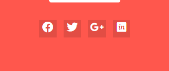

# Tuấn Anh đánh giá bài học viên

## [Hoang Van Thanh](https://github.com/YanShu92/F8-Fullstack-K4/tree/main/Day_6)

- [x] [Bài 1]:

  Bài làm tốt \*

  Vị trí thẻ `<div class="news-list">` nên cho xa ra 1 chút.

  - Đề xuất sửa thành:

  ```css
  .news-list {
    top: calc(100% + 14px);
  }
  ```

  Các thẻ `<li class= "menu-item">` có thuộc tính `border-color`có màu khác với bản mẫu.

---

- [x] [Bài 2]:

  Bài làm tốt \*

  Thiếu phần shadow của các icon.

  Nên tăng `line-height` của thẻ p để giống với bản mẫu hơn

---

- [x] [Bài 3]:

  Bài làm tốt

  Thẻ `<div class= "login-content">` và thẻ `<buttom>` có content là `LOGIN` sai màu nền.

  Các phần css này đang giống nhau nên nên gộp lại thành 1, màu nền đang sai so với bản mẫu.

  ```css
  .login-content {
    background-color: #ec6355;
  }
  .login-info button {
    background-color: #ec6355;
  }
  ```

  - Đề xuất sửa thành:

    ```css
    .login-content,
    .login-info button {
      background-color: #ff574d;
    }
    ```

  Phần `class= "form-login"` css sai **cú pháp** mã màu, mã màu hệ thập lục phân phải có `#` đằng trước.

  ```css
  .form-login {
    color: 717171;
  }
  ```

  - Đề xuất sửa thành:

    ```css
    .form-login {
      color: #717171;
    }
    ```

  Sai Cú Pháp thuộc tính `transition` trong selector `.login__socials li`.

  - Thiếu đơn vị thời gian chạy hiệu ứng.

  ```css
  .login__socials li {
    transition: top 0.5 ease;
  }
  ```

  Đề xuất sửa và cho thời gian chạy hiệu ứng nhanh hơn để người dùng cảm thấy đỡ chờ đợi và cảm thấy trải nghiệm tốt hơn.

  ```css
  .login__socials li {
    transition: top 0.3s ease;
  }
  ```

---

- [x] Đánh giá chung bài tập về nhà: Bài làm hầu hết đều rất tốt, chỉ cần điều chỉnh một số lỗi nhỏ để hoàn thiện hơn.

---

## [Nguyễn Hưng Tuân](https://github.com/hungtuan/f8-fullstack-k4/tree/main/Day-6)

- [x] [Bài 1]:

  Bài làm rất tốt \*

  Nên để `border-radius: 4px` vào `class= "nav-tooltip"`

---

- [x] [Bài 2]:

  Sai bản mẫu code lại.

---

- [x] [Bài 3]:

  Sai bản mẫu code lại.

---

- [x] Đánh giá chung bài tập về nhà: Bài làm không tốt. Code lại bài 2, 3.

---

## [Đặng Khải](https://github.com/AlbertKhai/f8-fullstack-offline/tree/main/Day-6)

- [x] [Bài 1]:

  Bài làm rất tốt \*

  Nên để `border-radius: 4px` vào `class="sub-menu"`

---

- [x] [Bài 2]:

  Bài làm rất tốt \*

- [x] [Bài 3]:

  Bài làm rất tốt \*

---

- [x] Đánh giá chung bài tập về nhà: Bài làm rất tốt, chỉ cần điều chỉnh một số lỗi nhỏ để hoàn thiện hơn.

---

## [Thái Duy Tiến](https://github.com/thaiduytien1611cunbeo/NopbaitapF8/tree/main/Day07)

- [x] [Bài 1]:

  Khi `:hover` vào các thẻ `<div class="menu_item">` thì sub menu hiện thị sai vị trí so với bản mẫu.

  Nên cho thẻ `<div class=list>`là con của các thẻ `<div class="menu_item">` để căn chỉnh position trở lên dễ dàng hơn.

  - Đề xuất sửa thành:

    ```html
    <div class="menu__item">
      ....
      <div class="list">...</div>
    </div>
    ```

  Để căn chỉnh các sub-menu có `class="list"`.

  - Đề xuất sửa thành:

    ```css
    .menu__item {
      position: relative;
    }
    .list {
      position: absolute;
      top: calc(100% + 5px);
      left: 0;
    }
    ```

  Thẻ `<div class="list">` chưa có hình tam giác khi hiện thị.

  - Đề xuất sửa thành:

  ```css
  .list::before {
    content: "";
    border: 10px solid;
    border-color: transparent transparent #fff transparent;
    position: absolute;
    top: -19px;
    left: 10px;
  }
  ```

  **Code lại phần sub menu.**

- [x] [Bài 2]:

  Bài làm tốt

  Thiếu phần shadow của các icon.

  Thẻ `<button class="item__button">` chưa phải `font-family: "Roboto"`.

  - Đề xuất sửa thành:

  ```css
  body,
  button {
    font-family: "Roboto", sans-serif;
  }
  ```

  Tăng `line-height` cho thẻ `<p>`.

  Thẻ `<p>` sai màu.

  - Đề xuất sửa thành:

  ```css
  p {
    color: #666666;
  }
  ```

  Thiếu phần shadow của các icon.

  Khoảng cách Thẻ `<button class="item__button">` và đường liền dưới xa hơn so với bản mẫu.

  Thiếu thuộc tính `box-shadow` cho các thẻ `<div class="item">`.

- [x] [Bài 3]:

  Thẻ `<input>` với trường nhập mật khẩu dùng sai kiểu `type`.

  Phần input để nhập mật khẩu không nên để là `type="number"` vì sẽ dễ bị lộ mật khẩu. Trong input có sẵn kiểu `type="password"` nên nên dùng kiểu này.

  ```html
  <input type="number" placeholder="Password" />
  ```

  - Đề xuất sửa thành:

  ```html
  <input type="password" placeholder="Password" />
  ```

  Lỗi chính tả `fogot Password` -> `forgot Password`.

  Sai ngữ nghĩa `forgot password` không phải 1 đoạn văn.

  Thường nhấn vào `fogot Password` sẽ ra liên kết khác.

  Không nên sử dụng thẻ `<p>` vì thẻ `<p></p>` chỉ dùng để định dạng đoạn văn bản(Paragraph).

  - Nên sử dụng thẻ `<a></a>` để thể hiện liên kết chuyển hướng sang trang lấy lại mật khẩu.

  ```html
  <p>Forgot Password</p>
  ```

  Chưa đặt màu chữ heading: `#272323` cho thẻ `<h2>`.

  Chưa đặt màu chữ `#717171` cho thẻ `<label>, <p>, <input>` trong form.

---

- [x] Đánh giá chung bài tập về nhà: Bài bài tạm ổn, cần phải cẩn thận hơn khi làm bài, xem kĩ trước khi nộp bài

---

## [Mạnh Huy](https://github.com/HuyNguyen3107/F8_Fullstack_Offline_K4/tree/main/Day_06)

- [x] [Bài 1]:

  Bài làm tốt

  Icon và chữ Blog chữ được căn giữa.

  

  - Đề xuất sửa thành:

  ```css
  label {
    align-items: center;
  }
  ```

  Bỏ thẻ `<input>` trong thẻ `<li class="message-items">` vì đấy là item rỗng.

  ```html
  <li class="message-item">
    <input type="text" name="message-content" id="message-content" />
  </li>
  ```

---

- [x] [Bài 2]:

  Bài làm tốt

  Thiếu phần shadow của các icon.

  Khi `:hover` vào các `.service-item` thì bị giật layout do chúng tăng `border` lên 1px.

  - Đề xuất sử dụng outline thay cho border vì outline không chiếm không gian layout.

  ```css
  .service-item {
    outline: 1px...;
  }
  ```

  Thêm `box-shadow` cho các `.serviec-item`

- [x] [Bài 3]:

  Bài làm tốt

  Thẻ heading `<h2>` không nhận màu `#272323`.

  Chiều rộng social facebook nhỏ hơn so với social còn lại.

  .

  Chiều rộng cách social phải bằng nhau.

  Đề xuất sửa thành:

  ```css
  .login-content ul {
    gap: 5px;
  }
  .login-content ul li {
    flex: 1;
  }
  ```

  Do phần css này nên hình ảnh bị khuyết vì hình ảnh đã bị đẩy ra ngoài phần hiển thị.

  ```css
  body {
    background-image: url(http://uiwebsoft.com/justlog/login-one/images/login-bg2.jpg);
    background-repeat: no-repeat;
    background-size: cover;
    background-position: top -210px center;
  }
  ```

  

- [x] Đánh giá chung bài tập về nhà: Bài làm tốt, chỉ cần điều chỉnh một số lỗi nhỏ để hoàn thiện hơn.

---

## [Hà Long Việt](https://github.com/Vietha22/f8_fullstack_k4/tree/main/Day_6)

- [x] [Bài 1]:

  Bài làm rất tốt \*

  Nên để `border-radius: 4px` vào `class="menu-list-item"`

---

- [x] [Bài 2]:

  Bài làm tốt \*

  Thiếu phần shadow của các icon.

  Nên tăng `line-height` của thẻ `<p>`.

- [x] [Bài 3]:

  Bài làm tốt \*

  Do phần css này nên hình ảnh bị khuyết vì hình ảnh đã bị đẩy ra ngoài phần hiển thị.

  ```css
  body {
    font-family: "Nunito", sans-serif;
    font-size: 10px;
    background-image: url(http://uiwebsoft.com/justlog/login-one/images/login-bg2.jpg);
    background-repeat: no-repeat;
    background-attachment: fixed;
    background-position-y: bottom;
  }
  ```

  - Đề xuất sửa thành:

  ```css
  body {
    font-family: "Nunito", sans-serif;
    font-size: 10px;
    background-image: url(http://uiwebsoft.com/justlog/login-one/images/login-bg2.jpg);
    background-repeat: no-repeat;
    background-position: left bottom;
    min-height: 100vh;
    background-size: cover;
  }
  ```

  

- [x] Đánh giá chung bài tập về nhà: Bài làm tốt, chỉ cần điều chỉnh một số lỗi nhỏ để hoàn thiện hơn.

---

## [Trần Đức Công](https://github.com/TranCong312002/F8-fullstack-k4/tree/main/Bai_tap_buoi_6)

- [x] [Bài 1]:

  Khi `:hover` vào các `class="home", class= "blog", class= "contact"` không đổi `background`.

  Icon và phần nội dung `contact` không làm trên 1 hàng.

  Không lên chia layout bằng <table> làm cho bài trở lên phức tạp hơn.

---

- [x] [Bài 2]:

  Thiếu phần shadow của các icon.

  Các Icon Background là màu linear và tăng kích thước icon.

  Tăng khoảng giữa icon và thẻ `<h3>.

  Thẻ `<p>`có`line-height` hơi gần.

- [x] [Bài 3]:

  Thẻ`<h1>` và thẻ `<p>` đổi màu sang `color: #fff` cho giống bản mẫu.

  Do phần css này nên hình ảnh bị khuyết vì hình ảnh đã bị đẩy ra ngoài phần hiển thị.

  ```css
  body {
    background-image: url(http://uiwebsoft.com/justlog/login-one/images/login-bg2.jpg);
    width: 100vw;
    height: 100vh;
    background-repeat: no-repeat;
  }
  ```

  

  - Đề xuất sửa thành:

  ```css
  body {
    background-image: url(http://uiwebsoft.com/justlog/login-one/images/login-bg2.jpg);
    background-repeat: no-repeat;
    background-position: left bottom;
    height: 100vh;
    background-size: cover;
  }
  ```

  Các icon không làm giữa khối.

  

  - Đề xuất đặt các thẻ `<i>` của các icon trên chung `class` vd: `class= icon__social`

  ```css
  .icon__social {
    display: flex;
    justify-content: center;
    align-items: center;
  }
  ```

---

- [x] Đánh giá chung bài tập về nhà: Bài làm tạm ổn, cần cẩn thận hơn khi nộp bài.

---

## [Lê Đình Hùng](https://github.com/Le-Hung-020903/f8-fullstack-k4/tree/main/buoi_6)

- [x] [Bài 1]:

  Bài làm rất tốt \*

  Nên để `border-radius: 4px` vào `class="sub-menu"`

---

- [x] [Bài 2]:

  Bài làm tốt \*

  Thiếu phần shadow của các icon.

  Các Background icon là màu linear.

- [x] [Bài 3]:

  Bài làm rất tốt \*

---

- [x] Đánh giá chung bài tập về nhà: Bài làm rất tốt, chỉ cần điều chỉnh một số lỗi nhỏ để hoàn thiện hơn.

---

# Quân đánh giá bài học viên

## [Vinh Nguyễn](https://github.com/vinhh03/vinh_f8_fullstack_k4/tree/main/bai_tap/day06)

- [x] [Bài 1]

  Bài làm rất tốt \*

---

- [x] [Bài 2]

  Bài làm rất tốt \*

---

- [x] [Bài 3]

  Bài làm rất tốt \*

  Tuy nhiên cần set ảnh nền full chiều cao và chiều rộng của màn hình sẽ hợp lý hơn với một trang đăng nhập.

  Icon mũi tên ở giữa đang để `position: absolute` với top và right đơn vị tuyệt đối nên nếu thay đổi kích thước của khối nó phụ thuộc vào sẽ phải căn lại vị trí. Đề xuất sử dụng đơn vị tương đối % để căn giữa sẽ tốt hơn.

  ```css
  top: 50%;
  right: 0;
  transform: translateX(50%) translateY(-50%);
  ```

---

- [x] Đánh giá chung bài tập về nhà: Bài làm rất tốt chỉ cần chú ý một số chỗ nhỏ để tối ưu hơn.

---

## [Huy Bui](https://github.com/Huy-Bui4869/f8_fullstack_k4/tree/main/Day_6)

- [x] [Bài 1]

  Bài làm tốt. \*

  Phần border đang hơi đậm so với bản mẫu cần điều chỉnh.

  Phần tam giác đỉnh đang chạm vào viền của menu cấp 1 nên điều chỉnh cho thấp hơn một chút.

  Nếu như đã làm được 2 cái menu dropdown thì chỉ cần copy để hoàn thiện nốt menu Portfolio vì menu này có icon mũi tên chỉ menu dropdown.

---

- [x] [Bài 2]

  Bài làm rất tốt. \*

---

- [x] [Bài 3]

  Bài làm tốt \*

  Vì đây có thể là một trang đăng nhập nên cần background full màn hình sẽ ổn hơn.

  Font chữ placeholder của các thẻ input chưa đúng với bản mẫu.

---

- [x] Đánh giá chung bài tập về nhà: Bài làm khá tốt, chỉ cần lưu ý vài chỗ nhỏ để hoàn thiện hơn.

---

## [Tuan Kiet Hoang](https://github.com/suspiciously36/f8_fullstack_k4/tree/main/day-06)

- [x] [Bài 1]

  Bài làm chưa tốt.

  Cần tuân thủ theo bản mẫu, ở đây menu dropdown của News có content đang khác so với bản mẫu.

  Phần icon mũi tên chỉ xuống đang căn theo đường baseline ở dưới nên điều chỉnh để căn giữa sẽ ổn hơn.

  Chưa xử lý tốt khi hover vào khoảng cách giữa menu cấp 1 và cấp 2 đang bị mất menu cấp 2, nên điều chỉnh để khi di chuột từ menu cấp 1 đến menu cấp 2 thì vẫn giữ được menu cấp 2.

  Phần menu cấp 2 chiều cao của từng menu đang hơi thấp so với bản mẫu.

  Khi hover vào từng menu thì background màu xanh đang để sát viền nhưng bản mẫu sẽ không sát viền như vậy, cần điều chỉnh lại.

  Nên dùng thẻ ul li để biểu diễn các menu sẽ đúng với HTML semantic hơn.

---

- [x] [Bài 2]

  Bài làm chưa tốt

  Kích thước của từng box đang lệch so với bản mẫu -> điều này có thể nói là đang sai layout so với bản mẫu.

  Ngoài ra còn một số lỗi cơ bản khi so sánh với bản mẫu như:

  - font chữ title của các box đang nhỏ hơn.

  - Background của các icon không đúng. (bản mẫu đang sử dụng màu gradient).

  - Phần viền của các box nên thay đổi màu theo màu background của icon.

  - Chưa có box-shadow cho các icon.

  Việc sáng tạo khi hover vào các box rất tốt tuy nhiên cần chú ý vào layout là điều quan trọng nhất, các animation là vô nghĩa nếu layout không đúng với bản mẫu.

---

- [x] [Bài 3]

  Bài làm tốt

  Title bên phải đang viết sai chính tả. Cần chỉnh sửa lại cho giống bản mẫu.

  Phần gạch chân đỏ ở title bên phải đang lệch so với bản mẫu.

  Chưa xử lý font chữ placeholder của các thẻ input.

  Chữ của `left-title`, và text của thẻ p đang có độ dày hơi mỏng so với bản mẫu.

  Phần button text đang viết là `Read more` mà bản mẫu là `Read More`, ngoài ra khoảng cách giữa các ký tự đang hẹp so với bản mẫu.

  Icon arrow ở giữa đang không bo tròn 50% mà đang đặt là 999px.

  Phần xử lý căn giữa Icon arrow chưa được tốt, hiện đang set cứng đơn vị % vậy nếu thay đổi chiều dài của box nó phụ thuộc vào thì vị trị của nó sẽ thay đổi, nên css sao cho dù có thay đổi như nào thì nó vẫn nằm ở giữa.

  - Đề xuất sửa thành:

  ```css
  top: 50%;
  right: 0;
  transform: translateX(50%) translateY(-50%);
  ```

---

- [x] Đánh giá chung bài tập về nhà: Bài làm còn khá nhiều chỗ cần chú ý hơn đặc biệt là layout ở bài 2, cần cải thiện và chỉnh chu hơn. Nếu gặp khó khăn nên đặt câu hỏi để được giúp đỡ.

---

## [Trung Kiên](https://github.com/KIENTT99/F8-Fullstack-k4/tree/main/ngay_6)

**Chưa deploy lên được github page**

- [x] [Bài 1]

  Bài làm chưa tốt

  Phần icon mũi tên chỉ xuống đang căn theo đường baseline ở dưới nên điều chỉnh để căn giữa sẽ ổn hơn.

  Chưa xử lý tốt khi hover vào khoảng cách giữa menu cấp 1 và cấp 2 đang bị mất menu cấp 2, nên điều chỉnh để khi di chuột từ menu cấp 1 đến menu cấp 2 thì vẫn giữ được menu cấp 2.

  Khi hover vào từng menu thì background màu xanh đang để sát viền nhưng bản mẫu sẽ không sát viền như vậy, cần điều chỉnh lại.

  Khi hover vào thì icon chưa chuyển sang màu trắng.

  Khoảng cách giữa icon và text ở menu đang hơi sát nhau.

  Sai chính tả `Bortfolio` => `Portfolio`

  Màu border đang hơi đậm so với bản mẫu.

---

- [x] [Bài 2]

  Bài làm chưa tốt

  Chưa xử lý tốt phần border nên khi hover vào đang bị giật layout gây khó chịu cho người đọc.

  Màu của border nên theo màu background của avatar sẽ ổn hơn.

  Avatar icon nên có `box-shadow` như bản mẫu và phần icon đang hơi nhỏ.

  Phần text `line-height` đang nhỏ hơn so với bản mẫu.

  Chữ `Learn More` viết sai chính tả và font-size đang hơi lớn cần chỉnh chu hơn.

  Không nên dùng thẻ `header` để biểu diễn cho toàn bộ layout -> semantic kém.

---

- [x] [Bài 3]

  Bài làm chưa tốt

  Ở bản mẫu phần form đang ở vị trí chính giữa so với khung hình, đó là điều rất dễ có thể nhận ra nhưng hiện layout đang bị lệch giữa. (Không chỉnh chu).

  Sai chính tả tiêu đề bên trái. Xử lý tiêu đề phần `JL` chưa tốt.

  Phần button `Read More` độ dài và khoảng cách giữa các ký tự cần điều chỉnh lại.

  Phần icon social `padding` đang hơi ít so với bản mẫu nên nhìn nhỏ hơn bản mẫu.

  Border của input đang hơi đậm, chưa xử lý font chữ placeholder của thẻ input.

  Phần checkbox khi nhấn vào label `Remember me` đang không nhấn được, gây khó chịu cho người dùng khi trải nghiệm.

  Phần xử lý căn giữa Icon arrow chưa được tốt, hiện đang set cứng khoảng cách vậy nếu thay đổi chiều dài của box nó phụ thuộc vào thì vị trị của nó sẽ thay đổi, nên css sao cho dù có thay đổi như nào thì nó vẫn nằm ở giữa.

  - Đề xuất sửa thành:

  ```css
  top: 50%;
  right: 0;
  transform: translateX(50%) translateY(-50%);
  ```

---

- [x] Đánh giá chung bài tập về nhà: Bài làm đều chưa ổn, chưa deploy để xem được trên github page và đặc biệt còn sai chính tả nhiều chỗ ở cả 3 bài, còn nhiều vấn đề cần phải chú ý. Thực sự cần chỉnh chu hơn trong việc làm bài tập về nhà.

---

## [Đông Nguyễn](https://github.com/Dongnguyen318/F8-fullstack-k4.git)

**Chưa deploy lên được github page.**

Tất cả các đường dẫn đang để tuyệt đối nên khi chuyển sang máy khác mà cấp thư mục thay đổi sẽ không thể link đến file CSS. Vì vậy không thể xem được bài làm.

Ở bài 1 trong file HTML Phần body đang lặp lại các thẻ DOCTYPE, HTML, head và body cần xem lại.

Đặt tên thư mục lúc viết hoa lúc viết thường và còn có dấu cách. Lỗi này đã góp ý ở bài trước nhưng vẫn lặp lại. Nên đặt tên thư mục viết thường và không có dấu cách.

## [Nguyễn Chi Nam](https://github.com/chinam197/nopbaibuoi6.git)

**Chưa deploy được lên github page**

- [x] [Bài 1]

  Bài làm chưa tốt

  Phần background màu xanh không đúng với bản mẫu và đang sát viền trong khi bản mẫu không sát viền.

  Xử lý chưa tốt phần tam giác chỉ lên menu cấp 1.

  Border của các menu đang bị đậm hơn so với bản mẫu rất nhiều, nên điều chỉnh lại.

  Các tiêu đề của các menu nên thống nhất việc viết hoa các chữ cái, hiện có một số chỗ không viết hoa chữ cái đầu tiên nhìn không theo format với các menu khác, cần chỉnh chu hơn.

  Phần CSS chưa Reset CSS và đang không format code rất khó nhìn và khi cần chỉnh sửa rất khó. Nên cài đặt extension format code.

---

- [x] [Bài 2]

  Bài làm tốt.

  Sai chính tả `Digital`, `Quick` đang viết là `Degital`, `Qick`.

  Chiều rộng của từng khối đang hẹp hơn so với bản mẫu. Và các khối cần có `box-shadow`

  Màu của background icon trong bản mẫu là màu gradient, cần chỉnh sửa lại.

  `line-height` của các đoạn text trong từng khối đang hơi thấp so với bản mẫu.

  Nên đổi màu border khi hover vào theo màu background của các icon sẽ hợp lý và đẹp hơn.

---

- [x] [Bài 3]

  Bài làm chưa tốt.

  Không có mũi tên ở giữa như bản mẫu. Cần chỉnh sửa thêm vào.

  Độ dày phần tiêu đề bên trái đang mỏng, kích thước button đang nhỏ hơn so với bản mẫu.

  Kích thước của các icon không đều nhau và chưa `border-radius` vào các icon.

  Độ dày của tiêu đề bên phải phần `Your Account` đang hơi dày.

  Border của input cũng hơi đậm và cần `border-radius` ở input.

  Không nhấn được vào phần label bên cạnh checkbox.

  Button Login chưa `border-radius`.

---

- [x] Đánh giá chung bài tập về nhà: Bài làm chưa tốt, cần RESET CSS, và còn mắc một số lỗi rất cơ bản, cần chú ý về cách viết các tiêu đề cho chỉnh chu và tuân thủ theo bản thiết kế là điều rất quan trọng.

---

## [Trần Quý](https://github.com/TranQuy252/f8_fullstack_k4/tree/main/Day_6)

**Chưa deploy được lên github page**

- [x] [Bài 1]

  Sai layout hoàn toàn. Cần code lại.

---

- [x] [Bài 2]

  Sai layout hoàn toàn. Cần code lại.

---

- [x] [Bài 3]

  Sai layout hoàn toàn. Cần code lại.

---

- [x] Đánh giá chung bài tập về nhà: Bài làm rất không tốt, cần code lại cả 3 bài cho chuẩn layout. Nếu gặp khó khăn nên đặt câu hỏi hoặc nhờ các bạn trợ giảng để có thể cải thiện tốt hơn việc làm bài tập về nhà.


## [Chiến Đặng](https://github.com/f8githubdemodilam/f8-fullstack-.git)

**Nộp muộn**

**Chưa deploy được lên github page**

- [x] [Bài 1]

  Sai layout hoàn toàn. Cần code lại.

---

- [x] [Bài 2]

  Bài làm tốt.

  Nếu xem trên màn nhỏ sẽ bị vỡ layout.

  Xử lý phần border chưa tốt vì khi hover vào đang bị giật layout.

  Nên thêm phần shadow cho các khối và các icon của từng box.

  Các đoạn text trong từng khối đang có `line-height` nhỏ hơn so với bản mẫu.

---

- [x] [Bài 3]

  Vì đang để `width` của các phần tử theo đơn vị % nên khi laptop màn hình nhỏ đang hiển thị sai layout. Cần chỉnh sửa lại.

  Sai font chữ ở hầu hết các đoạn text trong layout.

  Chưa xử lý tốt placeholder của các thẻ input.

---

- [x] Đánh giá: Bài làm chưa tốt, cần chú ý nhiều chỗ cơ bản về font chữ, cũng như layout của các bài tập cần chỉnh chu và hoàn thiện hơn.

## [Nguyễn Ngọc Hùng](https://github.com/Oladayne/f8-fullstack-k98.git)

**Nộp muộn**

**Chưa deploy được lên github page**

Nên đặt tên foler không có dấu cách và đặt tiếng Anh.

- [x] [Bài 1]

  Sai layout hoàn toàn. Cần code lại.

---

- [x] [Bài 2]

  Bài làm tốt.

  Sai chính tả `LEAR MORE` và chưa đổi màu của `LEARN MORE`.

  Sai font chữ của layout.

  Nên tuân thủ layout cho đúng layout nhất có thể.

---

- [x] [Bài 3]

  Sai layout hoàn toàn. Cần code lại.

---

- [x] Đánh giá: Bài làm chưa tốt, cần chỉnh chu và dành thời gian nhiều hơn và không nên tích hợp CSS trong file HTML vì khi CSS nhiều lên sẽ rất rối và khó debug. Cần code lại cho hoàn chỉnh và tuân thủ layout là điều quan trọng nhất.
