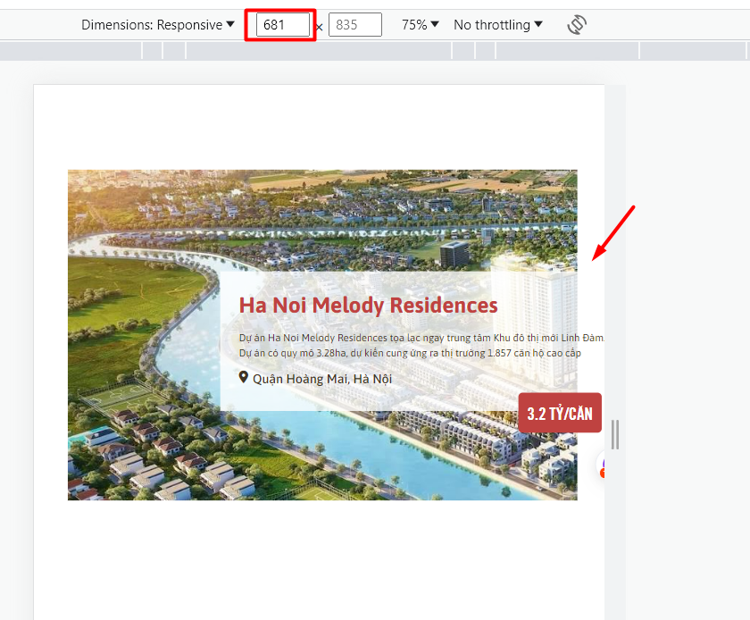
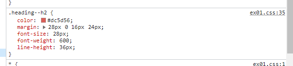
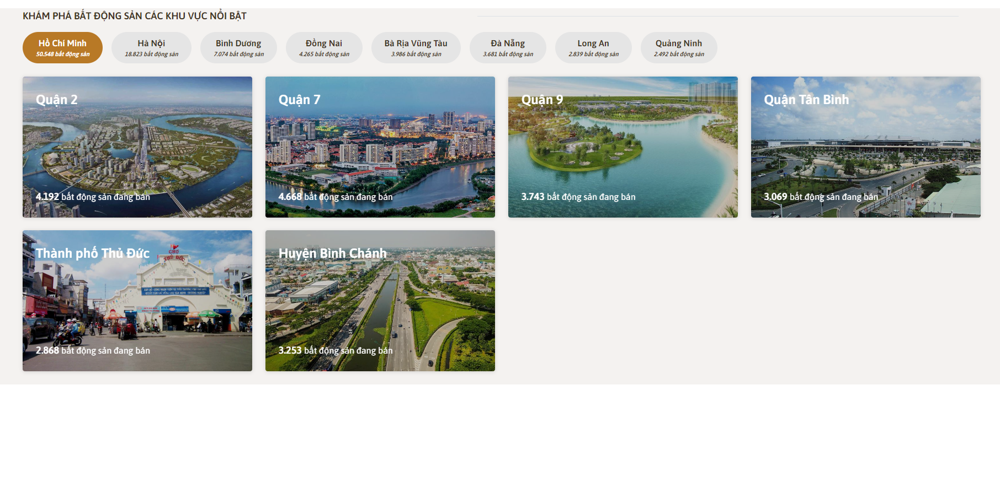
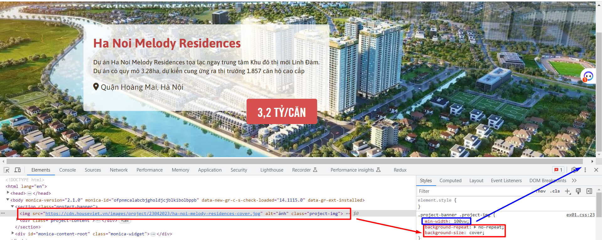
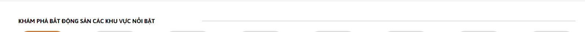

# Tuyết đánh giá bài học viên

## [Hoang Van Thanh](https://github.com/YanShu92/F8-Fullstack-K4/tree/main/Day_7)

Sớm nhất \*

- [x] [Bài 1](https://yanshu92.github.io/F8-Fullstack-K4/Day_7/Bai1.html):

  Bài làm tốt \*

  Phần `project-banner` theo design thì ảnh nền là sát trên cùng và có width full, nên không cần thêm css margin.

  Phần background nên thêm overlay để có thể nổi chữ trắng trên nền trong trường hợp thay đổi ảnh quá sáng.

  Thiếu `border-radius` cho `.project-content`.

  Padding của `project-price` chưa đúng, cần tăng padding 2 bên trái phải.

  Phần title h2 cần thêm CSS `text-transform: capitalize` có style là viết hoa chữ cái đầu giống như design.

  Thêm `min-width` cho `.project-banner` để khi resize hoặc với màn hình kích thước nhỏ hơn thì sẽ không bị vỡ giao diện:

  

---

- [x] [Bài 2](https://yanshu92.github.io/F8-Fullstack-K4/Day_7/Bai2.html):

  Bài làm tốt \*

  Phần `.profile-invester` theo design thì có width full nên để `width: 100%`. Trong bài này set `max-width: 1200px` là không đúng, có thể bỏ.

  Trong bài này tất cả chữ đều là chữ in hoa, nên cần thêm CSS `text-transform: uppercase` nữa cho các phần chữ.

  Phần `profile-data__number`: Chưa in đậm.

  Nên có thêm overlay cho background, và `text-shadow` cho `profile-data__name`, `profile-data__number` để phần text hiển thị nổi hơn.

---

- [x] [Bài 3](https://yanshu92.github.io/F8-Fullstack-K4/Day_7/Bai3.html):

  Bài làm tốt \*

  Nên thêm thẻ `section` bọc tất cả code. thay vì viết code trực tiếp trong thẻ `main`

  Xem lại design, cần thêm style css `text-transform: uppercase` cho các phần chữ in đậm, và thêm `text-transform: capitalize` cho các phần chữ viết hoa chữ cái đầu.

  Phần `real-estate__area` theo design là căn bên trái, nên set `justity-content: space-between` là chưa đúng.

  Nên có thêm overlay cho ảnh để text hiển thị dễ nhìn hơn.

  Check xóa css thừa (không có tác dụng / bị lặp): `z-index`, `position: relative`.

  - `z-index` ở `real-estate__title` và `real-estate__district-info span` (z-index chỉ có tác dụng khi phần tử đó có thuộc tính position là relative, absolute, fixed, sticky)
  - `position: relative` bị lặp ở `.real-estate__list .real-estate__district`

---

- [x] Đánh giá chung bài tập về nhà: Bài làm hầu hết đều đã tốt, chỉ cần điều chỉnh một số lỗi nhỏ để hoàn thiện hơn.

---

## [Tuan Kiet Hoang](https://github.com/suspiciously36/f8_fullstack_k4/tree/main/day-07)

- [x] [Bài 1](https://github.com/suspiciously36/f8_fullstack_k4/tree/main/day-07/ex-01):

  Bài làm chưa tốt

  Layout css chưa đúng, cần làm lại layout theo đúng như design:

  ```
  - Width, height của banner.
  - Background ảnh phải full width, full height của banner, không có khoảng cách trên, và 2 bên.
  - Phần "banner-content" lệch bên trái, chứ không phải căn giữa.
  ```

  Phần giá chưa đúng font-weight là đậm.

  Nên thay thẻ `div` có class`.banner` thành thẻ semantic là `section` để tốt cho SEO.

  Chỉ import những font-weight cần dùng (bỏ font-weight 300 và 700).

  Check xóa bỏ CSS comment thừa.

---

- [x] [Bài 2](https://github.com/suspiciously36/f8_fullstack_k4/tree/main/day-07/ex-02):

  Bài làm tốt \*

  Nên có thêm overlay cho background để phần text hiển thị nổi hơn.

  Nên css lại phần phần `.avatar` dùng `position`, các thẻ con bên trong dùng margin / padding để tạo khoảng cách.

  Các phần `.profile-name` , `.profile-data_data > span`, `.navbar-item`: font-weight chưa đúng, cần đậm hơn.

  Trong bài này tất cả chữ đều là chữ in hoa, nên cần thêm CSS `text-transform: uppercase` nữa cho các phần chữ.

  Thiết nội dung `alt` cho ảnh avatar.

  Check CSS thừa: `content: ''` ở css thẻ của thẻ `hr`. Vì nó không có tác dụng.

  Phần `.profile-name` nên dùng thẻ h2. Dùng thẻ `<b>` hoặc `<strong>` cho phần `profile-data_data span`

  Phần `.navbar`: Chưa có active item đầu tiên giống như design. Nên dùng `justify-content: flex-end` thay vì `flex-direction: row-reverse` để không cần viết HTML đảo ngược lại.

---

- [x] [Bài 3](https://github.com/suspiciously36/f8_fullstack_k4/tree/main/day-07/ex-03):

  Bài làm tốt \*

  Chỉnh lại `.container`: Chưa căn giữa như design. Width đang bị vượt quá màn hình (do set width:100% + margin:30px).

  Phần `.content-list` chưa đúng font-weight, cần đậm hơn. 2 dòng chữ trong tab bị chênh lệch size nhiều quá. Chữ tên tỉnh cần nhỏ lại chút và chữ hàng ngay dưới nó cần to lên chút để giống design hơn.

  Phần `.item-name` nên dùng thẻ semantic: h3 hoặc strong thay vì dùng `span`

  Phần `.item` nên có thêm overlay cho background image để phần text hiển thị nổi hơn.

---

- [x] Đánh giá chung bài tập về nhà: Bài chưa được tốt. HTML cần chú ý sử dụng thẻ semantic để tốt cho SEO. CSS chú ý căn chỉnh bố cục, những style tiểu tiết để giống với design hơn, điều chỉnh một số lỗi nhỏ để hoàn thiện hơn.

---

## [Nguyễn Hưng Tuân](https://github.com/hungtuan/f8-fullstack-k4/tree/main/Day-7)

- [x] Bài 1:

  Bài làm rất tốt \*

  Tuy nhiên 2 đoạn text nên gộp vào một thẻ p sẽ tốt hơn.

  Không nên reset vào thẻ body, nên đưa vào thẻ \* để tất cả các thẻ khác đều được reset.

---

- [x] Bài 2:

  Bài làm rất tốt \*

  Các số liệu trong title như `1993`, `35` đang hơi nhỏ so với bản gốc.

  Phần logo hơi lệch nên điều chỉnh lại.

  Ở trong thẻ `li` mô tả từng mục trong Navigation nên thêm thẻ `a` sẽ tốt hơn.

---

- [x] Bài 3:

  Bài làm rất tốt \*

  Phần `nav` hơi lệch so với bản mẫu.

---

- [x] Đánh giá: Bài làm rất tốt chỉ cần lưu ý một số chi tiết nhỏ để hoàn thiện hơn.

---

## [Huy Bui](https://github.com/Huy-Bui4869/f8_fullstack_k4/tree/main/Day_7)

- [x] Bài 1:

  Bài làm rất tốt \*

  Tuy nhiên độ rộng của phần banner hơi rộng hơn so với bản mẫu.

---

- [x] Bài 2:

  Bài làm rất tốt \*

---

- [x] Bài 3:

  Bài làm tốt \*

  Chưa có phần gạch ngang ở `title`.

  Phần text trong thẻ `nav` đang có độ dày mỏng hơn bản mẫu.

  Nên để `max-width` nhỏ hơn vì nếu xem trên màn hình laptop nhỏ sẽ bị vỡ layout.

---

- [x] Đánh giá: Bài làm rất tốt chỉ cần lưu ý một số chi tiết nhỏ để hoàn thiện hơn.

---

## [Nguyễn Chi Nam](https://github.com/chinam197/nopbaitapbuoi7.git)

- [x] Bài 1:

  Bài làm tốt

  Không nên để `background-image` có `height: 100vh` vì đây chỉ là phần banner nhỏ của 1 trang và với bài tập này nếu để thế thì ảnh sẽ bị vỡ.

---

- [x] Bài 2:

  Bài làm tốt

  Nên để background chiếm 100% độ rộng của trang sẽ tốt hơn.

  Phần logo hơi lệch và to hơn so với bản mẫu.

  Không nên để height: 100vh cho body, điều đó có nghĩa là nội dung sẽ không thể kéo xuống được

  Có thể xem xét thay qua sử dụng min-height: 100vh cho body và html

---

- [x] Bài 3:

  Bài làm rất tốt \*

  Thuộc tính `font-family` nên có font chữ dự phòng ở sau font chữ sử dụng.

---

- [x] Đánh giá: Bài làm tốt chỉ cần lưu ý một số chi tiết nhỏ để hoàn thiện hơn.

# tuấn anh đánh giá bài học viên

## [Vinh Nguyễn](https://github.com/vinhh03/vinh_f8_fullstack_k4/tree/main/bai_tap/day07)

- [x] [Bài 1]: Bài làm tốt \*

Sai Màu của Tiêu đề ` #bf4240`.

- Lỗi màu.

  

- [x] [Bài 2]: Bài làm rất tốt \*

---

- [x] [Bài 3]:

Căn Khối **container** ra giữa.

- Đề Xuất.

```css
.container {
  width: 1135px;
  margin: 0 auto;
}
```

Vỡ giao diện 1 hàng nhiều hơn 3 **item**.

- Lỗi.

  .

- Đề Xuất.

```css
.card-item {
  width: calc(100% / 3 - 10px);
}
```

---

- [x] Đánh giá chung bài tập về nhà: Bài làm hầu hết đều tốt, chỉ cần điều chỉnh một số lỗi nhỏ để hoàn thiện hơn.

---

## [Mạnh Huy](https://huynguyen3107.github.io/f8-fullstack-k4/Github/gitpage.html)

- [x] [Bài 1]: Bài làm tốt

Thẻ `<p>` có `font-size` hơi nhỏ tăng `font-size: 16px`.

Thẻ `<div class=`price`>` kích thước **width** và **height** nhỏ hơn so với bản mẫu.

- Đề Xuất.

```css
.price {
  padding: 14px 30px;
  font-size: 25px;
}
```

---

- [x] [Bài 2]:

Thẻ `img` trong `<div class ="profile-img">` ảnh bị vỡ.

- Đề Xuất.

```css
.profile-img img {
  object-fit: cover;
}
```

Tăng khoảng cách giữa 2 khối `<div class="profile-avt"` và `<div class="prfile-desc">`.

vị trí khối `<div class="profile-info">` sai so với bản mẫu.

- Lỗi.

  

---

- [x] [Bài 3]: bài làm tốt \*

Sai **semantic** thay thẻ `<p>` thành thẻ `<span>`.

Thẻ `<p>` dùng để bọc 1 đoạn văn.

---

Đánh giá chung bài tập về nhà: Bài làm hầu hết đều tốt, chỉ cần điều chỉnh một số lỗi nhỏ để hoàn thiện hơn.

---

## [Đặng Khải](https://github.com/AlbertKhai/f8-fullstack-offline/tree/main/Day-7)

- [x] [Bài 1]: Bài làm rất tốt \*

---

- [x] [Bài 2]: Bài làm rất tốt \*

---

- [x] [Bài 3]: Bài làm rất tốt \*

---

- [x] Đánh giá chung bài tập về nhà: Bài làm rất tốt

## [Hà Long Việt](https://github.com/Vietha22/f8_fullstack_k4/tree/main/Day_7)

- [x] [Bài 1](https://github.com/Vietha22/f8_fullstack_k4/blob/main/Day_7/ex01.html):

  Bài làm rất tốt \*

  Phần img: code CSS background này thừa vì nó không có tác dụng cho thẻ img, cần xóa bỏ.

  Và Không nên set `min-width: 100vw`, nên dùng `width:100%` hoặc dùng `min-width` thì để `min-width: 100%`. Vì khi web dài xuống sẽ xuất hiện thanh cuộn dọc thì khi đó set 100vw sẽ không có width full như design.

  

---

- [x] [Bài 2](https://github.com/Vietha22/f8_fullstack_k4/blob/main/Day_7/ex02.html):

  Bài làm tốt \*

  Thiếu `border-radius` cho `img` avatar

  Nên có thêm overlay cho background, và `text-shadow` cho thẻ `h2`, `strong` để phần text hiển thị nổi hơn.

  Trong bài này tất cả chữ đều là chữ in hoa, nên cần thêm CSS `text-transform: uppercase` nữa cho các phần chữ.

  Phần đường kẻ dưới `.intro` nên thay đổi lại width, không nên fix cứng từng width theo từng chữ.

---

- [x] [Bài 3](https://github.com/Vietha22/f8_fullstack_k4/blob/main/Day_7/ex03.html):

  Bài làm tốt \*

  Nên đổi thẻ h4 thành h3. Vì trong bài chưa có 'h3'. (các thẻ heading sẽ được dùng lần lượt h1 -> h2 -> h3 -> h4)

  Phần '.area-nav' set css `justity-content: space-between` là chưa đúng, vì theo design là căn trái.

  Các `.area-item` nên có thêm overlay cho background image để phần text hiển thị nổi hơn.

  Nên set lại `width` của `.area-heading` để nếu màn hình rộng hơn khoảng cách giữa nó không bị giãn ra rộng quá so với design như này:

  

---

- [x] Đánh giá chung bài tập về nhà: Bài làm rất tốt. Chỉ cần điều chỉnh một số lỗi nhỏ để hoàn thiện hơn.

---
